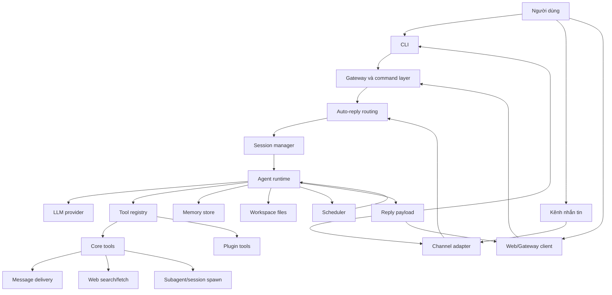
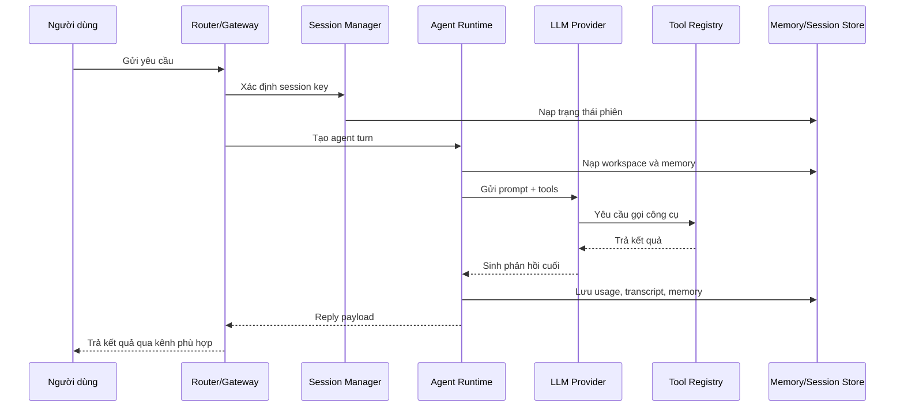
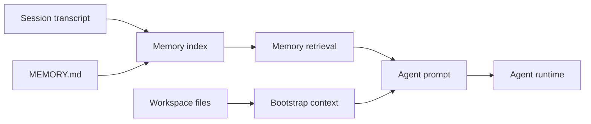
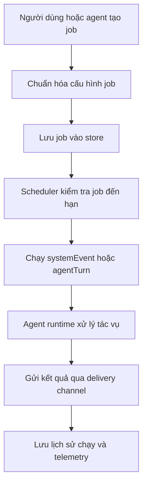

# BỘ GIÁO DỤC VÀ ĐÀO TẠO

# TRƯỜNG ĐẠI HỌC TÂN TẠO

# KHOA CÔNG NGHỆ THÔNG TIN

---

# ĐỒ ÁN TỐT NGHIỆP ĐẠI HỌC

# NGHIÊN CỨU VÀ XÂY DỰNG HỆ THỐNG TÁC NHÂN TỰ CHỦ HỖ TRỢ TỰ ĐỘNG HÓA QUY TRÌNH MARKETING SỐ ĐA KÊNH

Ngành: Công nghệ thông tin

Sinh viên thực hiện: [Họ và tên sinh viên]

Mã số sinh viên: [MSSV]

Giảng viên hướng dẫn: [Học hàm, học vị. Họ tên giảng viên hướng dẫn]

Tây Ninh, tháng [..] năm 20[..]

---

# TRANG PHÊ DUYỆT

Đồ án tốt nghiệp với đề tài **"Nghiên cứu và xây dựng hệ thống tác nhân tự chủ hỗ trợ tự động hóa quy trình marketing số đa kênh"** đã được trình và bảo vệ trước Hội đồng chấm đồ án tốt nghiệp ngành Công nghệ thông tin, Trường Đại học Tân Tạo.

Ngày bảo vệ: ....../....../20......

Kết quả: ....../10 điểm

Giảng viên hướng dẫn: ................................................

Giảng viên phản biện: ................................................

Chủ tịch Hội đồng: ................................................

---

# LỜI CẢM ƠN

Em xin chân thành cảm ơn Khoa Công nghệ thông tin, Trường Đại học Tân Tạo đã tạo điều kiện thuận lợi cho em trong quá trình học tập, nghiên cứu và thực hiện đồ án tốt nghiệp.

Em xin bày tỏ lòng biết ơn sâu sắc đến Thầy Cao Tiến Dũng, giảng viên hướng dẫn của em, đã tận tình định hướng, chỉ bảo và góp ý cho em trong suốt quá trình thực hiện đồ án. Những hướng dẫn và góp ý của Thầy đã giúp em hiểu rõ hơn về phương pháp nghiên cứu, cách phân tích và thiết kế hệ thống, cũng như cách trình bày một đề tài tốt nghiệp một cách khoa học và hoàn chỉnh.

Em cũng xin gửi lời cảm ơn đến quý thầy cô trong Khoa Công nghệ thông tin đã truyền đạt cho em những kiến thức nền tảng về lập trình, hệ thống phần mềm, trí tuệ nhân tạo, cơ sở dữ liệu, mạng máy tính và kiểm thử phần mềm. Đây là những kiến thức quan trọng giúp em có cơ sở để nghiên cứu và xây dựng hệ thống trong đồ án này.

Bên cạnh đó, em xin chân thành cảm ơn gia đình đã luôn động viên, quan tâm và tạo điều kiện cho em trong suốt quá trình học tập. Em cũng cảm ơn bạn bè và những người đã hỗ trợ, chia sẻ ý kiến, góp ý và khích lệ em trong quá trình hoàn thiện đồ án.

Do hạn chế về thời gian, kinh nghiệm nghiên cứu và kinh nghiệm triển khai thực tế, đồ án không tránh khỏi những thiếu sót. Em kính mong nhận được sự góp ý của quý thầy cô để có thể tiếp tục hoàn thiện và phát triển hệ thống tốt hơn trong tương lai.

Em xin chân thành cảm ơn!

---

# TÓM TẮT ĐỒ ÁN

Trong bối cảnh marketing số ngày càng phát triển, cá nhân và doanh nghiệp nhỏ thường phải thực hiện nhiều công việc cùng lúc như nghiên cứu thị trường, theo dõi xu hướng, xây dựng thông điệp, tạo nội dung, lên lịch đăng bài, phản hồi khách hàng, theo dõi hiệu quả chiến dịch và tổng hợp báo cáo. Các công việc này có tính lặp lại, diễn ra trên nhiều nền tảng khác nhau và đòi hỏi sự nhất quán về thông tin thương hiệu, giọng văn truyền thông cũng như mục tiêu chiến dịch.

Đồ án này nghiên cứu và xây dựng một hệ thống tác nhân tự chủ nhằm hỗ trợ tự động hóa quy trình marketing số đa kênh. Mục tiêu của đồ án là xây dựng một tác nhân marketing có khả năng tiếp nhận mục tiêu từ người dùng, duy trì ngữ cảnh thương hiệu, hỗ trợ lập kế hoạch nội dung, tạo bản nháp, nhắc việc, theo dõi chiến dịch và tổng hợp báo cáo. Phương pháp thực hiện bao gồm phân tích nhu cầu thực tế trong quy trình marketing số, nghiên cứu cơ sở lý thuyết về mô hình ngôn ngữ lớn và tác nhân tự chủ, thiết kế kiến trúc hệ thống, hiện thực các thành phần chính và kiểm thử các chức năng cốt lõi.

Kết quả đạt được là một tác nhân marketing tự chủ có khả năng hỗ trợ người dùng trong nhiều giai đoạn của quy trình marketing số, từ nghiên cứu, lập kế hoạch, sản xuất nội dung đến theo dõi và báo cáo. Hệ thống góp phần giảm khối lượng công việc lặp lại, tăng tính nhất quán trong truyền thông và hỗ trợ người dùng duy trì hoạt động marketing thường xuyên hơn.

Từ khóa: tác nhân tự chủ, marketing số, tự động hóa marketing, đa kênh, lập kế hoạch nội dung, báo cáo chiến dịch.

---

# ABSTRACT

In the context of the rapid development of digital marketing, individuals and small businesses often have to perform multiple tasks at the same time, such as market research, trend monitoring, message development, content creation, post scheduling, customer response, campaign tracking, and report generation. These tasks are repetitive, take place across multiple platforms, and require consistency in brand information, communication style, and campaign objectives.

This thesis studies and develops an autonomous agent system to support the automation of multi-channel digital marketing workflows. The main objective is to build a marketing agent capable of receiving user goals, maintaining brand context, supporting content planning, generating drafts, creating reminders, monitoring campaigns, and summarizing reports. The methodology includes analyzing practical needs in digital marketing workflows, studying the theoretical background of large language models and autonomous agents, designing the system architecture, implementing core components, and testing the main functions.

The result is an autonomous marketing agent that can assist users in several stages of the digital marketing process, from research and planning to content production, monitoring, and reporting. The system helps reduce repetitive work, improve communication consistency, and support users in maintaining regular marketing activities. The thesis concludes that applying an autonomous agent approach to digital marketing is a practical direction, especially for individuals and small teams with limited resources.

Keywords: autonomous agent, digital marketing, marketing automation, multi-channel, content planning, campaign reporting.

---

# MỤC LỤC

- [Danh mục hình ảnh](#danh-mục-hình-ảnh)
- [Danh mục bảng biểu](#danh-mục-bảng-biểu)
- [Danh mục từ viết tắt](#danh-mục-từ-viết-tắt)
- [Chương 1: Giới thiệu](#chương-1-giới-thiệu)
- [Chương 2: Cơ sở lý thuyết và tổng quan](#chương-2-cơ-sở-lý-thuyết-và-tổng-quan)
- [Chương 3: Phương pháp nghiên cứu và thiết kế hệ thống](#chương-3-phương-pháp-nghiên-cứu-và-thiết-kế-hệ-thống)
- [Chương 4: Hiện thực và kết quả](#chương-4-hiện-thực-và-kết-quả)
- [Chương 5: Kết luận và hướng phát triển](#chương-5-kết-luận-và-hướng-phát-triển)
- [Tài liệu tham khảo](#tài-liệu-tham-khảo)
- [Phụ lục](#phụ-lục)

---

# DANH MỤC HÌNH ẢNH

- Hình 1.1: Quy trình marketing số được hỗ trợ bởi tác nhân tự chủ.
- Hình 2.1: Sự khác nhau giữa chatbot phản hồi và tác nhân tự chủ.
- Hình 3.1: Kiến trúc tổng thể của hệ thống đề xuất.
- Hình 3.2: Luồng xử lý yêu cầu người dùng.
- Hình 3.3: Mô hình quản lý ngữ cảnh và dữ liệu.
- Hình 3.4: Luồng thực thi tác vụ định kỳ.
- Hình 4.1: Cấu trúc thư mục mã nguồn.
- Hình 4.2: Quy trình khởi tạo và sử dụng hệ thống.
- Hình 4.3: Quy trình xử lý tin nhắn đa kênh.

---

# DANH MỤC BẢNG BIỂU

- Bảng 1.1: Phạm vi chức năng của đề tài.
- Bảng 2.1: So sánh chatbot, tự động hóa quy trình và tác nhân tự chủ.
- Bảng 3.1: Yêu cầu chức năng.
- Bảng 3.2: Yêu cầu phi chức năng.
- Bảng 3.3: Các thành phần chính trong kiến trúc hệ thống.
- Bảng 4.1: Ánh xạ chức năng với module mã nguồn.
- Bảng 4.2: Kịch bản kiểm thử chức năng.
- Bảng 4.3: Đánh giá kết quả so với mục tiêu.

---

# DANH MỤC TỪ VIẾT TẮT

| Từ viết tắt | Giải thích                                                                           |
| ----------- | ------------------------------------------------------------------------------------ |
| AI          | Artificial Intelligence - Trí tuệ nhân tạo                                           |
| Agent       | Tác nhân phần mềm có khả năng nhận mục tiêu, quyết định hành động và sử dụng công cụ |
| Agentic AI  | Hệ thống AI có khả năng lập kế hoạch, ghi nhớ ngữ cảnh và hỗ trợ xử lý nhiều bước    |
| API         | Application Programming Interface - Giao diện lập trình ứng dụng                     |
| CRM         | Customer Relationship Management - Quản lý quan hệ khách hàng                        |
| LLM         | Large Language Model - Mô hình ngôn ngữ lớn                                          |
| UI          | User Interface - Giao diện người dùng                                                |
| UX          | User Experience - Trải nghiệm người dùng                                             |

---

# CHƯƠNG 1: GIỚI THIỆU

## 1.1. Đặt vấn đề

Marketing số hiện đại không còn chỉ là việc viết một bài quảng cáo hoặc đăng nội dung lên một nền tảng duy nhất. Một chiến dịch marketing thường bao gồm nhiều hoạt động liên kết với nhau như nghiên cứu thị trường, phân tích khách hàng, nghiên cứu đối thủ cạnh tranh, theo dõi xu hướng, xây dựng thông điệp, tạo nội dung, lên lịch đăng tải, phân phối nội dung trên nhiều nền tảng, theo dõi phản hồi, tổng hợp báo cáo và điều chỉnh kế hoạch. Các hoạt động này diễn ra liên tục, lặp lại và chịu ảnh hưởng bởi mục tiêu kinh doanh, phong cách thương hiệu, đặc điểm từng kênh truyền thông cũng như hành vi của khách hàng.

Trong thực tế, cá nhân, nhà sáng tạo nội dung, nhóm nhỏ hoặc doanh nghiệp nhỏ thường chưa có đủ nguồn lực để vận hành marketing một cách đều đặn và nhất quán. Người làm marketing không chỉ cần nghĩ ý tưởng và viết nội dung, mà còn phải điều chỉnh nội dung cho phù hợp với từng nền tảng như Facebook Fanpage, Instagram, TikTok, LinkedIn hoặc các kênh mạng xã hội khác. Cùng một thông điệp có thể cần được biến đổi thành nhiều định dạng khác nhau như bài viết ngắn, caption, kịch bản video hoặc nội dung chuyên nghiệp cho LinkedIn. Nếu thực hiện thủ công, quá trình này dễ tiêu tốn nhiều thời gian, gây quá tải, làm gián đoạn lịch đăng bài và khiến nội dung thiếu nhất quán giữa các kênh.

Bên cạnh đó, hoạt động marketing số còn đòi hỏi khả năng theo dõi thị trường, phân tích đối thủ và đánh giá hiệu quả chiến dịch. Tuy nhiên, việc thu thập, tổng hợp và phân tích các thông tin này thường mất nhiều công sức, đặc biệt khi dữ liệu phân tán trên nhiều nền tảng khác nhau. Nếu không có công cụ hỗ trợ phù hợp, cá nhân và doanh nghiệp nhỏ có thể bỏ lỡ cơ hội cải thiện chiến dịch hoặc không kịp phản ứng với thay đổi của thị trường.

Từ những vấn đề trên, đề tài hướng đến việc nghiên cứu và xây dựng một hệ thống tác nhân marketing tự chủ hỗ trợ tự động hóa quy trình marketing số đa kênh. Hệ thống không chỉ hỗ trợ tạo nội dung như một chatbot thông thường, mà còn có khả năng tiếp nhận mục tiêu, duy trì ngữ cảnh thương hiệu, nghiên cứu xu hướng, phân tích đối thủ, lập kế hoạch nội dung, tạo bài đăng phù hợp với từng nền tảng, hỗ trợ đăng hoặc lên lịch đăng bài trên nhiều kênh mạng xã hội, nhắc việc, theo dõi hiệu quả chiến dịch và tổng hợp báo cáo. Qua đó, hệ thống giúp giảm khối lượng công việc thủ công, duy trì lịch đăng bài đều đặn, tăng tính nhất quán trong truyền thông và nâng cao khả năng vận hành marketing số với nguồn lực hạn chế.

## 1.2. Mục tiêu nghiên cứu

### 1.2.1. Mục tiêu tổng quát

Mục tiêu tổng quát của đề tài là nghiên cứu và xây dựng một hệ thống tác nhân marketing tự chủ hỗ trợ tự động hóa quy trình marketing số đa kênh. Hệ thống hướng đến việc giúp cá nhân, nhà sáng tạo nội dung, nhóm nhỏ hoặc doanh nghiệp nhỏ giảm khối lượng công việc thủ công trong quá trình lập kế hoạch, tạo nội dung, phân phối nội dung, theo dõi chiến dịch và tổng hợp báo cáo.

Hệ thống được thiết kế để có khả năng tiếp nhận mục tiêu từ người dùng, duy trì ngữ cảnh thương hiệu, hỗ trợ tạo nội dung phù hợp với từng nền tảng, hỗ trợ đăng hoặc lên lịch đăng bài trên nhiều kênh mạng xã hội, nghiên cứu xu hướng, phân tích đối thủ cạnh tranh và đưa ra gợi ý cải thiện hoạt động marketing. Qua đó, đề tài hướng đến việc xây dựng một tác nhân có thể hỗ trợ người dùng vận hành marketing số thường xuyên, nhất quán và hiệu quả hơn trong điều kiện nguồn lực còn hạn chế.

### 1.2.2. Mục tiêu cụ thể

Để đạt được mục tiêu tổng quát, đề tài tập trung thực hiện các mục tiêu cụ thể sau:

- Phân tích các khó khăn thường gặp trong quy trình marketing số của cá nhân, nhà sáng tạo nội dung, nhóm nhỏ và doanh nghiệp nhỏ.
- Nghiên cứu cơ sở lý thuyết liên quan đến marketing số, tự động hóa marketing, mô hình ngôn ngữ lớn và tác nhân tự chủ.
- Xây dựng hệ thống tác nhân marketing tự chủ có khả năng tiếp nhận yêu cầu và mục tiêu từ người dùng bằng ngôn ngữ tự nhiên.
- Thiết kế cơ chế duy trì ngữ cảnh thương hiệu, bao gồm thông tin sản phẩm, khách hàng mục tiêu, giọng văn, thông điệp truyền thông và mục tiêu chiến dịch.
- Hỗ trợ người dùng lập kế hoạch nội dung theo ngày, tuần hoặc theo từng chiến dịch marketing cụ thể.
- Hỗ trợ tạo nội dung marketing như bài đăng mạng xã hội, caption, ý tưởng nội dung, kịch bản ngắn và các biến thể nội dung phù hợp với từng nền tảng.
- Hỗ trợ điều chỉnh và phân phối nội dung trên nhiều kênh mạng xã hội như Facebook Fanpage, Instagram, TikTok, LinkedIn hoặc các nền tảng khác tùy theo cấu hình của người dùng.
- Hỗ trợ nghiên cứu xu hướng, phân tích đối thủ cạnh tranh và đưa ra gợi ý cải thiện nội dung hoặc chiến dịch marketing.
- Xây dựng cơ chế nhắc việc, lên lịch đăng bài và tạo báo cáo định kỳ nhằm hỗ trợ người dùng duy trì hoạt động marketing thường xuyên.
- Kiểm thử và đánh giá hệ thống dựa trên các tiêu chí như khả năng đáp ứng yêu cầu, tính nhất quán của nội dung, khả năng hỗ trợ đa kênh, khả năng mở rộng và mức độ phù hợp với nhu cầu thực tế.

## 1.3. Đối tượng và phạm vi nghiên cứu

### 1.3.1. Đối tượng nghiên cứu

Đối tượng nghiên cứu của đề tài là quy trình marketing số đa kênh và việc ứng dụng tác nhân tự chủ vào hỗ trợ tự động hóa các công việc trong quy trình này.

Cụ thể, đề tài tập trung nghiên cứu các đối tượng sau:

- Quy trình marketing số của cá nhân, nhà sáng tạo nội dung, nhóm nhỏ và doanh nghiệp nhỏ.
- Các công việc marketing có tính lặp lại như nghiên cứu xu hướng, phân tích đối thủ cạnh tranh, lập kế hoạch nội dung, tạo nội dung, điều chỉnh nội dung theo từng nền tảng, lên lịch đăng bài, theo dõi phản hồi và tổng hợp báo cáo.
- Hệ thống tác nhân tự chủ có khả năng tiếp nhận mục tiêu từ người dùng, duy trì ngữ cảnh thương hiệu, sử dụng công cụ hỗ trợ và thực hiện nhiều bước trong quy trình marketing.
- Cơ chế quản lý ngữ cảnh thương hiệu, bao gồm thông tin sản phẩm, khách hàng mục tiêu, phong cách viết, thông điệp truyền thông và mục tiêu chiến dịch.
- Khả năng hỗ trợ phân phối nội dung trên nhiều nền tảng mạng xã hội như Facebook Fanpage, Instagram, TikTok, LinkedIn hoặc các kênh khác tùy theo cấu hình của người dùng.
- Các phương pháp đánh giá hệ thống dựa trên mức độ đáp ứng yêu cầu, tính nhất quán của nội dung, khả năng hỗ trợ đa kênh và khả năng mở rộng trong thực tế.

### 1.3.2. Phạm vi nghiên cứu

Đồ án tập trung nghiên cứu và xây dựng một hệ thống tác nhân marketing tự chủ hỗ trợ tự động hóa các bước phổ biến trong quy trình marketing số đa kênh. Các nội dung chính trong phạm vi đề tài bao gồm: nghiên cứu xu hướng, phân tích đối thủ cạnh tranh, lập kế hoạch nội dung, tạo bản nháp bài đăng, điều chỉnh nội dung cho phù hợp với từng nền tảng, hỗ trợ đăng hoặc lên lịch đăng bài, nhắc việc, theo dõi thông tin chiến dịch và tạo báo cáo.

Về mặt kỹ thuật, đề tài tập trung vào các thành phần cốt lõi như lõi xử lý tác nhân, quản lý ngữ cảnh, bộ nhớ dài hạn, quản lý phiên làm việc, công cụ hỗ trợ, lập lịch tác vụ định kỳ và tích hợp kênh giao tiếp. Hệ thống hướng đến việc hỗ trợ người dùng gửi yêu cầu, nhận phản hồi và nhận báo cáo qua nhiều kênh đã được cấu hình.

Đề tài không đi sâu vào các bài toán tối ưu marketing chuyên biệt như dự đoán doanh thu, phân bổ ngân sách quảng cáo, đấu giá quảng cáo, tối ưu chuyển đổi bằng mô hình thống kê nâng cao hoặc thay thế hoàn toàn các nền tảng quản lý mạng xã hội chuyên nghiệp. Các chức năng liên quan đến đăng bài đa nền tảng, phân tích đối thủ và theo dõi hiệu quả chiến dịch được giới hạn ở mức hỗ trợ quy trình, tạo đề xuất, tạo bản nháp, nhắc việc và tổng hợp thông tin.

Bảng 1.1 trình bày phạm vi chức năng chính của đề tài.
| Nhóm chức năng | Có trong phạm vi | Ghi chú |
| ---------------------------------- | -------------------- | -------------------------------------------------------------------------- |
| Tác nhân tự chủ | Có | Nhận mục tiêu và hỗ trợ thực hiện nhiều bước marketing |
| Tạo nội dung marketing | Có | Tạo bài đăng, chú thích, ý tưởng nội dung và biến thể nội dung |
| Điều chỉnh nội dung theo nền tảng | Có | Tùy biến nội dung cho Facebook, Instagram, TikTok, LinkedIn hoặc kênh khác |
| Đăng hoặc lên lịch đa nền tảng | Có định hướng hỗ trợ | Phụ thuộc vào khả năng tích hợp và cấu hình từng kênh |
| Nghiên cứu xu hướng | Có | Hỗ trợ tổng hợp và gợi ý chủ đề nội dung |
| Phân tích đối thủ cạnh tranh | Có | Dừng ở mức tổng hợp thông tin và đề xuất cải thiện |
| Làm việc đa kênh | Có | Người dùng có thể yêu cầu và nhận kết quả qua nhiều kênh |
| Ghi nhớ thông tin thương hiệu | Có | Lưu phong cách, mục tiêu và thông tin quan trọng |
| Nhắc việc và báo cáo định kỳ | Có | Hỗ trợ các công việc marketing lặp lại |
| Tối ưu quảng cáo trả phí | Không đi sâu | Chỉ dừng ở mức hỗ trợ phân tích và gợi ý |
| Bảng điều khiển phân tích nâng cao | Không phải trọng tâm | Có thể là hướng mở rộng |

## 1.4. Phương pháp nghiên cứu

Đồ án sử dụng các phương pháp sau:

- Phương pháp phân tích tài liệu: nghiên cứu các khái niệm về marketing số, marketing automation, mô hình ngôn ngữ lớn và tác nhân tự chủ.
- Phương pháp phân tích nghiệp vụ: xác định các công việc marketing thường lặp lại và các điểm người dùng cần hỗ trợ.
- Phương pháp phân tích hệ thống: chuyển các nhu cầu nghiệp vụ thành yêu cầu chức năng, phi chức năng và luồng xử lý.
- Phương pháp thiết kế kiến trúc: thiết kế các thành phần kỹ thuật để đáp ứng yêu cầu đã phân tích.
- Phương pháp hiện thực phần mềm: sử dụng TypeScript, Node.js và các thành phần lưu trữ, tích hợp phù hợp với hệ thống.
- Phương pháp kiểm thử: kiểm thử các luồng sử dụng chính như tạo nội dung, nhắc việc, báo cáo, xử lý đa kênh và các chức năng kỹ thuật liên quan.
- Phương pháp đánh giá: so sánh kết quả triển khai với mục tiêu ban đầu, phân tích ưu điểm, hạn chế và khả năng phát triển.

## 1.5. Ý nghĩa khoa học và thực tiễn

Về mặt khoa học, đề tài góp phần hệ thống hóa việc ứng dụng tác nhân tự chủ vào một quy trình nghiệp vụ cụ thể là marketing số đa kênh. Thay vì chỉ sử dụng mô hình ngôn ngữ lớn để tạo nội dung riêng lẻ, đề tài nghiên cứu cách kết hợp giữa tác nhân tự chủ, quản lý ngữ cảnh, bộ nhớ dài hạn, công cụ hỗ trợ và cơ chế lập lịch tác vụ để hỗ trợ một chuỗi công việc marketing gồm nghiên cứu, lập kế hoạch, tạo nội dung, phân phối nội dung và tổng hợp báo cáo.

Bên cạnh đó, đề tài có ý nghĩa trong việc nghiên cứu hướng tùy biến và phát triển hệ thống tác nhân theo một miền ứng dụng cụ thể. Việc kế thừa, điều chỉnh và mở rộng một số thành phần nền tảng có sẵn cho bài toán marketing số giúp làm rõ cách chuyển một hệ thống tác nhân tổng quát thành một hệ thống có định hướng nghiệp vụ rõ ràng, phù hợp với yêu cầu thực tế của người dùng.

Về mặt thực tiễn, hệ thống có thể hỗ trợ cá nhân, nhà sáng tạo nội dung, nhóm nhỏ và doanh nghiệp nhỏ giảm bớt khối lượng công việc thủ công trong quá trình vận hành marketing. Các chức năng như lập kế hoạch nội dung, tạo bài đăng, điều chỉnh nội dung theo từng nền tảng, nhắc việc, theo dõi xu hướng, phân tích đối thủ và tạo báo cáo giúp người dùng duy trì hoạt động marketing thường xuyên hơn.

Ngoài ra, hệ thống còn góp phần tăng tính nhất quán trong truyền thông nhờ khả năng duy trì ngữ cảnh thương hiệu, bao gồm thông tin sản phẩm, khách hàng mục tiêu, phong cách viết và mục tiêu chiến dịch. Điều này có ý nghĩa thực tế đối với các cá nhân và nhóm nhỏ chưa có đủ nguồn lực để xây dựng một đội ngũ marketing chuyên trách nhưng vẫn cần vận hành nội dung trên nhiều kênh khác nhau.

## 1.6. Bố cục đồ án

Đồ án được tổ chức thành 5 chương chính như sau:

- Chương 1: Giới thiệu
  Trình bày bối cảnh, lý do chọn đề tài, mục tiêu nghiên cứu, đối tượng và phạm vi nghiên cứu, phương pháp nghiên cứu, ý nghĩa khoa học và thực tiễn của đề tài.

- Chương 2: Cơ sở lý thuyết và tổng quan
  Trình bày các khái niệm và nền tảng lý thuyết liên quan đến marketing số, tự động hóa marketing, mô hình ngôn ngữ lớn, tác nhân tự chủ, quản lý ngữ cảnh, hệ thống đa kênh và các công nghệ được sử dụng trong đề tài.

- Chương 3: Phương pháp nghiên cứu và thiết kế hệ thống
  Phân tích yêu cầu chức năng, yêu cầu phi chức năng và trình bày thiết kế hệ thống. Nội dung chương bao gồm kiến trúc tổng thể, các thành phần chính, cơ chế quản lý ngữ cảnh, quản lý phiên làm việc, bộ nhớ dài hạn, lập lịch tác vụ, tích hợp kênh giao tiếp và luồng xử lý chính của hệ thống.

- Chương 4: Hiện thực và kết quả
  Trình bày môi trường phát triển, công nghệ sử dụng, quá trình hiện thực các chức năng chính, kết quả đạt được, các kịch bản sử dụng tiêu biểu và quá trình kiểm thử hệ thống.

- Chương 5: Kết luận và hướng phát triển
  Tổng kết kết quả đã đạt được, đánh giá mức độ hoàn thành mục tiêu đề tài, nêu các hạn chế còn tồn tại và đề xuất hướng phát triển trong tương lai.

---

# CHƯƠNG 2: CƠ SỞ LÝ THUYẾT VÀ TỔNG QUAN

## 2.1. Các khái niệm nền tảng

Phần này trình bày các khái niệm cơ bản liên quan đến đề tài, bao gồm marketing số, marketing số đa kênh, tự động hóa marketing, mô hình ngôn ngữ lớn, tác nhân tự chủ, ngữ cảnh thương hiệu, bộ nhớ dài hạn và làm việc đa kênh. Các khái niệm này là cơ sở để phân tích yêu cầu và thiết kế hệ thống tác nhân marketing tự chủ ở các chương tiếp theo.

### 2.1.1. Marketing số

Marketing số là tập hợp các hoạt động tiếp thị được thực hiện thông qua các nền tảng và công nghệ kỹ thuật số nhằm tiếp cận, tương tác và tạo giá trị cho khách hàng. Các kênh thường gặp trong marketing số bao gồm website, mạng xã hội, email, công cụ tìm kiếm, ứng dụng nhắn tin và các cộng đồng trực tuyến. Theo Chaffey và Ellis-Chadwick, marketing số không chỉ là hoạt động quảng bá trên môi trường trực tuyến, mà còn bao gồm việc ứng dụng công nghệ số vào toàn bộ quá trình tiếp cận, tương tác và duy trì quan hệ với khách hàng (Chaffey and Ellis-Chadwick, 2019).

Trong phạm vi đồ án, marketing số được xem là miền ứng dụng chính của hệ thống. Hệ thống không nhằm thay thế hoàn toàn vai trò của người làm marketing, mà tập trung hỗ trợ các công việc có tính lặp lại, cần duy trì sự nhất quán hoặc cần được thực hiện thường xuyên theo kế hoạch.

### 2.1.2. Marketing số đa kênh

Marketing số đa kênh là cách triển khai hoạt động marketing trên nhiều nền tảng khác nhau nhằm tiếp cận khách hàng tại nhiều điểm chạm. Một chiến dịch có thể được triển khai đồng thời trên Facebook Fanpage, Instagram, TikTok, LinkedIn, email hoặc các kênh nhắn tin. Theo Neslin và cộng sự, quản lý đa kênh liên quan đến việc thiết kế, triển khai và phối hợp các kênh tương tác với khách hàng nhằm nâng cao hiệu quả tiếp cận và trải nghiệm người dùng (Neslin et al., 2006).

Đặc điểm quan trọng của marketing đa kênh là mỗi nền tảng có định dạng nội dung, nhóm người dùng và hành vi tương tác khác nhau. Vì vậy, cùng một thông điệp marketing có thể cần được điều chỉnh thành nhiều dạng thể hiện khác nhau như bài viết ngắn, chú thích bài đăng, kịch bản video hoặc nội dung mang tính chuyên nghiệp hơn cho LinkedIn.

### 2.1.3. Tự động hóa marketing

Tự động hóa marketing là việc sử dụng công nghệ để hỗ trợ hoặc tự động thực hiện một số công việc trong quy trình marketing, chẳng hạn như lập lịch đăng bài, gửi thông báo, theo dõi chiến dịch, phân loại khách hàng, tạo báo cáo hoặc nhắc người dùng thực hiện các tác vụ định kỳ. Theo Järvinen và Taiminen, tự động hóa marketing có thể hỗ trợ doanh nghiệp trong việc quản lý nội dung, theo dõi khách hàng tiềm năng và cải thiện hiệu quả của các hoạt động marketing dựa trên dữ liệu (Järvinen and Taiminen, 2016).

Đối với cá nhân, nhà sáng tạo nội dung, nhóm nhỏ hoặc doanh nghiệp nhỏ, tự động hóa marketing giúp giảm khối lượng công việc thủ công và hạn chế tình trạng bỏ sót các nhiệm vụ lặp lại. Tuy nhiên, các hệ thống tự động hóa truyền thống thường phụ thuộc nhiều vào quy trình được cấu hình sẵn. Vì vậy, đề tài tiếp cận bài toán này theo hướng sử dụng tác nhân tự chủ, trong đó hệ thống có thể tiếp nhận mục tiêu, phân tích ngữ cảnh và hỗ trợ thực hiện nhiều bước trong quy trình marketing.

### 2.1.4. Mô hình ngôn ngữ lớn

Mô hình ngôn ngữ lớn là mô hình trí tuệ nhân tạo được huấn luyện trên khối lượng dữ liệu văn bản lớn, có khả năng xử lý và sinh ngôn ngữ tự nhiên. Sự phát triển của kiến trúc Transformer đã tạo nền tảng quan trọng cho nhiều mô hình ngôn ngữ hiện đại (Vaswani et al., 2017). Các mô hình ngôn ngữ lớn có thể thực hiện nhiều tác vụ như trả lời câu hỏi, tóm tắt văn bản, phân tích nội dung, tạo văn bản và hỗ trợ lập trình. Nghiên cứu về GPT-3 cũng cho thấy mô hình ngôn ngữ lớn có khả năng thực hiện nhiều tác vụ thông qua cách đưa yêu cầu và ví dụ trong ngữ cảnh đầu vào (Brown et al., 2020).

Trong hệ thống đề xuất, mô hình ngôn ngữ lớn đóng vai trò hỗ trợ suy luận và sinh nội dung cho tác nhân. Tuy nhiên, khi sử dụng độc lập, mô hình có thể gặp hạn chế trong việc duy trì ngữ cảnh dài hạn, theo dõi tiến độ công việc hoặc bảo đảm nội dung luôn phù hợp với thông tin thương hiệu. Vì vậy, mô hình cần được đặt trong một hệ thống có khả năng quản lý ngữ cảnh, sử dụng công cụ, ghi nhớ thông tin và kiểm soát kết quả đầu ra.

### 2.1.5. Tác nhân tự chủ

Tác nhân tự chủ là một thành phần phần mềm có khả năng tiếp nhận mục tiêu, phân tích ngữ cảnh, lựa chọn hành động phù hợp và thực hiện các bước xử lý để tạo ra kết quả mong muốn. Trong trí tuệ nhân tạo, khái niệm tác nhân thường được hiểu là một hệ thống có khả năng quan sát môi trường và thực hiện hành động dựa trên mục tiêu hoặc tiêu chí đánh giá nhất định (Russell and Norvig, 2020). Theo Wooldridge, một tác nhân có thể được xem là hệ thống có khả năng hoạt động trong một môi trường, có tính tự chủ và có thể đưa ra hành động nhằm đạt mục tiêu được giao (Wooldridge, 2009).

Khác với hệ thống hỏi đáp thông thường, tác nhân tự chủ không chỉ phản hồi một yêu cầu riêng lẻ mà có thể hỗ trợ một chuỗi công việc gồm phân tích mục tiêu, lập kế hoạch, sử dụng công cụ, ghi nhớ thông tin, theo dõi kết quả và điều chỉnh hành động khi cần thiết.

### 2.1.6. Tác nhân marketing tự chủ

Tác nhân marketing tự chủ là tác nhân được định hướng cho các công việc trong lĩnh vực marketing số. Thay vì phục vụ nhiều mục đích chung, tác nhân marketing tập trung vào các nghiệp vụ như nghiên cứu xu hướng, phân tích đối thủ cạnh tranh, lập kế hoạch nội dung, tạo bài đăng, điều chỉnh nội dung theo nền tảng, hỗ trợ phân phối nội dung, theo dõi chiến dịch và tạo báo cáo.

Khái niệm này được xây dựng trên cơ sở kết hợp giữa lý thuyết về tác nhân tự chủ trong trí tuệ nhân tạo (Russell and Norvig, 2020; Wooldridge, 2009) và các hoạt động trong marketing số (Chaffey and Ellis-Chadwick, 2019). Trong đồ án này, tác nhân marketing tự chủ là trọng tâm của hệ thống, hướng đến việc hỗ trợ người dùng giảm công việc lặp lại, duy trì ngữ cảnh thương hiệu và vận hành marketing số đều đặn hơn.

### 2.1.7. Ngữ cảnh thương hiệu

Ngữ cảnh thương hiệu là tập hợp các thông tin giúp hệ thống hiểu cách một thương hiệu nên được thể hiện trong nội dung truyền thông. Các thông tin này có thể bao gồm tên thương hiệu, sản phẩm, khách hàng mục tiêu, phong cách viết, giọng văn, thông điệp chính, mục tiêu chiến dịch và các nội dung đã sử dụng trước đó. Theo Keller, quản trị thương hiệu cần duy trì sự nhất quán trong nhận diện, liên tưởng và giá trị thương hiệu nhằm xây dựng tài sản thương hiệu bền vững (Keller and Swaminathan, 2020).

Trong hệ thống tác nhân marketing, ngữ cảnh thương hiệu có vai trò quan trọng vì nội dung được tạo ra cần phù hợp với sản phẩm, khách hàng mục tiêu và phong cách truyền thông. Nếu thiếu ngữ cảnh, hệ thống có thể tạo ra nội dung không nhất quán, sai giọng văn hoặc không phù hợp với mục tiêu chiến dịch.

### 2.1.8. Bộ nhớ dài hạn trong hệ thống tác nhân

Bộ nhớ dài hạn là khả năng lưu trữ và sử dụng lại thông tin từ các phiên làm việc trước. Trong hệ thống tác nhân, bộ nhớ dài hạn giúp duy trì các thông tin quan trọng như phong cách viết, thông tin sản phẩm, lịch sử chiến dịch, phản hồi của người dùng và các quyết định đã được đưa ra. Các nghiên cứu về truy xuất tăng cường sinh nội dung cho thấy việc kết hợp mô hình ngôn ngữ với nguồn tri thức bên ngoài có thể giúp cải thiện khả năng sử dụng thông tin và tạo nội dung có căn cứ hơn (Lewis et al., 2020).

Ngoài ra, nghiên cứu về tác nhân sinh mô phỏng hành vi con người cũng nhấn mạnh vai trò của bộ nhớ, phản ánh và lập kế hoạch trong việc giúp tác nhân duy trì hành vi nhất quán theo thời gian (Park et al., 2023). Đối với hệ thống marketing, bộ nhớ dài hạn giúp tác nhân duy trì thông tin thương hiệu, ghi nhớ mục tiêu chiến dịch và tạo nội dung phù hợp hơn trong các lần tương tác tiếp theo.

### 2.1.9. Làm việc đa kênh

Làm việc đa kênh là khả năng cho phép người dùng tương tác với hệ thống thông qua nhiều kênh khác nhau. Đối với một hệ thống tác nhân marketing, các kênh này có thể bao gồm giao diện dòng lệnh, ứng dụng nhắn tin, nhóm làm việc hoặc các nền tảng giao tiếp được cấu hình trong hệ thống. Trong lĩnh vực marketing, việc quản lý nhiều kênh tương tác là một vấn đề quan trọng vì khách hàng và người dùng có thể xuất hiện ở nhiều điểm chạm khác nhau (Neslin et al., 2006; Lemon and Verhoef, 2016).

Trong phạm vi đồ án, làm việc đa kênh được hiểu là khả năng hỗ trợ người dùng gửi yêu cầu, nhận phản hồi, nhận thông báo và theo dõi kết quả thông qua các kênh đã được cấu hình. Khái niệm này khác với phân phối nội dung marketing đa nền tảng, nhưng có mối liên hệ chặt chẽ với mục tiêu tự động hóa quy trình marketing số.

### 2.1.10. Lập lịch tác vụ và báo cáo định kỳ

Lập lịch tác vụ là cơ chế cho phép hệ thống thực hiện một công việc tại một thời điểm xác định hoặc lặp lại theo chu kỳ. Trong marketing số, nhiều công việc cần được thực hiện định kỳ như chuẩn bị lịch nội dung hằng tuần, kiểm tra xu hướng, theo dõi phản hồi, tổng hợp số liệu hoặc gửi báo cáo chiến dịch.

Trong phạm vi đồ án, lập lịch tác vụ và báo cáo định kỳ được xem là một thành phần quan trọng giúp tác nhân không chỉ phản hồi khi người dùng gửi yêu cầu, mà còn hỗ trợ các công việc cần duy trì theo thời gian. Cách tiếp cận này phù hợp với mục tiêu tự động hóa marketing, trong đó hệ thống hỗ trợ giảm bớt thao tác thủ công và duy trì các hoạt động lặp lại một cách ổn định (Järvinen and Taiminen, 2016).

## 2.2. Cơ sở lý thuyết

### 2.2.1. Mô hình ngôn ngữ lớn trong hệ thống tác nhân

Mô hình ngôn ngữ lớn là một trong những nền tảng quan trọng của các hệ thống trí tuệ nhân tạo hiện đại. Sự ra đời của kiến trúc Transformer đã tạo cơ sở cho nhiều mô hình có khả năng xử lý ngôn ngữ tự nhiên ở quy mô lớn, bao gồm hiểu văn bản, sinh văn bản, tóm tắt, phân tích và trả lời câu hỏi (Vaswani et al., 2017). Các nghiên cứu về mô hình ngôn ngữ lớn cũng cho thấy những mô hình này có khả năng thực hiện nhiều nhiệm vụ khác nhau thông qua yêu cầu bằng ngôn ngữ tự nhiên và ngữ cảnh đầu vào (Brown et al., 2020).

Trong đồ án này, mô hình ngôn ngữ lớn được sử dụng như thành phần hỗ trợ suy luận và sinh nội dung cho tác nhân marketing. Thông qua mô hình ngôn ngữ lớn, hệ thống có thể tiếp nhận yêu cầu của người dùng, phân tích mục tiêu, tạo bản nháp nội dung, điều chỉnh giọng văn và tổng hợp báo cáo. Tuy nhiên, mô hình ngôn ngữ lớn khi hoạt động độc lập thường khó duy trì ngữ cảnh dài hạn, khó theo dõi tiến độ công việc và khó bảo đảm sự nhất quán của nội dung nếu thiếu thông tin thương hiệu. Vì vậy, mô hình cần được kết hợp với các thành phần khác như bộ nhớ, công cụ hỗ trợ, lập lịch tác vụ và quản lý phiên làm việc.

### 2.2.2. Tác nhân tự chủ và quy trình xử lý nhiều bước

Trong trí tuệ nhân tạo, tác nhân được hiểu là một hệ thống có khả năng quan sát môi trường, xử lý thông tin và thực hiện hành động nhằm đạt được mục tiêu nhất định (Russell and Norvig, 2020). Theo Wooldridge, tác nhân có tính tự chủ khi có thể hoạt động mà không cần sự điều khiển trực tiếp liên tục từ con người và có khả năng lựa chọn hành động phù hợp với trạng thái hiện tại của môi trường (Wooldridge, 2009).

Đối với hệ thống trong đồ án, tác nhân tự chủ được hiểu là một thành phần phần mềm có khả năng tiếp nhận mục tiêu từ người dùng, phân tích ngữ cảnh, lập kế hoạch, sử dụng công cụ hỗ trợ và trả về kết quả sau nhiều bước xử lý. Khác với chatbot thông thường chỉ phản hồi từng yêu cầu riêng lẻ, tác nhân tự chủ có thể hỗ trợ một chuỗi công việc như lập kế hoạch nội dung, tạo bài đăng, điều chỉnh nội dung theo nền tảng, nhắc việc và tổng hợp báo cáo.

Cách tiếp cận này phù hợp với bài toán marketing số vì nhiều công việc marketing không diễn ra độc lập, mà thường gồm nhiều bước liên tiếp. Ví dụ, để chuẩn bị một chiến dịch nội dung, hệ thống cần hiểu mục tiêu, xác định đối tượng, đề xuất ý tưởng, tạo bản nháp, điều chỉnh theo từng kênh và hỗ trợ theo dõi kết quả sau khi triển khai.

### 2.2.3. Sử dụng công cụ trong hệ thống tác nhân

Một đặc điểm quan trọng của hệ thống tác nhân hiện đại là khả năng kết hợp giữa suy luận và hành động. Thay vì chỉ sinh câu trả lời bằng văn bản, tác nhân có thể lựa chọn và sử dụng các công cụ bên ngoài để thực hiện nhiệm vụ. Cách tiếp cận kết hợp suy luận và hành động được thể hiện trong phương pháp ReAct, trong đó mô hình vừa suy luận về nhiệm vụ vừa thực hiện hành động để thu thập hoặc xử lý thông tin (Yao et al., 2023).

Trong hệ thống tác nhân marketing, công cụ hỗ trợ có thể bao gồm công cụ tìm kiếm thông tin, công cụ quản lý phiên, công cụ lập lịch, công cụ gửi thông báo hoặc công cụ hỗ trợ tích hợp kênh giao tiếp. Nhờ cơ chế sử dụng công cụ, tác nhân không chỉ tạo nội dung mà còn có thể hỗ trợ các tác vụ thực tế hơn như nhắc việc, tạo báo cáo định kỳ, gửi kết quả qua kênh đã cấu hình hoặc hỗ trợ phân phối nội dung trên nhiều nền tảng.

Về mặt thiết kế, mỗi công cụ cần có chức năng rõ ràng, đầu vào xác định và kết quả trả về có thể được tác nhân sử dụng trong quá trình xử lý. Đây là cơ sở để xây dựng hệ thống có khả năng mở rộng, trong đó có thể bổ sung thêm công cụ hoặc kênh mới mà không cần thay đổi toàn bộ kiến trúc.

### 2.2.4. Quản lý ngữ cảnh và bộ nhớ dài hạn

Quản lý ngữ cảnh là yêu cầu quan trọng trong các hệ thống tác nhân, đặc biệt khi nhiệm vụ kéo dài qua nhiều lượt tương tác. Trong marketing số, ngữ cảnh có thể bao gồm thông tin sản phẩm, khách hàng mục tiêu, phong cách viết, thông điệp truyền thông, mục tiêu chiến dịch và các nội dung đã tạo trước đó. Nếu thiếu ngữ cảnh, hệ thống có thể sinh nội dung không phù hợp hoặc thiếu nhất quán với thương hiệu.

Bộ nhớ dài hạn giúp hệ thống lưu trữ và truy xuất lại các thông tin quan trọng từ những phiên làm việc trước. Các nghiên cứu về truy xuất tăng cường sinh nội dung cho thấy việc kết hợp mô hình ngôn ngữ với nguồn tri thức bên ngoài có thể giúp hệ thống sử dụng thông tin phù hợp hơn khi tạo câu trả lời hoặc sinh nội dung (Lewis et al., 2020). Ngoài ra, các nghiên cứu về tác nhân sinh cũng nhấn mạnh vai trò của bộ nhớ và lập kế hoạch trong việc duy trì hành vi nhất quán theo thời gian (Park et al., 2023).

Trong phạm vi đồ án, quản lý ngữ cảnh và bộ nhớ dài hạn được sử dụng để giúp tác nhân duy trì thông tin thương hiệu, ghi nhớ mục tiêu người dùng và hỗ trợ tạo nội dung nhất quán hơn. Đây là nền tảng quan trọng để hệ thống có thể hỗ trợ các tác vụ marketing theo ngày, theo tuần hoặc theo từng chiến dịch.

### 2.2.5. Tự động hóa marketing số đa kênh

Tự động hóa marketing là việc sử dụng công nghệ để hỗ trợ hoặc tự động thực hiện các công việc lặp lại trong quy trình marketing. Các công việc này có thể bao gồm lập lịch nội dung, gửi thông báo, theo dõi chiến dịch, phân loại thông tin và tổng hợp báo cáo. Järvinen và Taiminen cho rằng tự động hóa marketing có thể hỗ trợ doanh nghiệp trong quản lý nội dung, theo dõi khách hàng tiềm năng và nâng cao hiệu quả hoạt động marketing dựa trên dữ liệu (Järvinen and Taiminen, 2016).

Trong môi trường đa kênh, hoạt động marketing thường được triển khai trên nhiều nền tảng như Facebook Fanpage, Instagram, TikTok, LinkedIn, email hoặc các kênh nhắn tin. Mỗi nền tảng có đặc điểm riêng về định dạng nội dung, hành vi người dùng và cách tương tác. Vì vậy, cùng một thông điệp có thể cần được điều chỉnh thành nhiều phiên bản phù hợp với từng kênh. Các nghiên cứu về quản lý đa kênh cũng cho thấy việc phối hợp nhiều kênh là một vấn đề quan trọng trong quá trình tiếp cận và tương tác với khách hàng (Neslin et al., 2006; Lemon and Verhoef, 2016).

Trong đồ án này, tự động hóa marketing số đa kênh là cơ sở để xây dựng các chức năng như lập kế hoạch nội dung, tạo bài đăng, điều chỉnh nội dung theo từng nền tảng, hỗ trợ đăng hoặc lên lịch đăng bài, nhắc việc và tạo báo cáo định kỳ. Hệ thống hướng đến việc giảm thao tác thủ công, duy trì sự nhất quán trong truyền thông và hỗ trợ người dùng vận hành hoạt động marketing thường xuyên hơn.

## 2.3. Tổng quan các công trình và hướng tiếp cận liên quan

Các hướng tiếp cận liên quan đến đề tài có thể được xem xét theo hai phạm vi: trong nước và ngoài nước. Trong phạm vi trong nước, các nội dung liên quan chủ yếu gắn với marketing số, sáng tạo nội dung, truyền thông trên mạng xã hội, phân tích phản hồi khách hàng và nhu cầu ứng dụng AI vào hoạt động marketing. Trong phạm vi ngoài nước, các nghiên cứu tập trung rõ hơn vào tự động hóa marketing, quản lý đa kênh, mô hình ngôn ngữ lớn, tác nhân tự chủ, cơ chế sử dụng công cụ và bộ nhớ dài hạn.

Trong đồ án này, mô hình ngôn ngữ lớn được sử dụng như một thành phần nền tảng để hỗ trợ hiểu yêu cầu, sinh nội dung, tóm tắt và phân tích ngữ cảnh. Trọng tâm của đề tài là tổ chức các thành phần như quản lý ngữ cảnh, bộ nhớ dài hạn, công cụ hỗ trợ, lập lịch tác vụ và tích hợp kênh giao tiếp để xây dựng một hệ thống tác nhân marketing tự chủ phục vụ quy trình marketing số đa kênh.

### 2.3.1. Các nghiên cứu và hướng tiếp cận trong nước

Tại Việt Nam, sự phát triển của mạng xã hội, thương mại điện tử và các nền tảng truyền thông trực tuyến đã làm thay đổi cách cá nhân, nhà sáng tạo nội dung, nhóm truyền thông và doanh nghiệp nhỏ triển khai hoạt động marketing. Các công việc như xây dựng ý tưởng, viết bài quảng bá, điều chỉnh nội dung theo nền tảng, phản hồi khách hàng, theo dõi xu hướng và tổng hợp thông tin từ nhiều kênh ngày càng trở nên phổ biến. Điều này tạo ra nhu cầu đối với các công cụ hỗ trợ tạo nội dung, quản lý lịch đăng, theo dõi phản hồi và tự động hóa các tác vụ marketing có tính lặp lại.

Một số nghiên cứu trong nước có liên quan tập trung vào xử lý dữ liệu mạng xã hội tiếng Việt, phân tích phản hồi người dùng, phát hiện nội dung bất thường và khai thác dữ liệu bình luận hoặc đánh giá khách hàng. Các hướng nghiên cứu này có ý nghĩa thực tiễn đối với marketing số vì phản hồi, bình luận và tương tác của người dùng là nguồn thông tin quan trọng để đánh giá nội dung, nhận biết xu hướng và điều chỉnh chiến dịch. Chẳng hạn, các nghiên cứu về dữ liệu mạng xã hội tiếng Việt như ViHSD và ViSoBERT cho thấy nhu cầu xử lý bình luận, cảm xúc, nội dung độc hại hoặc nội dung rác trên mạng xã hội Việt Nam là một hướng nghiên cứu có giá trị thực tiễn (Luu, Nguyen and Nguyen, 2021; Nguyen et al., 2023).

Bên cạnh đó, các công cụ AI hỗ trợ viết nội dung, chatbot chăm sóc khách hàng và hệ thống phân tích phản hồi đang được quan tâm trong hoạt động marketing trực tuyến. Tuy nhiên, phần lớn các công cụ này thường tập trung vào từng tác vụ riêng lẻ như tạo nội dung, trả lời câu hỏi hoặc phân tích bình luận. Chúng chưa tập trung nhiều vào việc hỗ trợ toàn bộ chuỗi công việc marketing như lập kế hoạch nội dung, điều chỉnh nội dung theo nền tảng, nhắc việc, theo dõi chiến dịch và tổng hợp báo cáo. Vì vậy, đồ án hướng đến việc xây dựng một hệ thống tác nhân marketing tự chủ có khả năng kết hợp nhiều chức năng trong cùng một quy trình hỗ trợ marketing số đa kênh.

### 2.3.2. Các nghiên cứu và hướng tiếp cận ngoài nước

Trên thế giới, tự động hóa marketing và quản lý đa kênh đã được nghiên cứu từ nhiều góc độ. Järvinen và Taiminen cho rằng tự động hóa marketing có thể hỗ trợ doanh nghiệp trong việc quản lý nội dung, theo dõi khách hàng tiềm năng và nâng cao hiệu quả marketing dựa trên dữ liệu (Järvinen and Taiminen, 2016). Các nghiên cứu về quản lý đa kênh cũng nhấn mạnh rằng khách hàng có thể tương tác với thương hiệu qua nhiều điểm chạm khác nhau, do đó doanh nghiệp cần phối hợp các kênh để duy trì trải nghiệm và thông điệp nhất quán (Neslin et al., 2006; Lemon and Verhoef, 2016).

Cùng với sự phát triển của trí tuệ nhân tạo, các mô hình ngôn ngữ lớn tạo điều kiện cho việc xây dựng các hệ thống có khả năng hiểu yêu cầu, sinh nội dung, tóm tắt và phân tích thông tin. Các nghiên cứu về tác nhân dựa trên mô hình ngôn ngữ lớn cho thấy xu hướng chuyển từ hệ thống hỏi đáp đơn lẻ sang hệ thống có khả năng lập kế hoạch, ghi nhớ, sử dụng công cụ và thực hiện các tác vụ phức tạp hơn (Wang et al., 2023). Phương pháp ReAct cũng cho thấy việc kết hợp giữa suy luận và hành động giúp mô hình có thể tương tác với công cụ hoặc nguồn thông tin bên ngoài để giải quyết nhiệm vụ (Yao et al., 2023).

Ngoài ra, các nghiên cứu về truy xuất thông tin và bộ nhớ như Retrieval-Augmented Generation cho thấy việc kết hợp mô hình sinh với nguồn tri thức bên ngoài có thể giúp hệ thống sử dụng thông tin phù hợp hơn trong quá trình tạo câu trả lời hoặc nội dung (Lewis et al., 2020). Đây là cơ sở quan trọng cho các hệ thống tác nhân marketing, vì hệ thống cần ghi nhớ thông tin thương hiệu, lịch sử chiến dịch, phản hồi người dùng và các quyết định trước đó.

Từ các nghiên cứu ngoài nước có thể thấy, nhiều thành phần cần thiết cho một hệ thống tác nhân marketing đã được nghiên cứu riêng lẻ, bao gồm tự động hóa marketing, quản lý đa kênh, mô hình ngôn ngữ lớn, suy luận kết hợp hành động, sử dụng công cụ và bộ nhớ. Đồ án này hướng đến việc kết hợp các thành phần đó trong một hệ thống tác nhân marketing tự chủ, tập trung vào các tác vụ thực tế như lập kế hoạch nội dung, tạo nội dung đa nền tảng, nghiên cứu xu hướng, phân tích đối thủ cạnh tranh, nhắc việc và tổng hợp báo cáo.

## 2.4. Công nghệ sử dụng

Hệ thống được phát triển chủ yếu bằng TypeScript trên nền tảng Node.js. Đây là nhóm công nghệ phù hợp với các hệ thống cần xử lý bất đồng bộ, tích hợp nhiều dịch vụ bên ngoài và tổ chức mã nguồn theo nhiều module. TypeScript giúp tăng tính rõ ràng của mã nguồn thông qua cơ chế kiểu dữ liệu tĩnh, hỗ trợ quá trình phát triển, kiểm thử và bảo trì hệ thống.

Về môi trường thực thi, Node.js được sử dụng để vận hành các thành phần chính của hệ thống như giao diện dòng lệnh, lõi xử lý tác nhân, máy chủ trung gian, công cụ hỗ trợ, cơ chế lập lịch và tích hợp kênh giao tiếp. pnpm được sử dụng để quản lý thư viện, cài đặt phụ thuộc, chạy các lệnh phát triển và biên dịch mã nguồn.

Đối với thành phần trí tuệ nhân tạo, hệ thống được thiết kế để hỗ trợ nhiều nhà cung cấp mô hình ngôn ngữ lớn khác nhau như OpenAI, Anthropic, Gemini, Groq, OpenRouter, Ollama và các nhà cung cấp tương thích. Cách tiếp cận này giúp hệ thống không phụ thuộc vào một mô hình duy nhất, đồng thời cho phép lựa chọn mô hình phù hợp theo chất lượng phản hồi, tốc độ xử lý, chi phí sử dụng và điều kiện triển khai thực tế.

Về lưu trữ, hệ thống sử dụng cơ chế lưu trữ cục bộ để quản lý cấu hình, phiên làm việc, bộ nhớ, lịch tác vụ và trạng thái vận hành. SQLite được sử dụng cho các dữ liệu cần lưu trữ và truy vấn có cấu trúc, chẳng hạn như bộ nhớ, lịch tác vụ và trạng thái hệ thống. Bên cạnh đó, một số dữ liệu cấu hình và ngữ cảnh được lưu dưới dạng tệp nhằm thuận tiện cho việc chỉnh sửa, sao lưu và triển khai trên môi trường cá nhân.

Hệ thống cũng sử dụng kiến trúc mở rộng để hỗ trợ bổ sung nhà cung cấp mô hình, công cụ, kênh giao tiếp và chức năng mới. Các thành phần như công cụ hỗ trợ, bộ nhớ, lập lịch, kênh nhắn tin và giao diện điều khiển được tổ chức theo hướng tách biệt, giúp hệ thống dễ bảo trì và có khả năng mở rộng trong tương lai. Ngoài ra, Vitest được sử dụng để hỗ trợ kiểm thử tự động các thành phần chính trong quá trình phát triển.

Bảng 2.1 trình bày tóm tắt các công nghệ và vai trò của chúng trong hệ thống.
| Công nghệ / Thành phần | Vai trò trong hệ thống |
| -------------------------- | --------------------------------------------------------------------------------------------------------------------- |
| TypeScript | Ngôn ngữ lập trình chính, hỗ trợ kiểm tra kiểu dữ liệu và tổ chức mã nguồn rõ ràng |
| Node.js | Môi trường thực thi cho lõi hệ thống, giao diện dòng lệnh, máy chủ trung gian và các công cụ hỗ trợ |
| pnpm | Quản lý thư viện, cài đặt phụ thuộc, chạy lệnh phát triển và biên dịch mã nguồn |
| SQLite | Lưu trữ cục bộ cho bộ nhớ, lịch tác vụ, phiên làm việc và trạng thái hệ thống |
| JSON / tệp cấu hình | Lưu thông tin cấu hình, ngữ cảnh làm việc và dữ liệu cần chỉnh sửa thủ công |
| Mô hình ngôn ngữ lớn | Hỗ trợ hiểu yêu cầu, sinh nội dung, phân tích ngữ cảnh và tổng hợp báo cáo |
| Nhiều nhà cung cấp mô hình | Cho phép tích hợp nhiều dịch vụ như OpenAI, Anthropic, Gemini, Groq, OpenRouter, Ollama hoặc nhà cung cấp tương thích |
| Giao diện dòng lệnh | Cho phép người dùng cấu hình, chạy tác vụ, trò chuyện và kiểm tra trạng thái hệ thống |
| Gateway | Là lớp trung gian tiếp nhận yêu cầu, xử lý sự kiện và kết nối với các kênh giao tiếp |
| Công cụ hỗ trợ | Cho phép tác nhân thực hiện các tác vụ như tìm kiếm, lập lịch, gửi thông báo hoặc xử lý dữ liệu |
| Cơ chế lập lịch | Hỗ trợ nhắc việc, chạy tác vụ định kỳ và tạo báo cáo theo thời gian |
| Tích hợp kênh giao tiếp | Hỗ trợ người dùng gửi yêu cầu và nhận kết quả qua các kênh đã cấu hình |
| Cơ chế mở rộng | Hỗ trợ bổ sung nhà cung cấp mô hình, công cụ, kênh hoặc chức năng mới |
| Vitest | Hỗ trợ kiểm thử tự động trong quá trình phát triển |
| Docker / Railway | Hỗ trợ đóng gói và triển khai hệ thống khi cần thiết |

## 2.5. Kết luận chương

Chương 2 đã trình bày các cơ sở lý thuyết và tổng quan những hướng tiếp cận liên quan đến đề tài. Các khái niệm nền tảng như marketing số, marketing số đa kênh, tự động hóa marketing, mô hình ngôn ngữ lớn, tác nhân tự chủ, ngữ cảnh thương hiệu, bộ nhớ dài hạn, lập lịch tác vụ và làm việc đa kênh đã được làm rõ nhằm tạo cơ sở cho quá trình phân tích và thiết kế hệ thống.

Bên cạnh đó, chương này cũng trình bày các hướng nghiên cứu và ứng dụng liên quan trong nước và ngoài nước. Qua đó có thể thấy nhu cầu ứng dụng AI vào hoạt động marketing số ngày càng rõ ràng, đặc biệt trong các công việc như tạo nội dung, quản lý ngữ cảnh thương hiệu, theo dõi xu hướng, phân tích phản hồi, lập lịch và tổng hợp báo cáo. Tuy nhiên, nhiều hướng tiếp cận hiện nay vẫn tập trung vào từng tác vụ riêng lẻ, chưa kết hợp đầy đủ thành một hệ thống tác nhân tự chủ hỗ trợ quy trình marketing số đa kênh.

Từ các nội dung đã phân tích, đồ án xác định trọng tâm nghiên cứu là xây dựng một hệ thống tác nhân marketing tự chủ có khả năng tiếp nhận mục tiêu từ người dùng, duy trì ngữ cảnh thương hiệu, sử dụng công cụ hỗ trợ, thực hiện tác vụ theo lịch và phản hồi qua nhiều kênh giao tiếp. Các cơ sở lý thuyết trong chương này sẽ được sử dụng làm nền tảng cho việc phân tích yêu cầu và thiết kế hệ thống ở Chương 3.

---

# CHƯƠNG 3: PHƯƠNG PHÁP NGHIÊN CỨU VÀ THIẾT KẾ HỆ THỐNG

## 3.1. Phương pháp nghiên cứu và cách tiếp cận

Chương này trình bày phương pháp tiếp cận và định hướng thiết kế hệ thống tác nhân tự chủ hỗ trợ tự động hóa quy trình marketing số đa kênh. Khác với chatbot thông thường chỉ phản hồi từng yêu cầu riêng lẻ, hệ thống trong đồ án được tiếp cận theo hướng tác nhân tự chủ, có khả năng tiếp nhận mục tiêu từ người dùng, duy trì ngữ cảnh làm việc, sử dụng công cụ hỗ trợ, thực hiện tác vụ theo nhiều bước và trả kết quả thông qua các kênh giao tiếp phù hợp.

Về phương pháp nghiên cứu, đồ án kết hợp giữa phân tích nghiệp vụ marketing số và phân tích thiết kế hệ thống phần mềm. Ở góc độ nghiệp vụ, đề tài xác định các công việc phổ biến trong quy trình marketing số như nghiên cứu xu hướng, phân tích đối thủ cạnh tranh, lập kế hoạch nội dung, tạo bản nháp bài đăng, điều chỉnh nội dung theo từng nền tảng, nhắc việc, theo dõi chiến dịch và tổng hợp báo cáo. Các công việc này được xem là cơ sở để xác định yêu cầu chức năng và phạm vi hỗ trợ của hệ thống.

Ở góc độ kỹ thuật, các nhu cầu nghiệp vụ trên được chuyển hóa thành các thành phần chính của hệ thống, bao gồm lõi xử lý tác nhân, quản lý ngữ cảnh, quản lý phiên làm việc, bộ nhớ dài hạn, công cụ hỗ trợ, cơ chế lập lịch tác vụ, tích hợp kênh giao tiếp và cơ chế mở rộng chức năng. Cách phân tách này giúp hệ thống có cấu trúc rõ ràng, dễ bảo trì và có khả năng mở rộng thêm các chức năng mới trong tương lai.

Đồ án được phát triển trên cơ sở kế thừa, điều chỉnh và mở rộng một số thành phần nền tảng có sẵn. Tuy nhiên, hệ thống không giữ nguyên phạm vi tổng quát ban đầu mà được định hướng lại cho bài toán marketing số đa kênh. Quá trình tùy biến tập trung vào việc bổ sung ngữ cảnh thương hiệu, tổ chức các tác vụ theo quy trình marketing, hỗ trợ tạo và điều chỉnh nội dung theo từng nền tảng, thiết lập các tác vụ định kỳ và hỗ trợ người dùng nhận kết quả qua nhiều kênh giao tiếp.

Về thiết kế tổng thể, hệ thống được xây dựng theo hướng mô-đun. Lõi xử lý tác nhân chịu trách nhiệm tiếp nhận yêu cầu, phân tích mục tiêu, chuẩn bị ngữ cảnh, lựa chọn hành động và tạo phản hồi. Bộ nhớ dài hạn giúp lưu lại các thông tin quan trọng như thông tin thương hiệu, phong cách nội dung, mục tiêu chiến dịch và các quyết định đã được người dùng xác nhận. Hệ thống công cụ cho phép tác nhân thực hiện các tác vụ cụ thể như tìm kiếm thông tin, đọc và ghi dữ liệu, lập lịch nhắc việc, gửi thông báo hoặc hỗ trợ tạo báo cáo. Các kênh giao tiếp giúp người dùng gửi yêu cầu và nhận kết quả ở những môi trường làm việc khác nhau.

Cách tiếp cận thiết kế của đồ án nhấn mạnh ba yêu cầu chính. Thứ nhất, hệ thống cần duy trì được ngữ cảnh thương hiệu và lịch sử làm việc để nội dung tạo ra có tính nhất quán. Thứ hai, hệ thống cần hỗ trợ quy trình nhiều bước thay vì chỉ sinh phản hồi văn bản đơn lẻ. Thứ ba, hệ thống cần có khả năng mở rộng để bổ sung thêm mô hình ngôn ngữ, công cụ, kênh giao tiếp hoặc chức năng marketing mới khi cần thiết. Các yêu cầu này là cơ sở cho phần phân tích yêu cầu, thiết kế kiến trúc và xây dựng các luồng xử lý ở những mục tiếp theo của chương.

## 3.2. Phân tích yêu cầu

Việc phân tích yêu cầu của hệ thống được thực hiện từ hai nguồn chính. Nguồn thứ nhất là nhu cầu thực tế của người dùng trong quy trình marketing số đa kênh, bao gồm nghiên cứu thông tin, lập kế hoạch nội dung, tạo bản nháp, điều chỉnh nội dung theo từng kênh, đăng hoặc lên lịch bài viết trên nhiều nền tảng, theo dõi quảng cáo trả phí, nhắc việc và tổng hợp kết quả. Nguồn thứ hai là khả năng hiện có của hệ thống được phân tích từ mã nguồn, gồm tiếp nhận yêu cầu bằng ngôn ngữ tự nhiên, duy trì phiên làm việc, sử dụng công cụ, lập lịch tác vụ, giao tiếp qua nhiều kênh và mở rộng chức năng khi cần.

Theo các nghiên cứu về tự động hóa marketing và quản lý đa kênh, một hệ thống hỗ trợ marketing cần quan tâm đến quy trình làm việc, nội dung, thông điệp, dữ liệu khách hàng và các điểm chạm trên nhiều kênh khác nhau (Järvinen and Taiminen, 2016; Neslin et al., 2006; Lemon and Verhoef, 2016). Vì vậy, yêu cầu của hệ thống trong đồ án không chỉ dừng ở việc sinh văn bản, mà cần hỗ trợ cả quá trình làm việc có ngữ cảnh, có lịch, có kênh giao tiếp, có khả năng xuất bản nội dung lên các kênh xã hội đã cấu hình và có khả năng tổng hợp kết quả từ dữ liệu chiến dịch.

Tuy nhiên, phạm vi của đồ án cần được xác định rõ. Hệ thống hướng đến vai trò trợ lý tác nhân tự chủ hỗ trợ người dùng thực hiện quy trình marketing, không phải một nền tảng quảng cáo hay phân tích marketing chuyên sâu thay thế hoàn toàn các công cụ thương mại. Các chức năng như nghiên cứu xu hướng, phân tích đối thủ, đăng bài đa nền tảng, theo dõi chiến dịch quảng cáo và báo cáo được hiểu là khả năng hỗ trợ thu thập, tổng hợp, tạo đề xuất, tạo bản nháp, lên lịch và thực hiện một số thao tác qua các kênh đã được cấu hình. Đối với các hành động có ảnh hưởng trực tiếp ra bên ngoài như xuất bản bài viết, sử dụng tài khoản quảng cáo hoặc thay đổi dữ liệu chiến dịch, hệ thống cần ưu tiên cơ chế tạo nháp, yêu cầu xác nhận và giới hạn quyền theo cấu hình của người dùng.

### 3.2.1. Đối tượng sử dụng và nhu cầu chính

Đối tượng sử dụng chính của hệ thống là cá nhân, nhà sáng tạo nội dung, nhóm nhỏ hoặc doanh nghiệp nhỏ có nhu cầu duy trì hoạt động marketing thường xuyên nhưng chưa có đủ nguồn lực để vận hành một đội ngũ marketing chuyên trách. Nhóm người dùng này thường cần một công cụ có thể hỗ trợ nhiều công việc lặp lại, giảm thời gian chuẩn bị nội dung, phân phối nội dung lên nhiều nền tảng và theo dõi hiệu quả chiến dịch ở mức cơ bản, đồng thời vẫn duy trì sự nhất quán về thông tin thương hiệu.

Các nhu cầu chính được xác định gồm:

- Thiết lập thông tin nền tảng cho thương hiệu, sản phẩm, khách hàng mục tiêu, phong cách viết và mục tiêu chiến dịch.
- Gửi yêu cầu bằng ngôn ngữ tự nhiên thay vì phải thao tác qua nhiều màn hình phức tạp.
- Nhờ hệ thống hỗ trợ nghiên cứu thông tin, tóm tắt nội dung và đề xuất hướng triển khai.
- Lập kế hoạch nội dung theo ngày, tuần hoặc theo một chiến dịch cụ thể.
- Tạo bản nháp bài đăng, chú thích, ý tưởng nội dung hoặc biến thể nội dung phù hợp với từng kênh.
- Điều chỉnh nội dung theo đặc thù của từng nền tảng như Facebook, Instagram, TikTok, LinkedIn hoặc các kênh xã hội khác.
- Đăng ngay hoặc lên lịch đăng bài lên nhiều nền tảng mạng xã hội đã được cấu hình, với cơ chế duyệt trước khi xuất bản khi cần.
- Theo dõi dữ liệu quảng cáo Meta Ads ở mức chiến dịch, nhóm quảng cáo hoặc quảng cáo; từ đó tạo báo cáo ngắn, cảnh báo bất thường và đề xuất hướng tối ưu.
- Tạo bản nháp nội dung quảng cáo, biến thể thông điệp và gợi ý thử nghiệm A/B dựa trên mục tiêu chiến dịch và ngữ cảnh thương hiệu.
- Lưu lại ngữ cảnh làm việc để các lần tương tác sau không phải cung cấp lại toàn bộ thông tin.
- Đặt nhắc việc hoặc tác vụ định kỳ như kiểm tra xu hướng, chuẩn bị lịch nội dung hoặc gửi báo cáo.
- Nhận kết quả qua kênh phù hợp như giao diện dòng lệnh, giao diện điều khiển hoặc các kênh nhắn tin đã được cấu hình.
- Kiểm soát các hành động nhạy cảm như gửi nội dung ra bên ngoài, sử dụng khóa API hoặc thực thi công cụ có quyền cao.

### 3.2.2. Yêu cầu chức năng

Bảng 3.1 mô tả các yêu cầu chức năng chính của hệ thống.

| Mã    | Yêu cầu                                      | Mô tả                                                                                                                                     |
| ----- | -------------------------------------------- | ----------------------------------------------------------------------------------------------------------------------------------------- |
| FR-01 | Thiết lập môi trường làm việc                | Người dùng có thể thiết lập cấu hình ban đầu, chọn mô hình ngôn ngữ, khai báo kênh giao tiếp và tạo không gian làm việc cho tác nhân      |
| FR-02 | Tiếp nhận yêu cầu bằng ngôn ngữ tự nhiên     | Hệ thống cho phép người dùng gửi yêu cầu như “lập kế hoạch nội dung”, “viết bài đăng”, “tóm tắt xu hướng” hoặc “nhắc tôi báo cáo hằng tuần” |
| FR-03 | Duy trì ngữ cảnh thương hiệu                 | Hệ thống có thể lưu và sử dụng lại thông tin về thương hiệu, sản phẩm, khách hàng mục tiêu, phong cách viết và mục tiêu nội dung          |
| FR-04 | Quản lý lịch sử làm việc                     | Hệ thống cần phân biệt các cuộc trò chuyện hoặc nhóm công việc khác nhau để tránh trộn lẫn ngữ cảnh giữa các kênh, nhóm hoặc chủ đề       |
| FR-05 | Hỗ trợ nghiên cứu và tổng hợp thông tin      | Tác nhân có thể sử dụng công cụ để tìm kiếm, đọc, tóm tắt và tổng hợp thông tin phục vụ nghiên cứu xu hướng, đối thủ hoặc chủ đề nội dung |
| FR-06 | Hỗ trợ lập kế hoạch nội dung                 | Hệ thống có thể tạo lịch nội dung, dàn ý chiến dịch, danh sách ý tưởng hoặc kế hoạch triển khai theo ngày, tuần hoặc mục tiêu cụ thể      |
| FR-07 | Hỗ trợ tạo và điều chỉnh nội dung            | Hệ thống có thể tạo bản nháp bài đăng, chú thích, kịch bản ngắn và biến thể nội dung phù hợp với từng nền tảng hoặc giọng văn đã chọn     |
| FR-08 | Hỗ trợ nhắc việc và tác vụ định kỳ           | Người dùng có thể yêu cầu hệ thống tạo nhắc việc, chạy tác vụ một lần hoặc lặp lại để chuẩn bị nội dung, kiểm tra thông tin hoặc gửi báo cáo |
| FR-09 | Hỗ trợ báo cáo và tóm tắt kết quả            | Hệ thống có thể tổng hợp lịch sử làm việc, kết quả nghiên cứu hoặc nội dung đã xử lý thành báo cáo ngắn, bản tóm tắt hoặc gợi ý tiếp theo |
| FR-10 | Giao tiếp qua nhiều kênh                     | Người dùng có thể gửi yêu cầu và nhận kết quả qua giao diện dòng lệnh, giao diện điều khiển hoặc các kênh nhắn tin được cấu hình          |
| FR-11 | Phối hợp nhiều phiên hoặc tác nhân phụ       | Với tác vụ phức tạp, hệ thống có thể tách công việc thành phiên riêng hoặc tác nhân phụ để hỗ trợ nghiên cứu, tổng hợp hoặc kiểm tra kết quả |
| FR-12 | Mở rộng năng lực hệ thống                    | Hệ thống có thể bổ sung thêm mô hình ngôn ngữ, công cụ, kênh giao tiếp hoặc chức năng marketing mới thông qua cơ chế mở rộng              |
| FR-13 | Đăng và lên lịch bài viết đa nền tảng        | Hệ thống có thể tạo nội dung gốc, điều chỉnh theo từng nền tảng xã hội, lưu nháp, đăng ngay hoặc lên lịch đăng bài theo cấu hình của người dùng |
| FR-14 | Hỗ trợ theo dõi và phân tích Meta Ads        | Hệ thống có thể đọc dữ liệu chiến dịch quảng cáo được cấp quyền, tổng hợp chỉ số, phát hiện dấu hiệu bất thường, tạo báo cáo và đề xuất tối ưu ở mức hỗ trợ |

Các yêu cầu trên phù hợp với các thành phần đã được hiện thực trong mã nguồn như lệnh chạy tác nhân, quản lý tác nhân, quản lý kênh, lập lịch tác vụ, công cụ tìm kiếm và đọc web, công cụ gửi tin nhắn, công cụ quản lý phiên, bộ nhớ dài hạn và cơ chế mở rộng. Cách mô tả trong bảng tập trung vào nhu cầu nghiệp vụ để tránh biến phần phân tích yêu cầu thành danh sách tên module kỹ thuật.

### 3.2.3. Yêu cầu phi chức năng

Bảng 3.2 mô tả các yêu cầu phi chức năng.

| Mã     | Yêu cầu                        | Mô tả                                                                                                                                 |
| ------ | ------------------------------ | ------------------------------------------------------------------------------------------------------------------------------------- |
| NFR-01 | Dễ sử dụng                     | Người dùng có thể thiết lập, gửi yêu cầu, xem trạng thái và nhận kết quả mà không cần hiểu sâu về kiến trúc bên trong                 |
| NFR-02 | Nhất quán ngữ cảnh             | Nội dung được tạo ra cần bám sát thông tin thương hiệu, phong cách viết và lịch sử làm việc đã lưu                                     |
| NFR-03 | Riêng tư dữ liệu               | Dữ liệu cấu hình, bộ nhớ, phiên làm việc và thông tin nhạy cảm nên được ưu tiên lưu ở môi trường do người dùng kiểm soát              |
| NFR-04 | Bảo mật và kiểm soát quyền     | Hệ thống cần bảo vệ khóa truy cập, giới hạn hành động nguy hiểm, phân biệt người dùng được phép và kiểm soát việc gửi nội dung ra ngoài |
| NFR-05 | Độ tin cậy                     | Hệ thống cần xử lý lỗi trong quá trình gọi mô hình, dùng công cụ, chạy tác vụ định kỳ hoặc gửi kết quả qua kênh giao tiếp             |
| NFR-06 | Khả năng mở rộng               | Hệ thống cần cho phép bổ sung mô hình, công cụ, kênh giao tiếp hoặc chức năng marketing mới mà không phải thay đổi toàn bộ lõi xử lý   |
| NFR-07 | Khả năng bảo trì               | Mã nguồn cần được tổ chức theo thành phần rõ ràng để thuận lợi cho kiểm thử, sửa lỗi và phát triển thêm                                |
| NFR-08 | Khả năng kiểm thử              | Các luồng quan trọng như chạy tác nhân, quản lý phiên, kênh giao tiếp, lập lịch và công cụ cần có khả năng kiểm thử tự động            |
| NFR-09 | Khả năng theo dõi vận hành     | Hệ thống cần có thông tin trạng thái, nhật ký, lịch sử phiên và số liệu sử dụng để hỗ trợ kiểm tra lỗi và đánh giá quá trình vận hành |
| NFR-10 | Tương thích và triển khai linh hoạt | Hệ thống cần chạy được trong môi trường phát triển cục bộ và có khả năng mở rộng sang môi trường máy chủ hoặc thiết bị khác khi cần   |

### 3.2.4. Phạm vi đáp ứng của hệ thống trong đồ án

Dựa trên mã nguồn hiện tại, hệ thống đáp ứng tốt các yêu cầu nền tảng của một tác nhân tự chủ: tiếp nhận yêu cầu, duy trì phiên làm việc, sử dụng công cụ, truy xuất bộ nhớ, lập lịch tác vụ, gửi kết quả qua kênh giao tiếp và mở rộng chức năng khi cần. Đây là các năng lực cốt lõi để xây dựng một trợ lý marketing có thể hỗ trợ quy trình nhiều bước thay vì chỉ trả lời một câu hỏi đơn lẻ.

Đối với các yêu cầu nghiệp vụ marketing, hệ thống đáp ứng ở mức hỗ trợ quy trình. Cụ thể, hệ thống có thể hỗ trợ người dùng nghiên cứu thông tin, lập kế hoạch nội dung, tạo bản nháp, điều chỉnh giọng văn, đặt nhắc việc, đăng hoặc lên lịch bài viết đa nền tảng và tạo báo cáo dạng tóm tắt. Bên cạnh nhóm công việc nội dung tự nhiên, hệ thống cũng hỗ trợ người dùng theo dõi dữ liệu Meta Ads, tổng hợp các chỉ số quảng cáo cơ bản, phát hiện dấu hiệu bất thường và tạo đề xuất tối ưu ở mức tham khảo. Các khả năng này phù hợp với thực tế của tự động hóa marketing, nơi hệ thống thường được dùng để hỗ trợ quản lý nội dung, theo dõi khách hàng tiềm năng và cải thiện hiệu quả hoạt động dựa trên dữ liệu (Järvinen and Taiminen, 2016).

Hệ thống không tự động thay thế toàn bộ vai trò của người quản trị marketing. Việc xuất bản bài viết, sử dụng tài khoản quảng cáo hoặc thực hiện thao tác có ảnh hưởng trực tiếp đến dữ liệu bên ngoài cần tuân theo quyền truy cập, cấu hình kênh và cơ chế xác nhận của người dùng. Các bài toán như đo lường ROI đầy đủ, dự đoán doanh thu, tự động tối ưu ngân sách quảng cáo hoặc tự động ra quyết định quảng cáo vẫn không được xem là trọng tâm chính của đồ án. Cách xác định phạm vi như vậy giúp hệ thống vừa có khả năng tự động hóa các bước lặp lại trong quy trình marketing số đa kênh, vừa giữ được quyền kiểm soát của người dùng đối với các hành động nhạy cảm.

## 3.3. Thiết kế hệ thống

### 3.3.1. Kiến trúc tổng thể

Hệ thống được thiết kế theo kiến trúc nhiều lớp. Người dùng tương tác qua CLI, gateway hoặc kênh nhắn tin. Gateway và auto-reply routing tiếp nhận sự kiện, xác định phiên, chọn agent, sau đó gọi agent runtime. Agent runtime cung cấp LLM, công cụ, memory, workspace và session context. Kết quả được trả về CLI hoặc gửi lại kênh gốc.



Bảng 3.3 mô tả các thành phần chính.

| Thành phần         | Vai trò                                                               |
| ------------------ | --------------------------------------------------------------------- |
| CLI                | Cho phép chat, run task, onboard, cấu hình, status, channel setup     |
| Gateway            | Bề mặt điều khiển HTTP/WebSocket, nhận lệnh và sự kiện                |
| Channel adapter    | Kết nối với các kênh như Telegram, Discord, Slack, Signal hoặc plugin |
| Auto-reply routing | Xử lý inbound message, command, queue, typing, reply payload          |
| Session manager    | Tạo, tái sử dụng và lưu phiên theo agent/kênh/người gửi               |
| Agent runtime      | Chạy agent turn với model, context, tool, memory và fallback          |
| Tool registry      | Cung cấp công cụ lõi và công cụ plugin cho tác nhân                   |
| Memory store       | Lưu và truy xuất thông tin dài hạn                                    |
| Scheduler          | Quản lý tác vụ định kỳ và wake event                                  |
| Plugin system      | Mở rộng provider, channel và tool                                     |
| Workspace          | Lưu AGENTS, SOUL, TOOLS, IDENTITY, USER, HEARTBEAT, MEMORY            |

### 3.3.2. Thiết kế agent runtime

Agent runtime là trung tâm của hệ thống. Khi nhận một yêu cầu, runtime chuẩn bị prompt, session, workspace, thông tin channel, model provider và danh sách công cụ. Sau đó runtime gọi mô hình ngôn ngữ lớn. Trong quá trình chạy, mô hình có thể gọi tool để thực hiện hành động. Runtime chịu trách nhiệm xử lý kết quả tool, streaming, fallback, compaction, memory flush, usage và reply payload.

Luồng xử lý tổng quát:

1. Nhận yêu cầu từ CLI hoặc kênh.
2. Xác định session key và agent id.
3. Nạp cấu hình agent, model, workspace và memory.
4. Tạo danh sách tool khả dụng.
5. Gọi LLM hoặc backend CLI provider.
6. Nếu model gọi tool, thực thi tool và trả kết quả về model.
7. Nếu lỗi rate limit hoặc provider lỗi, thử fallback model.
8. Chuẩn hóa reply payload.
9. Lưu usage, session state và transcript.
10. Gửi kết quả về bề mặt người dùng.



### 3.3.3. Thiết kế tool registry

Tool registry được thiết kế như một lớp trung gian giữa tác nhân và các năng lực hệ thống. Mỗi tool có schema đầu vào rõ ràng, tên, mô tả và hàm thực thi. Các tool lõi được tạo trong runtime gồm:

- `message`: gửi tin nhắn hoặc media qua kênh.
- `cron`: tạo, cập nhật, xóa và chạy tác vụ định kỳ.
- `sessions_list`, `sessions_history`, `sessions_send`: quản lý phiên.
- `sessions_spawn`: tạo phiên tác nhân con hoặc phiên ACP.
- `subagents`: liệt kê, điều hướng hoặc dừng tác nhân con.
- `web_search`, `web_fetch`: tìm kiếm và đọc nội dung web.
- `image`, `image_generate`, `pdf`, `tts`: xử lý media.
- `gateway`, `nodes`, `canvas`: tương tác với gateway và bề mặt runtime.

Ngoài các tool lõi, hệ thống có thể nạp plugin tools. Plugin được kiểm tra trùng tên, áp dụng allowlist và gắn metadata để runtime biết tool thuộc plugin nào. Thiết kế này giúp mở rộng hệ thống mà không làm phình to lõi agent runtime.

### 3.3.4. Thiết kế bộ nhớ và workspace

Bộ nhớ của hệ thống gồm hai lớp:

- Workspace files: các tệp mô tả hành vi, công cụ, danh tính, người dùng, heartbeat và memory. Đây là lớp ngữ cảnh có thể đọc được, dễ chỉnh sửa.
- Memory search store: lớp lưu trữ có cấu hình nguồn dữ liệu, chunking, SQLite, vector search, hybrid retrieval và cache.

Các tệp workspace quan trọng:

- `AGENTS.md`: hướng dẫn cho tác nhân.
- `SOUL.md`: phong cách, cá tính và nguyên tắc phản hồi.
- `TOOLS.md`: hướng dẫn sử dụng công cụ.
- `IDENTITY.md`: danh tính tác nhân.
- `USER.md`: thông tin và sở thích người dùng.
- `HEARTBEAT.md`: hướng dẫn cho các lượt chạy định kỳ.
- `MEMORY.md`: ghi nhớ dài hạn.



### 3.3.5. Thiết kế quản lý phiên

Hệ thống sử dụng session key để phân biệt bối cảnh. Một session key có thể chứa agent id, kênh, account id, loại peer, peer id hoặc thread id. Cách tiếp cận này giải quyết các vấn đề:

- Không trộn lẫn ngữ cảnh giữa kênh cá nhân và nhóm.
- Cho phép mỗi nhóm hoặc thread có phiên riêng.
- Cho phép mỗi agent có session store riêng.
- Hỗ trợ subagent và cron session.
- Cho phép reset, fork hoặc spawn phiên khi cần.

Ví dụ logic session có thể mô tả như sau:

```text
agent:<agentId>:main
agent:<agentId>:telegram:direct:<userId>
agent:<agentId>:discord:channel:<channelId>
agent:<agentId>:slack:<accountId>:channel:<channelId>
agent:<agentId>:subagent:<parentSession>:<childId>
```

### 3.3.6. Thiết kế scheduler

Scheduler hỗ trợ ba kiểu lịch chính:

- `at`: chạy một lần tại thời điểm xác định.
- `every`: chạy lặp lại theo khoảng thời gian.
- `cron`: chạy theo biểu thức cron và múi giờ.

Payload của job có thể là:

- `systemEvent`: thêm sự kiện hệ thống vào phiên.
- `agentTurn`: chạy một lượt tác nhân trong phiên biệt lập, phiên hiện tại hoặc phiên được đặt tên.

Luồng tác vụ định kỳ:



### 3.3.7. Thiết kế giao tiếp đa kênh

Hệ thống tách channel adapter khỏi agent runtime. Channel adapter chịu trách nhiệm kết nối API hoặc gateway của nền tảng bên ngoài, chuẩn hóa inbound message, gửi outbound message và cung cấp các hành động đặc thù của kênh. Agent runtime không cần biết chi tiết API của từng kênh, mà gọi message tool với channel, target và payload.

Thiết kế này cho phép hệ thống hỗ trợ nhiều kênh:

- CLI cho phát triển và vận hành trực tiếp.
- Telegram, Discord, Slack, Signal cho nhắn tin.
- Web hoặc gateway client cho bề mặt điều khiển.
- Plugin channel cho các nền tảng mở rộng.

### 3.3.8. Thiết kế plugin

Plugin system cho phép đóng gói các năng lực mở rộng. Một plugin có thể cung cấp:

- Tool mới cho tác nhân.
- Channel adapter mới.
- Provider mới.
- Cấu hình metadata.
- Runtime integration.

Khi runtime tạo danh sách công cụ, hệ thống nạp plugin registry, gọi factory của plugin và kiểm tra conflict tên tool. Optional tools chỉ được bật khi có allowlist. Nhờ đó, lõi hệ thống vẫn ổn định nhưng có thể mở rộng theo nhu cầu marketing hoặc nền tảng mới.

## 3.4. Thiết kế dữ liệu

### 3.4.1. Dữ liệu cấu hình

Cấu hình hệ thống gồm provider, model, agent, channel, session, memory, cron, plugin và gateway. Cấu hình được lưu cục bộ, có thể chỉnh bằng CLI hoặc file.

Các nhóm cấu hình chính:

- `agents`: danh sách agent, model, memory, tools, skills, workspace.
- `channels`: cấu hình từng kênh nhắn tin.
- `providers`: cấu hình provider mô hình.
- `session`: chính sách session.
- `memorySearch`: cấu hình truy xuất bộ nhớ.
- `cron`: store và chính sách lịch.
- `plugins`: bật/tắt và cấu hình plugin.
- `gateway`: host, port, auth, remote access.

### 3.4.2. Dữ liệu phiên

Dữ liệu phiên gồm:

- `sessionId`: định danh phiên.
- `sessionKey`: khóa ánh xạ ngữ cảnh.
- `sessionFile`: file transcript.
- `updatedAt`: thời điểm cập nhật.
- model/provider đang dùng.
- usage token và chi phí ước lượng.
- trạng thái fallback.
- metadata kênh gửi/nhận.

### 3.4.3. Dữ liệu memory

Dữ liệu memory gồm nội dung văn bản, nguồn, chunk, embedding hoặc chỉ mục tìm kiếm. Hệ thống hỗ trợ tìm kiếm theo text, vector hoặc hybrid tùy cấu hình.

### 3.4.4. Dữ liệu cron

Dữ liệu cron gồm:

- `id`: định danh job.
- `name`: tên job.
- `schedule`: kiểu lịch.
- `payload`: nội dung thực thi.
- `delivery`: cách gửi kết quả.
- `sessionTarget`: phiên chạy.
- `enabled`: trạng thái bật/tắt.
- run history và telemetry.

## 3.5. Thiết kế bảo mật

Các rủi ro chính gồm rò rỉ khóa API, gửi nhầm tin nhắn, prompt injection từ nội dung bên ngoài, trộn lẫn phiên và lạm dụng công cụ nguy hiểm. Hệ thống áp dụng các hướng kiểm soát:

- Secret reference thay vì lưu trực tiếp secret trong nhiều nơi.
- Owner-only tool cho thao tác nhạy cảm như cron.
- Allowlist channel và người gửi.
- Session key tách biệt theo kênh/người gửi.
- Sandbox hoặc policy cho file system và command.
- Kiểm soát explicit target khi gửi tin nhắn từ tác vụ cron.
- Cơ chế sanitize nội dung trả về người dùng.
- Plugin tool conflict detection.

## 3.6. Kết luận chương

Chương 3 đã phân tích yêu cầu và thiết kế kiến trúc hệ thống. Hệ thống được xây dựng theo hướng tác nhân tự chủ, gồm agent runtime, tool registry, memory, scheduler, session manager, gateway, channel adapter và plugin system. Thiết kế này phù hợp với mục tiêu tự động hóa quy trình marketing số đa kênh.

---

# CHƯƠNG 4: HIỆN THỰC VÀ KẾT QUẢ

## 4.1. Môi trường phát triển

Hệ thống được phát triển trong môi trường:

- Hệ điều hành: macOS hoặc Linux.
- Runtime: Node.js 22 trở lên.
- Ngôn ngữ: TypeScript, ESM.
- Package manager: pnpm.
- Kiểm thử: Vitest.
- Lưu trữ cục bộ: file system và SQLite.
- Giao tiếp: CLI, HTTP/WebSocket gateway, channel adapters.
- Mô hình: nhiều provider LLM, có cơ chế cấu hình và fallback.

Các lệnh phát triển chính:

```bash
pnpm install
pnpm build
pnpm foxfang onboard
pnpm foxfang chat
pnpm foxfang run "Viết kế hoạch nội dung cho chiến dịch ra mắt sản phẩm"
pnpm foxfang gateway run
pnpm test
pnpm check
```

## 4.2. Cấu trúc mã nguồn

Mã nguồn được tổ chức theo các module chức năng. Bảng 4.1 ánh xạ các nhóm chức năng với thư mục triển khai.

| Chức năng           | Module/thư mục                                                                                       |
| ------------------- | ---------------------------------------------------------------------------------------------------- |
| CLI và command      | `src/cli`, `src/commands`                                                                            |
| Agent runtime       | `src/agents`, `src/auto-reply/reply/agent-runner*`                                                   |
| Tool registry       | `src/agents/tools`, `src/agents/foxfang-tools.ts`                                                    |
| Session manager     | `src/sessions`, `src/config/sessions`, `src/routing`                                                 |
| Memory              | `src/agents/memory-search.ts`, `extensions/memory-core`, `extensions/memory-lancedb`                 |
| Cron scheduler      | `src/cron`, `src/agents/tools/cron-tool.ts`                                                          |
| Gateway             | `src/gateway`                                                                                        |
| Channel adapters    | `src/channels`, `extensions/telegram`, `extensions/discord`, `extensions/slack`, `extensions/signal` |
| Plugin runtime      | `src/plugins`, `src/plugin-sdk`, `extensions/*`                                                      |
| Onboarding/config   | `src/commands/onboard*`, `src/config`                                                                |
| Media và web tools  | `src/media`, `src/media-understanding`, `src/web-search`, `src/agents/tools/web-*`                   |
| Logging/diagnostics | `src/logging`, `src/infra`, `src/commands/status-*`                                                  |

## 4.3. Hiện thực các module chính

### 4.3.1. CLI và onboarding

CLI là bề mặt đầu tiên để người dùng thiết lập và vận hành hệ thống. Các lệnh chính gồm:

- `onboard`: thiết lập provider, workspace, channel và kỹ năng.
- `chat`: mở phiên hội thoại tương tác.
- `run`: chạy một tác vụ đơn lẻ.
- `gateway run`: chạy gateway.
- `channels setup/list/status`: cấu hình và kiểm tra kênh.
- `memory list/search`: xem và tìm kiếm bộ nhớ.
- `sessions list`: quản lý phiên.
- `status`: kiểm tra trạng thái hệ thống.

Vai trò của CLI trong đồ án là cung cấp bề mặt quản trị, giúp hệ thống có thể chạy local-first mà không phụ thuộc vào giao diện web.

### 4.3.2. Agent runtime

Agent runtime được hiện thực bằng nhóm module trong `src/agents` và `src/auto-reply/reply`. Khi một yêu cầu được đưa vào hệ thống, runtime xây dựng `followupRun`, xác định session, chuẩn bị model, workspace, công cụ và cấu hình phản hồi. Runtime cũng xử lý các vấn đề vận hành như:

- báo hiệu typing hoặc progress cho kênh;
- queue hoặc follow-up khi phiên đang có tác vụ chạy;
- preflight compaction khi ngữ cảnh dài;
- memory flush trước khi mất thông tin quan trọng;
- fallback model khi provider lỗi;
- ghi usage token, model và chi phí ước lượng;
- chuẩn hóa reply payload;
- kiểm tra việc hứa nhắc lịch nhưng chưa tạo cron job.

Điểm quan trọng là runtime không chỉ gọi LLM một lần. Nó vận hành như một vòng điều phối có trạng thái, có công cụ và có khả năng xử lý lỗi.

### 4.3.3. Tool registry và tool execution

Tool registry được tạo trong `src/agents/foxfang-tools.ts`. Khi agent turn bắt đầu, hệ thống tạo danh sách công cụ dựa trên cấu hình hiện tại, session, channel, workspace, sandbox và plugin. Các công cụ lõi được thêm vào danh sách trước, sau đó plugin tools được nạp và kiểm tra conflict.

Cách hiện thực này có ba lợi ích:

- Tác nhân chỉ thấy các công cụ phù hợp với ngữ cảnh.
- Công cụ có schema rõ ràng, giúp model gọi đúng tham số.
- Hệ thống mở rộng được bằng plugin mà không cần sửa agent runtime.

Ví dụ, trong một tác vụ marketing, tác nhân có thể dùng `web_search` để tìm xu hướng, `web_fetch` để đọc bài viết, `sessions_spawn` để giao việc nghiên cứu sâu cho tác nhân con, `cron` để lên lịch báo cáo và `message` để gửi kết quả qua Telegram hoặc Discord.

### 4.3.4. Quản lý phiên và ngữ cảnh

Session manager giúp hệ thống duy trì hội thoại có trạng thái. Với mỗi yêu cầu, hệ thống xác định session key từ agent id, channel, account, người gửi, nhóm hoặc thread. Nếu phiên còn mới theo chính sách freshness, hệ thống tái sử dụng sessionId. Nếu phiên cũ hoặc bị reset, hệ thống tạo session mới.

Cơ chế này phù hợp với marketing đa kênh vì mỗi chiến dịch, nhóm hoặc kênh có thể có ngữ cảnh riêng. Ví dụ, nhóm Discord dùng cho nội dung có thể tách khỏi kênh Telegram dùng cho báo cáo nhanh.

### 4.3.5. Bộ nhớ dài hạn và workspace

Workspace được tạo trong thư mục cục bộ của người dùng, gồm các tệp hướng dẫn như `AGENTS.md`, `SOUL.md`, `TOOLS.md`, `IDENTITY.md`, `USER.md`, `HEARTBEAT.md` và `MEMORY.md`. Các tệp này được nạp vào ngữ cảnh khởi tạo, giúp tác nhân hiểu phong cách, công cụ, người dùng và nhiệm vụ dài hạn.

Bên cạnh workspace files, hệ thống có cấu hình memory search. Memory có thể lấy nguồn từ tệp memory hoặc session transcript. Cấu hình hỗ trợ chunking, SQLite store, vector search, hybrid search, cache, đồng bộ khi session start hoặc khi search. Nhờ đó, tác nhân có thể truy xuất thông tin cũ thay vì phụ thuộc hoàn toàn vào context window hiện tại.

### 4.3.6. Scheduler và tác vụ tự động

Scheduler được hiện thực trong `src/cron` và công cụ `cron`. Hệ thống cho phép tạo job với lịch `at`, `every` hoặc `cron`. Payload có thể là `systemEvent` hoặc `agentTurn`. Với `agentTurn`, scheduler có thể chạy tác nhân trong phiên biệt lập hoặc phiên được chỉ định, sau đó gửi kết quả qua delivery channel.

Trong marketing, chức năng này có thể dùng để:

- tạo báo cáo chiến dịch vào cuối ngày;
- nhắc chuẩn bị nội dung tuần mới;
- theo dõi một chủ đề định kỳ;
- tự động tổng hợp phản hồi khách hàng;
- gửi thông báo khi đến hạn đăng bài.

### 4.3.7. Giao tiếp đa kênh

Hệ thống hỗ trợ nhiều kênh thông qua channel adapter và message tool. Message tool xây dựng schema hành động gửi tin nhắn, media, attachment, reply, thread reply, poll hoặc interactive block tùy khả năng của kênh. Channel adapter chịu trách nhiệm chuyển đổi payload chung sang API riêng của nền tảng.

Thiết kế này giúp agent runtime giữ tính độc lập. Khi cần hỗ trợ kênh mới, hệ thống có thể thêm extension hoặc plugin channel mà không cần viết lại agent logic.

### 4.3.8. Plugin system

Plugin system được hiện thực trong `src/plugins`, `src/plugin-sdk` và các package dưới `extensions/*`. Khi plugin được bật, loader tạo registry, nạp tool factory và trả về danh sách công cụ. Hệ thống kiểm tra:

- plugin có bật hay không;
- tool optional có nằm trong allowlist không;
- tên tool có trùng tool lõi hoặc tool plugin khác không;
- metadata plugin để hỗ trợ logging và quản trị.

Nhờ plugin system, hệ thống có thể mở rộng sang provider mô hình mới, công cụ tìm kiếm mới, kênh mới hoặc năng lực media mới.

### 4.3.9. Fallback mô hình và độ tin cậy

Agent runtime có cơ chế fallback khi provider hoặc model gặp lỗi. Một số lỗi như rate limit, overload hoặc lỗi HTTP tạm thời có thể được retry hoặc chuyển sang model fallback. Hệ thống cũng ghi nhận fallback state vào session để người dùng biết model nào đang hoạt động.

Trong hệ thống agentic, fallback là cần thiết vì tác vụ có thể chạy tự động theo lịch. Nếu một provider tạm thời không khả dụng, hệ thống cần có phương án thay thế thay vì dừng toàn bộ workflow.

### 4.3.10. Bảo mật và kiểm soát hành động

Một hệ thống agentic có khả năng gửi tin nhắn, gọi công cụ và chạy tác vụ định kỳ cần được kiểm soát cẩn thận. Các cơ chế hiện thực gồm:

- owner-only cho các công cụ nhạy cảm;
- yêu cầu explicit target khi gửi message trong một số ngữ cảnh;
- channel allowlist;
- secret reference;
- sandbox và file-system policy;
- kiểm tra xung đột plugin;
- tách session theo người gửi/kênh;
- chặn schema tool phức tạp không tương thích provider;
- sanitize nội dung hiển thị.

## 4.4. Kịch bản sử dụng hệ thống

### 4.4.1. Kịch bản 1: Tạo kế hoạch nội dung

Người dùng nhập yêu cầu:

```text
Hãy lập kế hoạch nội dung 7 ngày cho chiến dịch ra mắt sản phẩm mới.
```

Hệ thống xử lý:

1. CLI hoặc channel adapter nhận yêu cầu.
2. Session manager xác định phiên.
3. Agent runtime nạp workspace, user preference và memory.
4. Agent dùng LLM để phân tích mục tiêu.
5. Nếu cần, agent gọi web search để tìm xu hướng.
6. Agent tạo kế hoạch nội dung theo ngày.
7. Kết quả được gửi về kênh gốc.

### 4.4.2. Kịch bản 2: Tạo tác vụ báo cáo định kỳ

Người dùng yêu cầu:

```text
Mỗi sáng lúc 8 giờ hãy gửi cho tôi bản tóm tắt xu hướng marketing AI trong ngày.
```

Hệ thống xử lý:

1. Agent nhận thấy đây là yêu cầu định kỳ.
2. Agent gọi `cron` để tạo job.
3. Scheduler lưu job.
4. Đến thời điểm chạy, scheduler tạo agent turn.
5. Agent tìm kiếm và tổng hợp nội dung.
6. Kết quả được gửi qua delivery channel.

### 4.4.3. Kịch bản 3: Điều phối tác nhân con

Người dùng yêu cầu:

```text
Hãy nghiên cứu đối thủ, đề xuất thông điệp chính và viết 5 bài đăng ngắn.
```

Hệ thống có thể phân rã:

- Tác nhân con 1 nghiên cứu đối thủ.
- Tác nhân con 2 đề xuất thông điệp.
- Tác nhân chính tổng hợp và viết bài đăng.

Điều này giúp ngữ cảnh từng phần rõ hơn và phù hợp với tác vụ marketing phức tạp.

## 4.5. Kiểm thử

Bảng 4.2 mô tả các kịch bản kiểm thử chính.

| Mã    | Kịch bản                                              | Kết quả mong đợi                                                |
| ----- | ----------------------------------------------------- | --------------------------------------------------------------- |
| TC-01 | Chạy `pnpm foxfang run` với prompt đơn giản           | Hệ thống trả lời và ghi phiên                                   |
| TC-02 | Mở `pnpm foxfang chat`                                | Người dùng chat nhiều lượt trong cùng phiên                     |
| TC-03 | Tạo session mới                                       | SessionId mới được sinh và transcript tách biệt                 |
| TC-04 | Gọi web search tool                                   | Tool trả về kết quả phù hợp hoặc lỗi có kiểm soát               |
| TC-05 | Gọi message tool với target hợp lệ                    | Tin nhắn được gửi đến đúng kênh                                 |
| TC-06 | Gọi message tool thiếu target trong ngữ cảnh bắt buộc | Hệ thống báo lỗi, không gửi nhầm                                |
| TC-07 | Tạo cron job `agentTurn`                              | Job được lưu và chạy đúng lịch                                  |
| TC-08 | Chạy cron job isolated                                | Tác vụ chạy trong phiên biệt lập                                |
| TC-09 | Spawn subagent                                        | Tạo phiên con và trả thông tin run                              |
| TC-10 | Plugin tool trùng tên                                 | Plugin bị bỏ qua hoặc ghi diagnostic                            |
| TC-11 | Memory search                                         | Trả kết quả từ memory/session theo cấu hình                     |
| TC-12 | Provider lỗi tạm thời                                 | Runtime retry hoặc fallback model                               |
| TC-13 | Channel group message                                 | Session key được tách theo group/thread                         |
| TC-14 | Build hệ thống                                        | TypeScript build thành công                                     |
| TC-15 | Test suite                                            | Các test liên quan command/session/cron/channel chạy thành công |

Các lệnh kiểm thử đề xuất:

```bash
pnpm check
pnpm test
pnpm build
pnpm test -- src/cron
pnpm test -- src/commands/agent.test.ts
pnpm test -- src/auto-reply/reply/session.test.ts
```

## 4.6. Kết quả đạt được

Hệ thống đã đạt các kết quả chính:

- Xây dựng được runtime cho tác nhân tự chủ có khả năng chạy qua CLI, gateway và kênh nhắn tin.
- Xây dựng được tool registry với nhiều công cụ lõi và khả năng nạp plugin tools.
- Hỗ trợ bộ nhớ dài hạn thông qua workspace files, session transcript, SQLite và cấu hình memory search.
- Hỗ trợ quản lý phiên theo agent, kênh, người gửi, nhóm và thread.
- Hỗ trợ scheduler để chạy tác vụ một lần hoặc định kỳ.
- Hỗ trợ điều phối tác nhân con thông qua session spawning và subagent control.
- Hỗ trợ nhiều provider LLM và fallback khi gặp lỗi.
- Hỗ trợ nhiều kênh giao tiếp và có thể mở rộng qua plugin.
- Có cơ chế logging, usage tracking và status command phục vụ vận hành.

Bảng 4.3 đánh giá kết quả theo mục tiêu.

| Mục tiêu                     | Mức độ đạt được     | Ghi chú                                                                    |
| ---------------------------- | ------------------- | -------------------------------------------------------------------------- |
| Tác nhân tự chủ              | Đạt                 | Có runtime, tool-use, session, scheduler                                   |
| Tự động hóa marketing        | Đạt ở mức nền tảng  | Hỗ trợ research, content, scheduling, reporting, outreach qua tool/channel |
| Đa kênh                      | Đạt                 | CLI, gateway, channel adapters, plugin channels                            |
| Bộ nhớ dài hạn               | Đạt                 | Workspace, session, memory search                                          |
| Điều phối tác nhân con       | Đạt                 | `sessions_spawn`, `subagents`                                              |
| Local-first                  | Đạt                 | Cấu hình, workspace, session, memory lưu cục bộ                            |
| Tối ưu chiến dịch định lượng | Chưa đi sâu         | Là hướng phát triển                                                        |
| Dashboard phân tích nâng cao | Chưa phải trọng tâm | Có thể mở rộng                                                             |

## 4.7. Đánh giá

### 4.7.1. Ưu điểm

Hệ thống có các ưu điểm:

- Kiến trúc agentic rõ ràng, không giới hạn ở chatbot phản hồi.
- Hỗ trợ nhiều mô hình và provider.
- Có cơ chế tool-use mạnh, giúp tác nhân thực hiện hành động thực tế.
- Có bộ nhớ dài hạn và workspace giúp cá nhân hóa.
- Có scheduler giúp tác nhân hoạt động tự động theo thời gian.
- Có plugin system giúp mở rộng.
- Thiết kế local-first phù hợp với dữ liệu marketing nhạy cảm.
- Tách channel adapter khỏi runtime, thuận lợi bảo trì.

### 4.7.2. Hạn chế

Hệ thống còn một số hạn chế:

- Chưa có module tối ưu marketing định lượng chuyên sâu như phân bổ ngân sách hoặc dự báo chuyển đổi.
- Kết quả sinh nội dung phụ thuộc vào chất lượng mô hình LLM và prompt.
- Cần cấu hình API key và channel token nên quá trình onboarding có thể phức tạp với người dùng không kỹ thuật.
- Việc đánh giá hiệu quả marketing thực tế cần dữ liệu chiến dịch thật và thời gian vận hành dài.
- Agentic system có rủi ro gọi tool sai nếu prompt hoặc schema không được kiểm soát tốt.
- Dashboard phân tích chưa phải trọng tâm chính của đồ án.

### 4.7.3. So sánh với chatbot thông thường

So với chatbot thông thường, hệ thống đề xuất có các điểm khác biệt:

| Tiêu chí       | Chatbot thông thường            | Hệ thống đề xuất                     |
| -------------- | ------------------------------- | ------------------------------------ |
| Cách hoạt động | Phản hồi prompt                 | Thực hiện agentic workflow           |
| Bộ nhớ         | Thường giới hạn trong hội thoại | Có workspace, session, memory search |
| Công cụ        | Ít hoặc không có                | Tool registry và plugin tools        |
| Tác vụ định kỳ | Không phổ biến                  | Có scheduler và wake event           |
| Đa kênh        | Tùy nền tảng                    | Thiết kế channel adapter             |
| Tác nhân con   | Không có                        | Có session spawn và subagent         |
| Tự chủ         | Thấp                            | Cao hơn, có thể thực thi nhiều bước  |

## 4.8. Kết luận chương

Chương 4 đã trình bày quá trình hiện thực các thành phần chính của hệ thống, gồm CLI, agent runtime, tool registry, session manager, memory, scheduler, channel adapter, plugin system và cơ chế bảo mật. Kết quả cho thấy hệ thống đáp ứng mục tiêu xây dựng nền tảng tác nhân tự chủ hỗ trợ tự động hóa quy trình marketing số đa kênh.

---

# CHƯƠNG 5: KẾT LUẬN VÀ HƯỚNG PHÁT TRIỂN

## 5.1. Kết luận

Đồ án đã nghiên cứu và xây dựng hệ thống tác nhân tự chủ hỗ trợ tự động hóa quy trình marketing số đa kênh. Hệ thống được thiết kế không phải như một chatbot đơn thuần, mà là một nền tảng agentic có khả năng nhận mục tiêu, quản lý phiên, sử dụng công cụ, truy xuất bộ nhớ, lập lịch tác vụ, phản hồi đa kênh và mở rộng thông qua plugin.

Về mặt kỹ thuật, đồ án đã làm rõ các thành phần cần thiết để chuyển từ LLM sang tác nhân tự chủ: agent runtime, tool registry, memory, scheduler, session manager, gateway và channel adapter. Về mặt ứng dụng, hệ thống có thể hỗ trợ các công việc marketing như nghiên cứu, lập kế hoạch, tạo nội dung, nhắc lịch, gửi báo cáo và phối hợp qua nhiều kênh giao tiếp.

## 5.2. Đóng góp của đồ án

Các đóng góp chính của đồ án gồm:

- Đề xuất kiến trúc hệ thống tác nhân tự chủ ứng dụng trong marketing số đa kênh.
- Hiện thực runtime cho tác nhân có khả năng sử dụng công cụ, fallback model và quản lý trạng thái phiên.
- Xây dựng cơ chế tool registry kết hợp công cụ lõi và plugin tools.
- Xây dựng cơ chế bộ nhớ dài hạn dựa trên workspace, session và memory search.
- Xây dựng scheduler cho tác vụ tự động một lần hoặc định kỳ.
- Xây dựng cơ chế giao tiếp đa kênh tách biệt với agent runtime.
- Phân tích các yêu cầu bảo mật, riêng tư và kiểm soát hành động trong hệ thống agentic.
- Đánh giá hệ thống theo các tiêu chí chức năng và phi chức năng phù hợp với đồ án ngành Công nghệ thông tin.

## 5.3. Hạn chế

Mặc dù hệ thống đạt được mục tiêu nền tảng, đồ án còn các hạn chế:

- Chưa có đánh giá thực nghiệm trên nhiều chiến dịch marketing thật với số liệu KPI đầy đủ.
- Chưa xây dựng thuật toán tối ưu ngân sách, chuyển đổi hoặc phân phối nội dung dựa trên dữ liệu thống kê.
- Một số kênh hoặc plugin phụ thuộc vào API bên ngoài nên có thể thay đổi theo chính sách nền tảng.
- Chất lượng kết quả phụ thuộc vào provider LLM, cấu hình prompt và chất lượng memory.
- Cần cải thiện trải nghiệm người dùng cho quá trình onboarding và cấu hình kênh.
- Cần thêm cơ chế kiểm duyệt nội dung marketing trước khi gửi tự động trong môi trường sản xuất.

## 5.4. Hướng phát triển

Các hướng phát triển trong tương lai:

- Xây dựng dashboard phân tích chiến dịch với chỉ số reach, engagement, conversion và chi phí.
- Tích hợp dữ liệu từ nền tảng quảng cáo và mạng xã hội để đánh giá hiệu quả thật.
- Bổ sung module A/B testing cho tiêu đề, nội dung và thời điểm đăng.
- Xây dựng cơ chế approval workflow để người dùng duyệt nội dung trước khi đăng.
- Cải thiện RAG và memory bằng vector database chuyên dụng.
- Thêm policy engine để kiểm soát hành động nhạy cảm của tác nhân.
- Bổ sung module đánh giá chất lượng nội dung theo brand voice.
- Tối ưu onboarding để người dùng không kỹ thuật có thể cấu hình dễ hơn.
- Mở rộng plugin cho CRM, email marketing, social listening và analytics.
- Nghiên cứu mô hình multi-agent chuyên biệt cho các vai trò marketing như strategist, copywriter, analyst và community manager.

## 5.5. Kết luận chương

Chương 5 đã tổng kết kết quả đồ án, nêu các đóng góp, hạn chế và hướng phát triển. Hệ thống đề xuất là một nền tảng phù hợp để tiếp tục mở rộng thành trợ lý marketing tự chủ có khả năng vận hành dài hạn trong môi trường thực tế.

---

# TÀI LIỆU THAM KHẢO

## Tiếng Anh

[1] Chaffey, D. and Ellis-Chadwick, F. (2019) Digital Marketing. 7th edn. Harlow: Pearson.

[2] Brown, T.B., Mann, B., Ryder, N., Subbiah, M., Kaplan, J., Dhariwal, P. et al. (2020) 'Language Models are Few-Shot Learners', Advances in Neural Information Processing Systems, 33, pp. 1877-1901.

[3] Järvinen, J. and Taiminen, H. (2016) 'Harnessing marketing automation for B2B content marketing', Industrial Marketing Management, 54, pp. 164-175.

[4] Keller, K.L. and Swaminathan, V. (2020) Strategic Brand Management: Building, Measuring, and Managing Brand Equity. 5th edn. Harlow: Pearson.

[5] Lemon, K.N. and Verhoef, P.C. (2016) 'Understanding Customer Experience Throughout the Customer Journey', Journal of Marketing, 80(6), pp. 69-96.

[6] Lewis, P., Perez, E., Piktus, A., Petroni, F., Karpukhin, V., Goyal, N. et al. (2020) 'Retrieval-Augmented Generation for Knowledge-Intensive NLP Tasks', Advances in Neural Information Processing Systems, 33, pp. 9459-9474.

[7] Neslin, S.A., Grewal, D., Leghorn, R., Shankar, V., Teerling, M.L., Thomas, J.S. and Verhoef, P.C. (2006) 'Challenges and Opportunities in Multichannel Customer Management', Journal of Service Research, 9(2), pp. 95-112.

[8] Park, J.S., O'Brien, J.C., Cai, C.J., Morris, M.R., Liang, P. and Bernstein, M.S. (2023) 'Generative Agents: Interactive Simulacra of Human Behavior', Proceedings of the 36th Annual ACM Symposium on User Interface Software and Technology.

[9] Russell, S. and Norvig, P. (2020) Artificial Intelligence: A Modern Approach. 4th edn. Harlow: Pearson.

[10] Vaswani, A., Shazeer, N., Parmar, N., Uszkoreit, J., Jones, L., Gomez, A.N. et al. (2017) 'Attention is All You Need', Advances in Neural Information Processing Systems, 30.

[11] Wooldridge, M. (2009) An Introduction to MultiAgent Systems. 2nd edn. Chichester: John Wiley & Sons.

[12] Yao, S., Zhao, J., Yu, D., Du, N., Shafran, I., Narasimhan, K. and Cao, Y. (2023) 'ReAct: Synergizing Reasoning and Acting in Language Models', International Conference on Learning Representations.

[13] Luu, S.T., Nguyen, K.V. and Nguyen, N.L.T. (2021) 'A large-scale dataset for hate speech detection on Vietnamese social media texts', arXiv preprint arXiv:2103.11528. Available at: https://arxiv.org/abs/2103.11528 (Accessed: 16 May 2026).

[14] Nguyen, Q.N., Phan, T.C., Nguyen, D.V. and Nguyen, K.V. (2023) 'ViSoBERT: A pre-trained language model for Vietnamese social media text processing', arXiv preprint arXiv:2310.11166. Available at: https://arxiv.org/abs/2310.11166 (Accessed: 16 May 2026).

[15] Wang, L., Ma, C., Feng, X., Zhang, Z., Yang, H., Zhang, J. et al. (2023) 'A survey on large language model based autonomous agents', arXiv preprint arXiv:2308.11432. Available at: https://arxiv.org/abs/2308.11432 (Accessed: 16 May 2026).

---

# PHỤ LỤC

## Phụ lục A: Gợi ý lệnh chạy hệ thống

```bash
# Cài đặt thư viện
pnpm install

# Build
pnpm build

# Thiết lập ban đầu
pnpm foxfang onboard

# Chat tương tác
pnpm foxfang chat

# Chạy một tác vụ đơn lẻ
pnpm foxfang run "Lập kế hoạch nội dung 7 ngày cho chiến dịch marketing sản phẩm mới"

# Chạy gateway
pnpm foxfang gateway run

# Kiểm tra trạng thái
pnpm foxfang status

# Kiểm thử
pnpm test
pnpm check
```

## Phụ lục B: Gợi ý demo bảo vệ đồ án

Kịch bản demo có thể gồm:

1. Chạy lệnh kiểm tra trạng thái hệ thống.
2. Gửi một yêu cầu marketing qua CLI.
3. Cho hệ thống tạo kế hoạch nội dung.
4. Tạo một cron job gửi báo cáo định kỳ.
5. Minh họa session hoặc memory bằng cách hỏi lại thông tin đã lưu.
6. Minh họa khả năng spawn subagent cho một tác vụ nghiên cứu.
7. Minh họa gửi kết quả qua một kênh nhắn tin đã cấu hình.

## Phụ lục C: Mẫu yêu cầu marketing dùng để kiểm thử

```text
Hãy phân tích đối tượng khách hàng cho sản phẩm thảm yoga cao cấp.
```

```text
Hãy viết 5 bài đăng Facebook theo phong cách thân thiện, ngắn gọn, có lời kêu gọi hành động.
```

```text
Mỗi sáng lúc 8 giờ hãy gửi cho tôi bản tóm tắt xu hướng marketing AI trong ngày.
```

```text
Hãy nghiên cứu 3 đối thủ, sau đó đề xuất thông điệp chính cho chiến dịch tuần tới.
```

## Phụ lục D: Checklist hoàn thiện bản DOCX

Khi chuyển từ Markdown sang DOCX, cần bổ sung:

- Thông tin sinh viên, MSSV, giảng viên hướng dẫn.
- Mục lục tự động.
- Số trang.
- Danh mục hình ảnh và bảng biểu tự động.
- Hình chụp màn hình demo thực tế.
- Kết quả chạy test hoặc build thực tế.
- Trích dẫn chuẩn IEEE hoặc APA theo yêu cầu của trường.
- Phụ lục mã nguồn quan trọng nếu cần.
