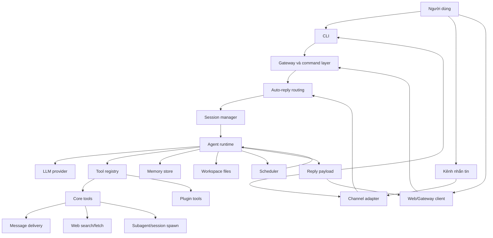
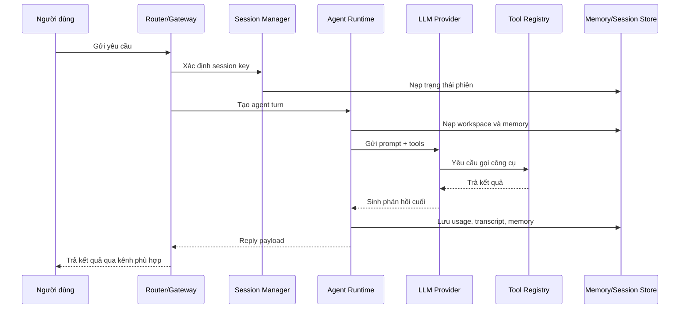
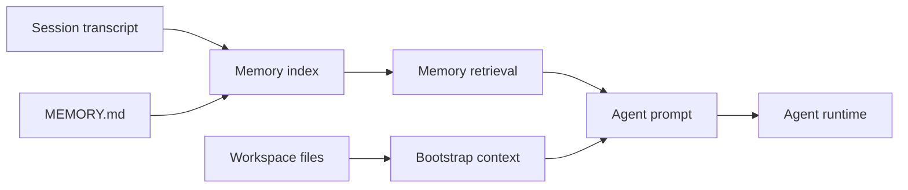
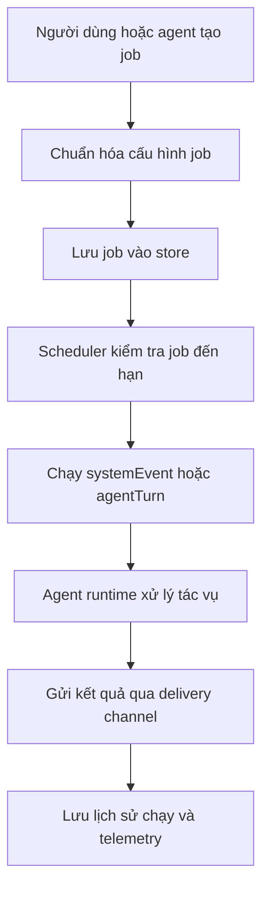

# BỘ GIÁO DỤC VÀ ĐÀO TẠO

# TRƯỜNG ĐẠI HỌC TÂN TẠO

# KHOA CÔNG NGHỆ THÔNG TIN

---

# ĐỒ ÁN TỐT NGHIỆP ĐẠI HỌC

# NGHIÊN CỨU VÀ XÂY DỰNG HỆ THỐNG TÁC NHÂN TỰ CHỦ HỖ TRỢ TỰ ĐỘNG HÓA QUY TRÌNH MARKETING SỐ ĐA KÊNH

Ngành: Công nghệ thông tin

Sinh viên thực hiện: [Họ và tên sinh viên]

Mã số sinh viên: [MSSV]

Giảng viên hướng dẫn: [Học hàm, học vị. Họ tên giảng viên hướng dẫn]

Tây Ninh, tháng [..] năm 20[..]

---

# TRANG PHÊ DUYỆT

Đồ án tốt nghiệp với đề tài **"Nghiên cứu và xây dựng hệ thống tác nhân tự chủ hỗ trợ tự động hóa quy trình marketing số đa kênh"** đã được trình và bảo vệ trước Hội đồng chấm đồ án tốt nghiệp ngành Công nghệ thông tin, Trường Đại học Tân Tạo.

Ngày bảo vệ: ....../....../20......

Kết quả: ....../10 điểm

Giảng viên hướng dẫn: ................................................

Giảng viên phản biện: ................................................

Chủ tịch Hội đồng: ................................................

---

# LỜI CẢM ƠN

Em xin chân thành cảm ơn Khoa Công nghệ thông tin, Trường Đại học Tân Tạo đã tạo điều kiện thuận lợi cho em trong quá trình học tập, nghiên cứu và thực hiện đồ án tốt nghiệp.

Em xin bày tỏ lòng biết ơn sâu sắc đến Thầy Cao Tiến Dũng, giảng viên hướng dẫn của em, đã tận tình định hướng, chỉ bảo và góp ý cho em trong suốt quá trình thực hiện đồ án. Những hướng dẫn và góp ý của Thầy đã giúp em hiểu rõ hơn về phương pháp nghiên cứu, cách phân tích và thiết kế hệ thống, cũng như cách trình bày một đề tài tốt nghiệp một cách khoa học và hoàn chỉnh.

Em cũng xin gửi lời cảm ơn đến quý thầy cô trong Khoa Công nghệ thông tin đã truyền đạt cho em những kiến thức nền tảng về lập trình, hệ thống phần mềm, trí tuệ nhân tạo, cơ sở dữ liệu, mạng máy tính và kiểm thử phần mềm. Đây là những kiến thức quan trọng giúp em có cơ sở để nghiên cứu và xây dựng hệ thống trong đồ án này.

Bên cạnh đó, em xin chân thành cảm ơn gia đình đã luôn động viên, quan tâm và tạo điều kiện cho em trong suốt quá trình học tập. Em cũng cảm ơn bạn bè và những người đã hỗ trợ, chia sẻ ý kiến, góp ý và khích lệ em trong quá trình hoàn thiện đồ án.

Do hạn chế về thời gian, kinh nghiệm nghiên cứu và kinh nghiệm triển khai thực tế, đồ án không tránh khỏi những thiếu sót. Em kính mong nhận được sự góp ý của quý thầy cô để có thể tiếp tục hoàn thiện và phát triển hệ thống tốt hơn trong tương lai.

Em xin chân thành cảm ơn!

---

# TÓM TẮT ĐỒ ÁN

Trong bối cảnh marketing số ngày càng phát triển, cá nhân và doanh nghiệp nhỏ thường phải thực hiện nhiều công việc cùng lúc như nghiên cứu thị trường, theo dõi xu hướng, xây dựng thông điệp, tạo nội dung, lên lịch đăng bài, phản hồi khách hàng, theo dõi hiệu quả chiến dịch và tổng hợp báo cáo. Các công việc này có tính lặp lại, diễn ra trên nhiều nền tảng khác nhau và đòi hỏi sự nhất quán về thông tin thương hiệu, giọng văn truyền thông cũng như mục tiêu chiến dịch.

Đồ án này nghiên cứu và xây dựng một hệ thống tác nhân tự chủ nhằm hỗ trợ tự động hóa quy trình marketing số đa kênh. Mục tiêu của đồ án là xây dựng một tác nhân marketing có khả năng tiếp nhận mục tiêu từ người dùng, duy trì ngữ cảnh thương hiệu, hỗ trợ lập kế hoạch nội dung, tạo bản nháp, nhắc việc, theo dõi chiến dịch và tổng hợp báo cáo. Phương pháp thực hiện bao gồm phân tích nhu cầu thực tế trong quy trình marketing số, nghiên cứu cơ sở lý thuyết về mô hình ngôn ngữ lớn và tác nhân tự chủ, thiết kế kiến trúc hệ thống, hiện thực các thành phần chính và kiểm thử các chức năng cốt lõi.

Kết quả đạt được là một tác nhân marketing tự chủ có khả năng hỗ trợ người dùng trong nhiều giai đoạn của quy trình marketing số, từ nghiên cứu, lập kế hoạch, sản xuất nội dung đến theo dõi và báo cáo. Hệ thống góp phần giảm khối lượng công việc lặp lại, tăng tính nhất quán trong truyền thông và hỗ trợ người dùng duy trì hoạt động marketing thường xuyên hơn.

Từ khóa: tác nhân tự chủ, marketing số, tự động hóa marketing, đa kênh, lập kế hoạch nội dung, báo cáo chiến dịch.

---

# ABSTRACT

In the context of the rapid development of digital marketing, individuals and small businesses often have to perform multiple tasks at the same time, such as market research, trend monitoring, message development, content creation, post scheduling, customer response, campaign tracking, and report generation. These tasks are repetitive, take place across multiple platforms, and require consistency in brand information, communication style, and campaign objectives.

This thesis studies and develops an autonomous agent system to support the automation of multi-channel digital marketing workflows. The main objective is to build a marketing agent capable of receiving user goals, maintaining brand context, supporting content planning, generating drafts, creating reminders, monitoring campaigns, and summarizing reports. The methodology includes analyzing practical needs in digital marketing workflows, studying the theoretical background of large language models and autonomous agents, designing the system architecture, implementing core components, and testing the main functions.

The result is an autonomous marketing agent that can assist users in several stages of the digital marketing process, from research and planning to content production, monitoring, and reporting. The system helps reduce repetitive work, improve communication consistency, and support users in maintaining regular marketing activities. The thesis concludes that applying an autonomous agent approach to digital marketing is a practical direction, especially for individuals and small teams with limited resources.

Keywords: autonomous agent, digital marketing, marketing automation, multi-channel, content planning, campaign reporting.

---

# MỤC LỤC

- [Danh mục hình ảnh](#danh-mục-hình-ảnh)
- [Danh mục bảng biểu](#danh-mục-bảng-biểu)
- [Danh mục từ viết tắt](#danh-mục-từ-viết-tắt)
- [Chương 1: Giới thiệu](#chương-1-giới-thiệu)
- [Chương 2: Cơ sở lý thuyết và tổng quan](#chương-2-cơ-sở-lý-thuyết-và-tổng-quan)
- [Chương 3: Phương pháp nghiên cứu và thiết kế hệ thống](#chương-3-phương-pháp-nghiên-cứu-và-thiết-kế-hệ-thống)
- [Chương 4: Hiện thực và kết quả](#chương-4-hiện-thực-và-kết-quả)
- [Chương 5: Kết luận và hướng phát triển](#chương-5-kết-luận-và-hướng-phát-triển)
- [Tài liệu tham khảo](#tài-liệu-tham-khảo)
- [Phụ lục](#phụ-lục)

---

# DANH MỤC HÌNH ẢNH

- Hình 1.1: Quy trình marketing số được hỗ trợ bởi tác nhân tự chủ.
- Hình 2.1: Sự khác nhau giữa chatbot phản hồi và tác nhân tự chủ.
- Hình 3.1: Kiến trúc tổng thể của hệ thống đề xuất.
- Hình 3.2: Luồng xử lý yêu cầu người dùng.
- Hình 3.3: Mô hình quản lý ngữ cảnh và dữ liệu.
- Hình 3.4: Luồng thực thi tác vụ định kỳ.
- Hình 4.1: Cấu trúc thư mục mã nguồn.
- Hình 4.2: Quy trình khởi tạo và sử dụng hệ thống.
- Hình 4.3: Quy trình xử lý tin nhắn đa kênh.

---

# DANH MỤC BẢNG BIỂU

- Bảng 1.1: Phạm vi chức năng của đề tài.
- Bảng 2.1: So sánh chatbot, tự động hóa quy trình và tác nhân tự chủ.
- Bảng 3.1: Yêu cầu chức năng.
- Bảng 3.2: Yêu cầu phi chức năng.
- Bảng 3.3: Các thành phần chính trong kiến trúc hệ thống.
- Bảng 4.1: Ánh xạ chức năng với module mã nguồn.
- Bảng 4.2: Kịch bản kiểm thử chức năng.
- Bảng 4.3: Đánh giá kết quả so với mục tiêu.

---

# DANH MỤC TỪ VIẾT TẮT

| Từ viết tắt | Giải thích                                                                           |
| ----------- | ------------------------------------------------------------------------------------ |
| AI          | Artificial Intelligence - Trí tuệ nhân tạo                                           |
| Agent       | Tác nhân phần mềm có khả năng nhận mục tiêu, quyết định hành động và sử dụng công cụ |
| Agentic AI  | Hệ thống AI có khả năng lập kế hoạch, ghi nhớ ngữ cảnh và hỗ trợ xử lý nhiều bước    |
| API         | Application Programming Interface - Giao diện lập trình ứng dụng                     |
| CRM         | Customer Relationship Management - Quản lý quan hệ khách hàng                        |
| LLM         | Large Language Model - Mô hình ngôn ngữ lớn                                          |
| UI          | User Interface - Giao diện người dùng                                                |
| UX          | User Experience - Trải nghiệm người dùng                                             |

---

# CHƯƠNG 1: GIỚI THIỆU

## 1.1. Đặt vấn đề

Marketing số hiện đại không còn chỉ là việc viết một bài quảng cáo hoặc đăng nội dung lên một nền tảng duy nhất. Một chiến dịch marketing thường bao gồm nhiều hoạt động liên kết với nhau như nghiên cứu thị trường, phân tích khách hàng, nghiên cứu đối thủ cạnh tranh, theo dõi xu hướng, xây dựng thông điệp, tạo nội dung, lên lịch đăng tải, phân phối nội dung trên nhiều nền tảng, theo dõi phản hồi, tổng hợp báo cáo và điều chỉnh kế hoạch. Các hoạt động này diễn ra liên tục, lặp lại và chịu ảnh hưởng bởi mục tiêu kinh doanh, phong cách thương hiệu, đặc điểm từng kênh truyền thông cũng như hành vi của khách hàng.

Trong thực tế, cá nhân, nhà sáng tạo nội dung, nhóm nhỏ hoặc doanh nghiệp nhỏ thường chưa có đủ nguồn lực để vận hành marketing một cách đều đặn và nhất quán. Người làm marketing không chỉ cần nghĩ ý tưởng và viết nội dung, mà còn phải điều chỉnh nội dung cho phù hợp với từng nền tảng như Facebook Fanpage, Instagram, TikTok, LinkedIn hoặc các kênh mạng xã hội khác. Cùng một thông điệp có thể cần được biến đổi thành nhiều định dạng khác nhau như bài viết ngắn, caption, kịch bản video hoặc nội dung chuyên nghiệp cho LinkedIn. Nếu thực hiện thủ công, quá trình này dễ tiêu tốn nhiều thời gian, gây quá tải, làm gián đoạn lịch đăng bài và khiến nội dung thiếu nhất quán giữa các kênh.

Bên cạnh đó, hoạt động marketing số còn đòi hỏi khả năng theo dõi thị trường, phân tích đối thủ và đánh giá hiệu quả chiến dịch. Tuy nhiên, việc thu thập, tổng hợp và phân tích các thông tin này thường mất nhiều công sức, đặc biệt khi dữ liệu phân tán trên nhiều nền tảng khác nhau. Nếu không có công cụ hỗ trợ phù hợp, cá nhân và doanh nghiệp nhỏ có thể bỏ lỡ cơ hội cải thiện chiến dịch hoặc không kịp phản ứng với thay đổi của thị trường.

Từ những vấn đề trên, đề tài hướng đến việc nghiên cứu và xây dựng một hệ thống tác nhân marketing tự chủ hỗ trợ tự động hóa quy trình marketing số đa kênh. Hệ thống không chỉ hỗ trợ tạo nội dung như một chatbot thông thường, mà còn có khả năng tiếp nhận mục tiêu, duy trì ngữ cảnh thương hiệu, nghiên cứu xu hướng, phân tích đối thủ, lập kế hoạch nội dung, tạo bài đăng phù hợp với từng nền tảng, hỗ trợ đăng hoặc lên lịch đăng bài trên nhiều kênh mạng xã hội, nhắc việc, theo dõi hiệu quả chiến dịch và tổng hợp báo cáo. Qua đó, hệ thống giúp giảm khối lượng công việc thủ công, duy trì lịch đăng bài đều đặn, tăng tính nhất quán trong truyền thông và nâng cao khả năng vận hành marketing số với nguồn lực hạn chế.

## 1.2. Mục tiêu nghiên cứu

### 1.2.1. Mục tiêu tổng quát

Mục tiêu tổng quát của đề tài là nghiên cứu và xây dựng một hệ thống tác nhân marketing tự chủ hỗ trợ tự động hóa quy trình marketing số đa kênh. Hệ thống hướng đến việc giúp cá nhân, nhà sáng tạo nội dung, nhóm nhỏ hoặc doanh nghiệp nhỏ giảm khối lượng công việc thủ công trong quá trình lập kế hoạch, tạo nội dung, phân phối nội dung, theo dõi chiến dịch và tổng hợp báo cáo.

Hệ thống được thiết kế để có khả năng tiếp nhận mục tiêu từ người dùng, duy trì ngữ cảnh thương hiệu, hỗ trợ tạo nội dung phù hợp với từng nền tảng, hỗ trợ đăng hoặc lên lịch đăng bài trên nhiều kênh mạng xã hội, nghiên cứu xu hướng, phân tích đối thủ cạnh tranh và đưa ra gợi ý cải thiện hoạt động marketing. Qua đó, đề tài hướng đến việc xây dựng một tác nhân có thể hỗ trợ người dùng vận hành marketing số thường xuyên, nhất quán và hiệu quả hơn trong điều kiện nguồn lực còn hạn chế.

### 1.2.2. Mục tiêu cụ thể

Để đạt được mục tiêu tổng quát, đề tài tập trung thực hiện các mục tiêu cụ thể sau:

- Phân tích các khó khăn thường gặp trong quy trình marketing số của cá nhân, nhà sáng tạo nội dung, nhóm nhỏ và doanh nghiệp nhỏ.
- Nghiên cứu cơ sở lý thuyết liên quan đến marketing số, tự động hóa marketing, mô hình ngôn ngữ lớn và tác nhân tự chủ.
- Xây dựng hệ thống tác nhân marketing tự chủ có khả năng tiếp nhận yêu cầu và mục tiêu từ người dùng bằng ngôn ngữ tự nhiên.
- Thiết kế cơ chế duy trì ngữ cảnh thương hiệu, bao gồm thông tin sản phẩm, khách hàng mục tiêu, giọng văn, thông điệp truyền thông và mục tiêu chiến dịch.
- Hỗ trợ người dùng lập kế hoạch nội dung theo ngày, tuần hoặc theo từng chiến dịch marketing cụ thể.
- Hỗ trợ tạo nội dung marketing như bài đăng mạng xã hội, caption, ý tưởng nội dung, kịch bản ngắn và các biến thể nội dung phù hợp với từng nền tảng.
- Hỗ trợ điều chỉnh và phân phối nội dung trên nhiều kênh mạng xã hội như Facebook Fanpage, Instagram, TikTok, LinkedIn hoặc các nền tảng khác tùy theo cấu hình của người dùng.
- Hỗ trợ nghiên cứu xu hướng, phân tích đối thủ cạnh tranh và đưa ra gợi ý cải thiện nội dung hoặc chiến dịch marketing.
- Xây dựng cơ chế nhắc việc, lên lịch đăng bài và tạo báo cáo định kỳ nhằm hỗ trợ người dùng duy trì hoạt động marketing thường xuyên.
- Kiểm thử và đánh giá hệ thống dựa trên các tiêu chí như khả năng đáp ứng yêu cầu, tính nhất quán của nội dung, khả năng hỗ trợ đa kênh, khả năng mở rộng và mức độ phù hợp với nhu cầu thực tế.

## 1.3. Đối tượng và phạm vi nghiên cứu

### 1.3.1. Đối tượng nghiên cứu

Đối tượng nghiên cứu của đề tài là quy trình marketing số đa kênh và việc ứng dụng tác nhân tự chủ vào hỗ trợ tự động hóa các công việc trong quy trình này.

Cụ thể, đề tài tập trung nghiên cứu các đối tượng sau:

- Quy trình marketing số của cá nhân, nhà sáng tạo nội dung, nhóm nhỏ và doanh nghiệp nhỏ.
- Các công việc marketing có tính lặp lại như nghiên cứu xu hướng, phân tích đối thủ cạnh tranh, lập kế hoạch nội dung, tạo nội dung, điều chỉnh nội dung theo từng nền tảng, lên lịch đăng bài, theo dõi phản hồi và tổng hợp báo cáo.
- Hệ thống tác nhân tự chủ có khả năng tiếp nhận mục tiêu từ người dùng, duy trì ngữ cảnh thương hiệu, sử dụng công cụ hỗ trợ và thực hiện nhiều bước trong quy trình marketing.
- Cơ chế quản lý ngữ cảnh thương hiệu, bao gồm thông tin sản phẩm, khách hàng mục tiêu, phong cách viết, thông điệp truyền thông và mục tiêu chiến dịch.
- Khả năng hỗ trợ phân phối nội dung trên nhiều nền tảng mạng xã hội như Facebook Fanpage, Instagram, TikTok, LinkedIn hoặc các kênh khác tùy theo cấu hình của người dùng.
- Các phương pháp đánh giá hệ thống dựa trên mức độ đáp ứng yêu cầu, tính nhất quán của nội dung, khả năng hỗ trợ đa kênh và khả năng mở rộng trong thực tế.

### 1.3.2. Phạm vi nghiên cứu

Đồ án tập trung nghiên cứu và xây dựng một hệ thống tác nhân marketing tự chủ hỗ trợ tự động hóa các bước phổ biến trong quy trình marketing số đa kênh. Các nội dung chính trong phạm vi đề tài bao gồm: nghiên cứu xu hướng, phân tích đối thủ cạnh tranh, lập kế hoạch nội dung, tạo bản nháp bài đăng, điều chỉnh nội dung cho phù hợp với từng nền tảng, hỗ trợ đăng hoặc lên lịch đăng bài, nhắc việc, theo dõi thông tin chiến dịch và tạo báo cáo.

Về mặt kỹ thuật, đề tài tập trung vào các thành phần cốt lõi như lõi xử lý tác nhân, quản lý ngữ cảnh, bộ nhớ dài hạn, quản lý phiên làm việc, công cụ hỗ trợ, lập lịch tác vụ định kỳ và tích hợp kênh giao tiếp. Hệ thống hướng đến việc hỗ trợ người dùng gửi yêu cầu, nhận phản hồi và nhận báo cáo qua nhiều kênh đã được cấu hình.

Đề tài không đi sâu vào các bài toán tối ưu marketing chuyên biệt như dự đoán doanh thu, phân bổ ngân sách quảng cáo, đấu giá quảng cáo, tối ưu chuyển đổi bằng mô hình thống kê nâng cao hoặc thay thế hoàn toàn các nền tảng quản lý mạng xã hội chuyên nghiệp. Các chức năng liên quan đến đăng bài đa nền tảng, phân tích đối thủ và theo dõi hiệu quả chiến dịch được giới hạn ở mức hỗ trợ quy trình, tạo đề xuất, tạo bản nháp, nhắc việc và tổng hợp thông tin.

Bảng 1.1 trình bày phạm vi chức năng chính của đề tài.
| Nhóm chức năng | Có trong phạm vi | Ghi chú |
| ---------------------------------- | -------------------- | -------------------------------------------------------------------------- |
| Tác nhân tự chủ | Có | Nhận mục tiêu và hỗ trợ thực hiện nhiều bước marketing |
| Tạo nội dung marketing | Có | Tạo bài đăng, chú thích, ý tưởng nội dung và biến thể nội dung |
| Điều chỉnh nội dung theo nền tảng | Có | Tùy biến nội dung cho Facebook, Instagram, TikTok, LinkedIn hoặc kênh khác |
| Đăng hoặc lên lịch đa nền tảng | Có định hướng hỗ trợ | Phụ thuộc vào khả năng tích hợp và cấu hình từng kênh |
| Nghiên cứu xu hướng | Có | Hỗ trợ tổng hợp và gợi ý chủ đề nội dung |
| Phân tích đối thủ cạnh tranh | Có | Dừng ở mức tổng hợp thông tin và đề xuất cải thiện |
| Làm việc đa kênh | Có | Người dùng có thể yêu cầu và nhận kết quả qua nhiều kênh |
| Ghi nhớ thông tin thương hiệu | Có | Lưu phong cách, mục tiêu và thông tin quan trọng |
| Nhắc việc và báo cáo định kỳ | Có | Hỗ trợ các công việc marketing lặp lại |
| Tối ưu quảng cáo trả phí | Không đi sâu | Chỉ dừng ở mức hỗ trợ phân tích và gợi ý |
| Bảng điều khiển phân tích nâng cao | Không phải trọng tâm | Có thể là hướng mở rộng |

## 1.4. Phương pháp nghiên cứu

Đồ án sử dụng các phương pháp sau:

- Phương pháp phân tích tài liệu: nghiên cứu các khái niệm về marketing số, marketing automation, mô hình ngôn ngữ lớn và tác nhân tự chủ.
- Phương pháp phân tích nghiệp vụ: xác định các công việc marketing thường lặp lại và các điểm người dùng cần hỗ trợ.
- Phương pháp phân tích hệ thống: chuyển các nhu cầu nghiệp vụ thành yêu cầu chức năng, phi chức năng và luồng xử lý.
- Phương pháp thiết kế kiến trúc: thiết kế các thành phần kỹ thuật để đáp ứng yêu cầu đã phân tích.
- Phương pháp hiện thực phần mềm: sử dụng TypeScript, Node.js và các thành phần lưu trữ, tích hợp phù hợp với hệ thống.
- Phương pháp kiểm thử: kiểm thử các luồng sử dụng chính như tạo nội dung, nhắc việc, báo cáo, xử lý đa kênh và các chức năng kỹ thuật liên quan.
- Phương pháp đánh giá: so sánh kết quả triển khai với mục tiêu ban đầu, phân tích ưu điểm, hạn chế và khả năng phát triển.

## 1.5. Ý nghĩa khoa học và thực tiễn

Về mặt khoa học, đề tài góp phần hệ thống hóa việc ứng dụng tác nhân tự chủ vào một quy trình nghiệp vụ cụ thể là marketing số đa kênh. Thay vì chỉ sử dụng mô hình ngôn ngữ lớn để tạo nội dung riêng lẻ, đề tài nghiên cứu cách kết hợp giữa tác nhân tự chủ, quản lý ngữ cảnh, bộ nhớ dài hạn, công cụ hỗ trợ và cơ chế lập lịch tác vụ để hỗ trợ một chuỗi công việc marketing gồm nghiên cứu, lập kế hoạch, tạo nội dung, phân phối nội dung và tổng hợp báo cáo.

Bên cạnh đó, đề tài có ý nghĩa trong việc nghiên cứu hướng tùy biến và phát triển hệ thống tác nhân theo một miền ứng dụng cụ thể. Việc kế thừa, điều chỉnh và mở rộng một số thành phần nền tảng có sẵn cho bài toán marketing số giúp làm rõ cách chuyển một hệ thống tác nhân tổng quát thành một hệ thống có định hướng nghiệp vụ rõ ràng, phù hợp với yêu cầu thực tế của người dùng.

Về mặt thực tiễn, hệ thống có thể hỗ trợ cá nhân, nhà sáng tạo nội dung, nhóm nhỏ và doanh nghiệp nhỏ giảm bớt khối lượng công việc thủ công trong quá trình vận hành marketing. Các chức năng như lập kế hoạch nội dung, tạo bài đăng, điều chỉnh nội dung theo từng nền tảng, nhắc việc, theo dõi xu hướng, phân tích đối thủ và tạo báo cáo giúp người dùng duy trì hoạt động marketing thường xuyên hơn.

Ngoài ra, hệ thống còn góp phần tăng tính nhất quán trong truyền thông nhờ khả năng duy trì ngữ cảnh thương hiệu, bao gồm thông tin sản phẩm, khách hàng mục tiêu, phong cách viết và mục tiêu chiến dịch. Điều này có ý nghĩa thực tế đối với các cá nhân và nhóm nhỏ chưa có đủ nguồn lực để xây dựng một đội ngũ marketing chuyên trách nhưng vẫn cần vận hành nội dung trên nhiều kênh khác nhau.

## 1.6. Bố cục đồ án

Đồ án được tổ chức thành 5 chương chính như sau:

- Chương 1: Giới thiệu
  Trình bày bối cảnh, lý do chọn đề tài, mục tiêu nghiên cứu, đối tượng và phạm vi nghiên cứu, phương pháp nghiên cứu, ý nghĩa khoa học và thực tiễn của đề tài.

- Chương 2: Cơ sở lý thuyết và tổng quan
  Trình bày các khái niệm và nền tảng lý thuyết liên quan đến marketing số, tự động hóa marketing, mô hình ngôn ngữ lớn, tác nhân tự chủ, quản lý ngữ cảnh, hệ thống đa kênh và các công nghệ được sử dụng trong đề tài.

- Chương 3: Phương pháp nghiên cứu và thiết kế hệ thống
  Phân tích yêu cầu chức năng, yêu cầu phi chức năng và trình bày thiết kế hệ thống. Nội dung chương bao gồm kiến trúc tổng thể, các thành phần chính, cơ chế quản lý ngữ cảnh, quản lý phiên làm việc, bộ nhớ dài hạn, lập lịch tác vụ, tích hợp kênh giao tiếp và luồng xử lý chính của hệ thống.

- Chương 4: Hiện thực và kết quả
  Trình bày môi trường phát triển, công nghệ sử dụng, quá trình hiện thực các chức năng chính, kết quả đạt được, các kịch bản sử dụng tiêu biểu và quá trình kiểm thử hệ thống.

- Chương 5: Kết luận và hướng phát triển
  Tổng kết kết quả đã đạt được, đánh giá mức độ hoàn thành mục tiêu đề tài, nêu các hạn chế còn tồn tại và đề xuất hướng phát triển trong tương lai.

---

# CHƯƠNG 2: CƠ SỞ LÝ THUYẾT VÀ TỔNG QUAN

## 2.1. Các khái niệm liên quan

### 2.1.1. Marketing số

Marketing số là tập hợp các hoạt động tiếp thị sử dụng nền tảng kỹ thuật số để tiếp cận, tương tác và chuyển đổi khách hàng. Các kênh thường gặp gồm website, mạng xã hội, email, ứng dụng nhắn tin, công cụ tìm kiếm và cộng đồng trực tuyến. Một quy trình marketing số thường bao gồm nghiên cứu, lập kế hoạch, sản xuất nội dung, phân phối, tương tác và đo lường.

Trong đồ án này, marketing số được hiểu là miền ứng dụng chính của hệ thống. Hệ thống không thay thế hoàn toàn chuyên môn của người làm marketing, mà hỗ trợ các công việc có tính lặp lại, cần tổng hợp thông tin, cần duy trì tính nhất quán hoặc cần được thực hiện đều đặn theo kế hoạch.

### 2.1.2. Mô hình ngôn ngữ lớn

Mô hình ngôn ngữ lớn là mô hình học sâu được huấn luyện trên khối lượng dữ liệu văn bản lớn, có khả năng hiểu ngôn ngữ tự nhiên, sinh văn bản, tóm tắt, phân tích, lập luận và hỗ trợ lập trình. Trong hệ thống đề xuất, LLM đóng vai trò bộ phận suy luận và sinh ngôn ngữ cho tác nhân.

Tuy nhiên, LLM riêng lẻ có một số hạn chế: thường phản hồi theo từng yêu cầu riêng lẻ, không tự theo dõi toàn bộ quy trình marketing dài hạn và có thể tạo ra nội dung chưa phù hợp nếu thiếu thông tin thương hiệu. Vì vậy, khi ứng dụng vào marketing, LLM cần được đặt trong một hệ thống có khả năng giữ ngữ cảnh, hỗ trợ nhiều bước công việc và kiểm soát kết quả đầu ra.

### 2.1.3. Tác nhân tự chủ

Tác nhân tự chủ là một thực thể phần mềm có khả năng nhận mục tiêu, quan sát ngữ cảnh, quyết định hành động và trả về kết quả sau nhiều bước xử lý. Trong ngữ cảnh AI hiện đại, tác nhân thường sử dụng LLM làm lõi suy luận, nhưng giá trị thực tế của tác nhân nằm ở khả năng hỗ trợ cả một quy trình thay vì chỉ sinh một câu trả lời đơn lẻ.

Một tác nhân tự chủ khác với chatbot ở chỗ nó có thể hỗ trợ chuỗi hành động nhiều bước. Ví dụ, khi người dùng yêu cầu chuẩn bị kế hoạch nội dung cho một chiến dịch, tác nhân có thể phân tích mục tiêu, đề xuất nhóm khách hàng, tạo ý tưởng nội dung, sắp xếp lịch đăng, nhắc người dùng kiểm tra kết quả và tổng hợp báo cáo sau chiến dịch.

### 2.1.4. Quy trình tác nhân tự chủ

Quy trình tác nhân tự chủ là quy trình trong đó hệ thống AI không chỉ trả lời, mà còn hỗ trợ nhiều bước xử lý để đi từ yêu cầu ban đầu đến kết quả cuối cùng. Quy trình này thường gồm các bước:

1. Nhận mục tiêu hoặc yêu cầu từ người dùng.
2. Phân tích yêu cầu và ngữ cảnh.
3. Lập kế hoạch hoặc chọn hành động tiếp theo.
4. Gọi công cụ phù hợp.
5. Quan sát kết quả trung gian.
6. Cập nhật thông tin cần ghi nhớ.
7. Tiếp tục thực hiện cho đến khi đạt mục tiêu.
8. Trả kết quả hoặc gửi báo cáo qua kênh thích hợp.

Trong hệ thống đề xuất, quy trình tác nhân tự chủ được dùng để mô tả cách hệ thống hỗ trợ người dùng đi từ mục tiêu marketing ban đầu đến kết quả cụ thể như kế hoạch nội dung, bản nháp bài đăng, lịch nhắc việc hoặc báo cáo chiến dịch.

### 2.1.5. Duy trì ngữ cảnh thương hiệu

Duy trì ngữ cảnh thương hiệu là yêu cầu quan trọng trong marketing số. Một hệ thống hỗ trợ marketing cần biết sản phẩm đang bán là gì, khách hàng mục tiêu là ai, giọng văn thương hiệu như thế nào, các thông điệp nào đã sử dụng trước đó và mục tiêu chiến dịch hiện tại là gì.

Nếu không duy trì được ngữ cảnh, hệ thống có thể tạo nội dung không nhất quán, lặp lại ý tưởng cũ hoặc đưa ra gợi ý không phù hợp với thương hiệu. Vì vậy, khả năng ghi nhớ và tái sử dụng thông tin quan trọng là một phần cần thiết của hệ thống tác nhân tự chủ.

### 2.1.6. Tự động hóa đa kênh

Tự động hóa đa kênh là khả năng hỗ trợ người dùng trên nhiều nền tảng làm việc khác nhau. Đối với marketing số, điều này đặc biệt quan trọng vì hoạt động marketing có thể diễn ra trên mạng xã hội, nhóm trao đổi nội bộ, ứng dụng nhắn tin, email hoặc các công cụ quản lý công việc. Hệ thống cần giúp người dùng gửi yêu cầu và nhận kết quả ở nơi họ đang làm việc, thay vì buộc mọi thao tác diễn ra trên một giao diện duy nhất.

## 2.2. Cơ sở lý thuyết

### 2.2.1. LLM trong vai trò trợ lý marketing

LLM có thể hỗ trợ nhiều công việc marketing như viết nội dung, tóm tắt thông tin, phân tích khách hàng, đề xuất ý tưởng và tạo nhiều biến thể thông điệp. Tuy nhiên, khi dùng LLM trong vai trò trợ lý marketing, cần chú ý đến ba vấn đề: thông tin đầu vào phải đủ rõ, nội dung đầu ra cần phù hợp với thương hiệu và kết quả nên được người dùng kiểm tra trước khi sử dụng trong chiến dịch thật.

Trong phạm vi đồ án, LLM không chỉ được xem là công cụ viết văn bản, mà là thành phần hỗ trợ suy luận trong một hệ thống lớn hơn. Các chi tiết về cách hệ thống kết nối LLM với các chức năng phần mềm sẽ được trình bày ở Chương 3.

### 2.2.2. Điều phối đa tác nhân

Điều phối đa tác nhân là mô hình trong đó một tác nhân chính có thể giao việc cho các tác nhân con hoặc khu vực xử lý riêng biệt. Mục đích là chia nhỏ công việc phức tạp, tách ngữ cảnh, chạy song song hoặc duy trì một phần chuyên trách cho một chủ đề.

Trong marketing, tư duy đa tác nhân có thể được hiểu như việc chia công việc cho nhiều vai trò chuyên môn khác nhau. Điều này phù hợp với các quy trình marketing như:

- Một tác nhân nghiên cứu thị trường.
- Một tác nhân viết nội dung.
- Một tác nhân phân tích phản hồi.
- Một tác nhân theo dõi lịch đăng và báo cáo.

### 2.2.3. Quản lý ngữ cảnh làm việc

Quản lý ngữ cảnh làm việc giúp hệ thống phân biệt các tình huống khác nhau. Ví dụ, một người dùng có thể vừa làm chiến dịch cho sản phẩm A, vừa chuẩn bị nội dung cho sản phẩm B. Nếu hai ngữ cảnh này bị trộn lẫn, hệ thống có thể đưa ra nội dung sai sản phẩm hoặc báo cáo nhầm chiến dịch.

Vì vậy, một hệ thống trợ lý marketing cần có khả năng phân biệt ngữ cảnh theo chiến dịch, kênh làm việc, người dùng hoặc nhóm nội dung. Cơ chế kỹ thuật để thực hiện điều này sẽ được trình bày trong phần thiết kế hệ thống.

### 2.2.4. Nhắc việc và tác vụ định kỳ

Một điểm khác biệt quan trọng giữa chatbot và tác nhân tự chủ là khả năng hỗ trợ các công việc cần thực hiện lặp lại. Trong marketing, nhiều hoạt động không xảy ra một lần mà cần được duy trì theo lịch, ví dụ kiểm tra xu hướng mỗi sáng, chuẩn bị lịch nội dung mỗi tuần hoặc tổng hợp báo cáo vào cuối ngày.

Trong marketing số, cơ chế nhắc việc và tác vụ định kỳ có thể dùng cho:

- Nhắc tạo báo cáo hằng ngày.
- Theo dõi xu hướng hằng tuần.
- Chuẩn bị lịch nội dung.
- Kiểm tra phản hồi từ chiến dịch.
- Gửi bản tóm tắt qua kênh đã cấu hình.

### 2.2.5. Quyền kiểm soát dữ liệu marketing

Dữ liệu marketing có thể bao gồm thông tin thương hiệu, phong cách nội dung, danh sách khách hàng, kế hoạch chiến dịch và lịch sử trao đổi. Đây là những dữ liệu có giá trị đối với cá nhân hoặc doanh nghiệp. Vì vậy, hệ thống cần quan tâm đến quyền kiểm soát dữ liệu, hạn chế lộ thông tin nhạy cảm và cho phép người dùng biết dữ liệu của mình được sử dụng như thế nào.

## 2.3. Tổng quan các hướng tiếp cận liên quan

### 2.3.1. Chatbot hỗ trợ marketing

Chatbot hỗ trợ marketing thường tập trung vào phản hồi câu hỏi, tạo nội dung theo yêu cầu hoặc trả lời khách hàng. Ưu điểm là dễ triển khai, chi phí thấp và thân thiện với người dùng. Tuy nhiên, chatbot thường thiếu khả năng ghi nhớ thông tin dài hạn, thiếu khả năng tự theo dõi công việc định kỳ và khó hỗ trợ các quy trình nhiều bước.

### 2.3.2. Công cụ marketing automation truyền thống

Các nền tảng marketing automation truyền thống thường mạnh ở email campaign, CRM, phân khúc khách hàng và báo cáo. Tuy nhiên, chúng thường yêu cầu cấu hình thủ công, quy trình cứng và ít linh hoạt trong việc suy luận ngôn ngữ tự nhiên. Người dùng phải thiết kế workflow trước, thay vì giao mục tiêu cấp cao cho tác nhân.

### 2.3.3. Hệ thống tác nhân tự chủ ứng dụng vào marketing

Hệ thống tác nhân tự chủ kết hợp ưu điểm của LLM và tự động hóa quy trình. Người dùng có thể mô tả mục tiêu bằng ngôn ngữ tự nhiên, còn hệ thống hỗ trợ chia nhỏ công việc, tạo kết quả trung gian và duy trì tiến độ. Đồ án này đi theo hướng đó, nhưng giới hạn trong phạm vi hỗ trợ quy trình marketing số thay vì xây dựng một nền tảng quảng cáo hoặc CRM thương mại hoàn chỉnh.

## 2.4. Công nghệ sử dụng

Hệ thống được triển khai chủ yếu bằng TypeScript trên nền Node.js. Các thành phần chính gồm:

- TypeScript: ngôn ngữ chính để xây dựng hệ thống.
- Node.js: môi trường thực thi.
- pnpm: quản lý gói và script phát triển.
- SQLite: lưu trữ cục bộ cho dữ liệu ngữ cảnh, lịch và trạng thái.
- LLM providers: hỗ trợ nhiều nhà cung cấp mô hình như OpenAI, Anthropic, Gemini, Groq, OpenRouter, Ollama và các provider tương thích.
- Kiến trúc mở rộng: hỗ trợ bổ sung provider, kênh và chức năng mới mà không sửa lõi hệ thống.
- Vitest: kiểm thử tự động.

## 2.5. Kết luận chương

Chương 2 đã trình bày nền tảng lý thuyết của đề tài, gồm marketing số, LLM, tác nhân tự chủ, quy trình nhiều bước, quản lý ngữ cảnh, tự động hóa định kỳ và quyền kiểm soát dữ liệu. Các khái niệm này là cơ sở để phân tích yêu cầu và thiết kế hệ thống trong Chương 3.

---

# CHƯƠNG 3: PHƯƠNG PHÁP NGHIÊN CỨU VÀ THIẾT KẾ HỆ THỐNG

## 3.1. Phương pháp nghiên cứu và cách tiếp cận

Đề tài được triển khai theo hướng phân tích hệ thống tác nhân tự chủ hiện có và hoàn thiện thiết kế đồ án dựa trên các thành phần đã được hiện thực. Thay vì mô tả hệ thống như một chatbot marketing, đồ án xác định lõi kỹ thuật là một nền tảng tác nhân tự chủ. Vì vậy, quá trình thiết kế tập trung vào các câu hỏi:

- Hệ thống nhận yêu cầu từ người dùng qua những bề mặt nào?
- Yêu cầu được ánh xạ vào phiên và tác nhân như thế nào?
- Tác nhân được cung cấp công cụ nào để thực thi hành động?
- Hệ thống lưu và truy xuất ngữ cảnh dài hạn như thế nào?
- Tác vụ tự động theo lịch được tạo, chạy và gửi kết quả ra sao?
- Plugin và channel adapter được tổ chức thế nào để mở rộng?
- Cơ chế kiểm soát lỗi, fallback mô hình và bảo mật được xử lý ra sao?

## 3.2. Phân tích yêu cầu

### 3.2.1. Yêu cầu chức năng

Bảng 3.1 mô tả các yêu cầu chức năng chính của hệ thống.

| Mã    | Yêu cầu                | Mô tả                                                                                                 |
| ----- | ---------------------- | ----------------------------------------------------------------------------------------------------- |
| FR-01 | Khởi tạo hệ thống      | Người dùng có thể cấu hình provider, workspace, channel và agent thông qua CLI hoặc file cấu hình     |
| FR-02 | Chạy tác nhân qua CLI  | Người dùng có thể gửi yêu cầu đơn lẻ hoặc mở phiên chat tương tác                                     |
| FR-03 | Chạy gateway           | Hệ thống có thể chạy gateway để nhận yêu cầu từ kênh và bề mặt điều khiển                             |
| FR-04 | Quản lý phiên          | Hệ thống phân biệt phiên theo agent, kênh, người gửi, nhóm hoặc thread                                |
| FR-05 | Sử dụng công cụ        | Tác nhân có thể gọi công cụ tìm kiếm, gửi tin nhắn, quản lý session, cron, image, PDF và plugin tools |
| FR-06 | Bộ nhớ dài hạn         | Hệ thống lưu và truy xuất thông tin người dùng, thương hiệu, phiên làm việc và ngữ cảnh               |
| FR-07 | Điều phối tác nhân con | Tác nhân có thể tạo phiên con hoặc phiên biệt lập để xử lý tác vụ riêng                               |
| FR-08 | Tác vụ định kỳ         | Người dùng hoặc tác nhân có thể tạo job chạy một lần hoặc định kỳ                                     |
| FR-09 | Giao tiếp đa kênh      | Hệ thống có thể nhận và gửi thông điệp qua nhiều channel adapter                                      |
| FR-10 | Mở rộng plugin         | Hệ thống có thể nạp công cụ và kênh từ plugin                                                         |
| FR-11 | Theo dõi vận hành      | Hệ thống ghi nhận model, token, chi phí ước lượng, log và trạng thái phiên                            |
| FR-12 | Hỗ trợ marketing       | Hệ thống hỗ trợ nghiên cứu, lập kế hoạch, tạo nội dung, nhắc lịch và báo cáo marketing                |

### 3.2.2. Yêu cầu phi chức năng

Bảng 3.2 mô tả các yêu cầu phi chức năng.

| Mã     | Yêu cầu           | Mô tả                                                                   |
| ------ | ----------------- | ----------------------------------------------------------------------- |
| NFR-01 | Khả năng mở rộng  | Có thể thêm provider, channel hoặc tool thông qua plugin                |
| NFR-02 | Tính riêng tư     | Ưu tiên lưu dữ liệu trên thiết bị hoặc hạ tầng người dùng kiểm soát     |
| NFR-03 | Độ tin cậy        | Có fallback mô hình, retry lỗi tạm thời và quản lý lỗi phiên            |
| NFR-04 | Bảo mật           | Có cơ chế kiểm soát quyền owner, secret reference, sandbox và allowlist |
| NFR-05 | Khả năng bảo trì  | Mã nguồn phân tách theo module rõ ràng                                  |
| NFR-06 | Khả năng kiểm thử | Có test cho command, session, channel, cron và runtime                  |
| NFR-07 | Khả năng quan sát | Có log, usage, trace và trạng thái gateway                              |
| NFR-08 | Tính tương thích  | Hỗ trợ nhiều provider LLM và nhiều môi trường triển khai                |

## 3.3. Thiết kế hệ thống

### 3.3.1. Kiến trúc tổng thể

Hệ thống được thiết kế theo kiến trúc nhiều lớp. Người dùng tương tác qua CLI, gateway hoặc kênh nhắn tin. Gateway và auto-reply routing tiếp nhận sự kiện, xác định phiên, chọn agent, sau đó gọi agent runtime. Agent runtime cung cấp LLM, công cụ, memory, workspace và session context. Kết quả được trả về CLI hoặc gửi lại kênh gốc.



Bảng 3.3 mô tả các thành phần chính.

| Thành phần         | Vai trò                                                               |
| ------------------ | --------------------------------------------------------------------- |
| CLI                | Cho phép chat, run task, onboard, cấu hình, status, channel setup     |
| Gateway            | Bề mặt điều khiển HTTP/WebSocket, nhận lệnh và sự kiện                |
| Channel adapter    | Kết nối với các kênh như Telegram, Discord, Slack, Signal hoặc plugin |
| Auto-reply routing | Xử lý inbound message, command, queue, typing, reply payload          |
| Session manager    | Tạo, tái sử dụng và lưu phiên theo agent/kênh/người gửi               |
| Agent runtime      | Chạy agent turn với model, context, tool, memory và fallback          |
| Tool registry      | Cung cấp công cụ lõi và công cụ plugin cho tác nhân                   |
| Memory store       | Lưu và truy xuất thông tin dài hạn                                    |
| Scheduler          | Quản lý tác vụ định kỳ và wake event                                  |
| Plugin system      | Mở rộng provider, channel và tool                                     |
| Workspace          | Lưu AGENTS, SOUL, TOOLS, IDENTITY, USER, HEARTBEAT, MEMORY            |

### 3.3.2. Thiết kế agent runtime

Agent runtime là trung tâm của hệ thống. Khi nhận một yêu cầu, runtime chuẩn bị prompt, session, workspace, thông tin channel, model provider và danh sách công cụ. Sau đó runtime gọi mô hình ngôn ngữ lớn. Trong quá trình chạy, mô hình có thể gọi tool để thực hiện hành động. Runtime chịu trách nhiệm xử lý kết quả tool, streaming, fallback, compaction, memory flush, usage và reply payload.

Luồng xử lý tổng quát:

1. Nhận yêu cầu từ CLI hoặc kênh.
2. Xác định session key và agent id.
3. Nạp cấu hình agent, model, workspace và memory.
4. Tạo danh sách tool khả dụng.
5. Gọi LLM hoặc backend CLI provider.
6. Nếu model gọi tool, thực thi tool và trả kết quả về model.
7. Nếu lỗi rate limit hoặc provider lỗi, thử fallback model.
8. Chuẩn hóa reply payload.
9. Lưu usage, session state và transcript.
10. Gửi kết quả về bề mặt người dùng.



### 3.3.3. Thiết kế tool registry

Tool registry được thiết kế như một lớp trung gian giữa tác nhân và các năng lực hệ thống. Mỗi tool có schema đầu vào rõ ràng, tên, mô tả và hàm thực thi. Các tool lõi được tạo trong runtime gồm:

- `message`: gửi tin nhắn hoặc media qua kênh.
- `cron`: tạo, cập nhật, xóa và chạy tác vụ định kỳ.
- `sessions_list`, `sessions_history`, `sessions_send`: quản lý phiên.
- `sessions_spawn`: tạo phiên tác nhân con hoặc phiên ACP.
- `subagents`: liệt kê, điều hướng hoặc dừng tác nhân con.
- `web_search`, `web_fetch`: tìm kiếm và đọc nội dung web.
- `image`, `image_generate`, `pdf`, `tts`: xử lý media.
- `gateway`, `nodes`, `canvas`: tương tác với gateway và bề mặt runtime.

Ngoài các tool lõi, hệ thống có thể nạp plugin tools. Plugin được kiểm tra trùng tên, áp dụng allowlist và gắn metadata để runtime biết tool thuộc plugin nào. Thiết kế này giúp mở rộng hệ thống mà không làm phình to lõi agent runtime.

### 3.3.4. Thiết kế bộ nhớ và workspace

Bộ nhớ của hệ thống gồm hai lớp:

- Workspace files: các tệp mô tả hành vi, công cụ, danh tính, người dùng, heartbeat và memory. Đây là lớp ngữ cảnh có thể đọc được, dễ chỉnh sửa.
- Memory search store: lớp lưu trữ có cấu hình nguồn dữ liệu, chunking, SQLite, vector search, hybrid retrieval và cache.

Các tệp workspace quan trọng:

- `AGENTS.md`: hướng dẫn cho tác nhân.
- `SOUL.md`: phong cách, cá tính và nguyên tắc phản hồi.
- `TOOLS.md`: hướng dẫn sử dụng công cụ.
- `IDENTITY.md`: danh tính tác nhân.
- `USER.md`: thông tin và sở thích người dùng.
- `HEARTBEAT.md`: hướng dẫn cho các lượt chạy định kỳ.
- `MEMORY.md`: ghi nhớ dài hạn.



### 3.3.5. Thiết kế quản lý phiên

Hệ thống sử dụng session key để phân biệt bối cảnh. Một session key có thể chứa agent id, kênh, account id, loại peer, peer id hoặc thread id. Cách tiếp cận này giải quyết các vấn đề:

- Không trộn lẫn ngữ cảnh giữa kênh cá nhân và nhóm.
- Cho phép mỗi nhóm hoặc thread có phiên riêng.
- Cho phép mỗi agent có session store riêng.
- Hỗ trợ subagent và cron session.
- Cho phép reset, fork hoặc spawn phiên khi cần.

Ví dụ logic session có thể mô tả như sau:

```text
agent:<agentId>:main
agent:<agentId>:telegram:direct:<userId>
agent:<agentId>:discord:channel:<channelId>
agent:<agentId>:slack:<accountId>:channel:<channelId>
agent:<agentId>:subagent:<parentSession>:<childId>
```

### 3.3.6. Thiết kế scheduler

Scheduler hỗ trợ ba kiểu lịch chính:

- `at`: chạy một lần tại thời điểm xác định.
- `every`: chạy lặp lại theo khoảng thời gian.
- `cron`: chạy theo biểu thức cron và múi giờ.

Payload của job có thể là:

- `systemEvent`: thêm sự kiện hệ thống vào phiên.
- `agentTurn`: chạy một lượt tác nhân trong phiên biệt lập, phiên hiện tại hoặc phiên được đặt tên.

Luồng tác vụ định kỳ:



### 3.3.7. Thiết kế giao tiếp đa kênh

Hệ thống tách channel adapter khỏi agent runtime. Channel adapter chịu trách nhiệm kết nối API hoặc gateway của nền tảng bên ngoài, chuẩn hóa inbound message, gửi outbound message và cung cấp các hành động đặc thù của kênh. Agent runtime không cần biết chi tiết API của từng kênh, mà gọi message tool với channel, target và payload.

Thiết kế này cho phép hệ thống hỗ trợ nhiều kênh:

- CLI cho phát triển và vận hành trực tiếp.
- Telegram, Discord, Slack, Signal cho nhắn tin.
- Web hoặc gateway client cho bề mặt điều khiển.
- Plugin channel cho các nền tảng mở rộng.

### 3.3.8. Thiết kế plugin

Plugin system cho phép đóng gói các năng lực mở rộng. Một plugin có thể cung cấp:

- Tool mới cho tác nhân.
- Channel adapter mới.
- Provider mới.
- Cấu hình metadata.
- Runtime integration.

Khi runtime tạo danh sách công cụ, hệ thống nạp plugin registry, gọi factory của plugin và kiểm tra conflict tên tool. Optional tools chỉ được bật khi có allowlist. Nhờ đó, lõi hệ thống vẫn ổn định nhưng có thể mở rộng theo nhu cầu marketing hoặc nền tảng mới.

## 3.4. Thiết kế dữ liệu

### 3.4.1. Dữ liệu cấu hình

Cấu hình hệ thống gồm provider, model, agent, channel, session, memory, cron, plugin và gateway. Cấu hình được lưu cục bộ, có thể chỉnh bằng CLI hoặc file.

Các nhóm cấu hình chính:

- `agents`: danh sách agent, model, memory, tools, skills, workspace.
- `channels`: cấu hình từng kênh nhắn tin.
- `providers`: cấu hình provider mô hình.
- `session`: chính sách session.
- `memorySearch`: cấu hình truy xuất bộ nhớ.
- `cron`: store và chính sách lịch.
- `plugins`: bật/tắt và cấu hình plugin.
- `gateway`: host, port, auth, remote access.

### 3.4.2. Dữ liệu phiên

Dữ liệu phiên gồm:

- `sessionId`: định danh phiên.
- `sessionKey`: khóa ánh xạ ngữ cảnh.
- `sessionFile`: file transcript.
- `updatedAt`: thời điểm cập nhật.
- model/provider đang dùng.
- usage token và chi phí ước lượng.
- trạng thái fallback.
- metadata kênh gửi/nhận.

### 3.4.3. Dữ liệu memory

Dữ liệu memory gồm nội dung văn bản, nguồn, chunk, embedding hoặc chỉ mục tìm kiếm. Hệ thống hỗ trợ tìm kiếm theo text, vector hoặc hybrid tùy cấu hình.

### 3.4.4. Dữ liệu cron

Dữ liệu cron gồm:

- `id`: định danh job.
- `name`: tên job.
- `schedule`: kiểu lịch.
- `payload`: nội dung thực thi.
- `delivery`: cách gửi kết quả.
- `sessionTarget`: phiên chạy.
- `enabled`: trạng thái bật/tắt.
- run history và telemetry.

## 3.5. Thiết kế bảo mật

Các rủi ro chính gồm rò rỉ khóa API, gửi nhầm tin nhắn, prompt injection từ nội dung bên ngoài, trộn lẫn phiên và lạm dụng công cụ nguy hiểm. Hệ thống áp dụng các hướng kiểm soát:

- Secret reference thay vì lưu trực tiếp secret trong nhiều nơi.
- Owner-only tool cho thao tác nhạy cảm như cron.
- Allowlist channel và người gửi.
- Session key tách biệt theo kênh/người gửi.
- Sandbox hoặc policy cho file system và command.
- Kiểm soát explicit target khi gửi tin nhắn từ tác vụ cron.
- Cơ chế sanitize nội dung trả về người dùng.
- Plugin tool conflict detection.

## 3.6. Kết luận chương

Chương 3 đã phân tích yêu cầu và thiết kế kiến trúc hệ thống. Hệ thống được xây dựng theo hướng tác nhân tự chủ, gồm agent runtime, tool registry, memory, scheduler, session manager, gateway, channel adapter và plugin system. Thiết kế này phù hợp với mục tiêu tự động hóa quy trình marketing số đa kênh.

---

# CHƯƠNG 4: HIỆN THỰC VÀ KẾT QUẢ

## 4.1. Môi trường phát triển

Hệ thống được phát triển trong môi trường:

- Hệ điều hành: macOS hoặc Linux.
- Runtime: Node.js 22 trở lên.
- Ngôn ngữ: TypeScript, ESM.
- Package manager: pnpm.
- Kiểm thử: Vitest.
- Lưu trữ cục bộ: file system và SQLite.
- Giao tiếp: CLI, HTTP/WebSocket gateway, channel adapters.
- Mô hình: nhiều provider LLM, có cơ chế cấu hình và fallback.

Các lệnh phát triển chính:

```bash
pnpm install
pnpm build
pnpm foxfang onboard
pnpm foxfang chat
pnpm foxfang run "Viết kế hoạch nội dung cho chiến dịch ra mắt sản phẩm"
pnpm foxfang gateway run
pnpm test
pnpm check
```

## 4.2. Cấu trúc mã nguồn

Mã nguồn được tổ chức theo các module chức năng. Bảng 4.1 ánh xạ các nhóm chức năng với thư mục triển khai.

| Chức năng           | Module/thư mục                                                                                       |
| ------------------- | ---------------------------------------------------------------------------------------------------- |
| CLI và command      | `src/cli`, `src/commands`                                                                            |
| Agent runtime       | `src/agents`, `src/auto-reply/reply/agent-runner*`                                                   |
| Tool registry       | `src/agents/tools`, `src/agents/foxfang-tools.ts`                                                    |
| Session manager     | `src/sessions`, `src/config/sessions`, `src/routing`                                                 |
| Memory              | `src/agents/memory-search.ts`, `extensions/memory-core`, `extensions/memory-lancedb`                 |
| Cron scheduler      | `src/cron`, `src/agents/tools/cron-tool.ts`                                                          |
| Gateway             | `src/gateway`                                                                                        |
| Channel adapters    | `src/channels`, `extensions/telegram`, `extensions/discord`, `extensions/slack`, `extensions/signal` |
| Plugin runtime      | `src/plugins`, `src/plugin-sdk`, `extensions/*`                                                      |
| Onboarding/config   | `src/commands/onboard*`, `src/config`                                                                |
| Media và web tools  | `src/media`, `src/media-understanding`, `src/web-search`, `src/agents/tools/web-*`                   |
| Logging/diagnostics | `src/logging`, `src/infra`, `src/commands/status-*`                                                  |

## 4.3. Hiện thực các module chính

### 4.3.1. CLI và onboarding

CLI là bề mặt đầu tiên để người dùng thiết lập và vận hành hệ thống. Các lệnh chính gồm:

- `onboard`: thiết lập provider, workspace, channel và kỹ năng.
- `chat`: mở phiên hội thoại tương tác.
- `run`: chạy một tác vụ đơn lẻ.
- `gateway run`: chạy gateway.
- `channels setup/list/status`: cấu hình và kiểm tra kênh.
- `memory list/search`: xem và tìm kiếm bộ nhớ.
- `sessions list`: quản lý phiên.
- `status`: kiểm tra trạng thái hệ thống.

Vai trò của CLI trong đồ án là cung cấp bề mặt quản trị, giúp hệ thống có thể chạy local-first mà không phụ thuộc vào giao diện web.

### 4.3.2. Agent runtime

Agent runtime được hiện thực bằng nhóm module trong `src/agents` và `src/auto-reply/reply`. Khi một yêu cầu được đưa vào hệ thống, runtime xây dựng `followupRun`, xác định session, chuẩn bị model, workspace, công cụ và cấu hình phản hồi. Runtime cũng xử lý các vấn đề vận hành như:

- báo hiệu typing hoặc progress cho kênh;
- queue hoặc follow-up khi phiên đang có tác vụ chạy;
- preflight compaction khi ngữ cảnh dài;
- memory flush trước khi mất thông tin quan trọng;
- fallback model khi provider lỗi;
- ghi usage token, model và chi phí ước lượng;
- chuẩn hóa reply payload;
- kiểm tra việc hứa nhắc lịch nhưng chưa tạo cron job.

Điểm quan trọng là runtime không chỉ gọi LLM một lần. Nó vận hành như một vòng điều phối có trạng thái, có công cụ và có khả năng xử lý lỗi.

### 4.3.3. Tool registry và tool execution

Tool registry được tạo trong `src/agents/foxfang-tools.ts`. Khi agent turn bắt đầu, hệ thống tạo danh sách công cụ dựa trên cấu hình hiện tại, session, channel, workspace, sandbox và plugin. Các công cụ lõi được thêm vào danh sách trước, sau đó plugin tools được nạp và kiểm tra conflict.

Cách hiện thực này có ba lợi ích:

- Tác nhân chỉ thấy các công cụ phù hợp với ngữ cảnh.
- Công cụ có schema rõ ràng, giúp model gọi đúng tham số.
- Hệ thống mở rộng được bằng plugin mà không cần sửa agent runtime.

Ví dụ, trong một tác vụ marketing, tác nhân có thể dùng `web_search` để tìm xu hướng, `web_fetch` để đọc bài viết, `sessions_spawn` để giao việc nghiên cứu sâu cho tác nhân con, `cron` để lên lịch báo cáo và `message` để gửi kết quả qua Telegram hoặc Discord.

### 4.3.4. Quản lý phiên và ngữ cảnh

Session manager giúp hệ thống duy trì hội thoại có trạng thái. Với mỗi yêu cầu, hệ thống xác định session key từ agent id, channel, account, người gửi, nhóm hoặc thread. Nếu phiên còn mới theo chính sách freshness, hệ thống tái sử dụng sessionId. Nếu phiên cũ hoặc bị reset, hệ thống tạo session mới.

Cơ chế này phù hợp với marketing đa kênh vì mỗi chiến dịch, nhóm hoặc kênh có thể có ngữ cảnh riêng. Ví dụ, nhóm Discord dùng cho nội dung có thể tách khỏi kênh Telegram dùng cho báo cáo nhanh.

### 4.3.5. Bộ nhớ dài hạn và workspace

Workspace được tạo trong thư mục cục bộ của người dùng, gồm các tệp hướng dẫn như `AGENTS.md`, `SOUL.md`, `TOOLS.md`, `IDENTITY.md`, `USER.md`, `HEARTBEAT.md` và `MEMORY.md`. Các tệp này được nạp vào ngữ cảnh khởi tạo, giúp tác nhân hiểu phong cách, công cụ, người dùng và nhiệm vụ dài hạn.

Bên cạnh workspace files, hệ thống có cấu hình memory search. Memory có thể lấy nguồn từ tệp memory hoặc session transcript. Cấu hình hỗ trợ chunking, SQLite store, vector search, hybrid search, cache, đồng bộ khi session start hoặc khi search. Nhờ đó, tác nhân có thể truy xuất thông tin cũ thay vì phụ thuộc hoàn toàn vào context window hiện tại.

### 4.3.6. Scheduler và tác vụ tự động

Scheduler được hiện thực trong `src/cron` và công cụ `cron`. Hệ thống cho phép tạo job với lịch `at`, `every` hoặc `cron`. Payload có thể là `systemEvent` hoặc `agentTurn`. Với `agentTurn`, scheduler có thể chạy tác nhân trong phiên biệt lập hoặc phiên được chỉ định, sau đó gửi kết quả qua delivery channel.

Trong marketing, chức năng này có thể dùng để:

- tạo báo cáo chiến dịch vào cuối ngày;
- nhắc chuẩn bị nội dung tuần mới;
- theo dõi một chủ đề định kỳ;
- tự động tổng hợp phản hồi khách hàng;
- gửi thông báo khi đến hạn đăng bài.

### 4.3.7. Giao tiếp đa kênh

Hệ thống hỗ trợ nhiều kênh thông qua channel adapter và message tool. Message tool xây dựng schema hành động gửi tin nhắn, media, attachment, reply, thread reply, poll hoặc interactive block tùy khả năng của kênh. Channel adapter chịu trách nhiệm chuyển đổi payload chung sang API riêng của nền tảng.

Thiết kế này giúp agent runtime giữ tính độc lập. Khi cần hỗ trợ kênh mới, hệ thống có thể thêm extension hoặc plugin channel mà không cần viết lại agent logic.

### 4.3.8. Plugin system

Plugin system được hiện thực trong `src/plugins`, `src/plugin-sdk` và các package dưới `extensions/*`. Khi plugin được bật, loader tạo registry, nạp tool factory và trả về danh sách công cụ. Hệ thống kiểm tra:

- plugin có bật hay không;
- tool optional có nằm trong allowlist không;
- tên tool có trùng tool lõi hoặc tool plugin khác không;
- metadata plugin để hỗ trợ logging và quản trị.

Nhờ plugin system, hệ thống có thể mở rộng sang provider mô hình mới, công cụ tìm kiếm mới, kênh mới hoặc năng lực media mới.

### 4.3.9. Fallback mô hình và độ tin cậy

Agent runtime có cơ chế fallback khi provider hoặc model gặp lỗi. Một số lỗi như rate limit, overload hoặc lỗi HTTP tạm thời có thể được retry hoặc chuyển sang model fallback. Hệ thống cũng ghi nhận fallback state vào session để người dùng biết model nào đang hoạt động.

Trong hệ thống agentic, fallback là cần thiết vì tác vụ có thể chạy tự động theo lịch. Nếu một provider tạm thời không khả dụng, hệ thống cần có phương án thay thế thay vì dừng toàn bộ workflow.

### 4.3.10. Bảo mật và kiểm soát hành động

Một hệ thống agentic có khả năng gửi tin nhắn, gọi công cụ và chạy tác vụ định kỳ cần được kiểm soát cẩn thận. Các cơ chế hiện thực gồm:

- owner-only cho các công cụ nhạy cảm;
- yêu cầu explicit target khi gửi message trong một số ngữ cảnh;
- channel allowlist;
- secret reference;
- sandbox và file-system policy;
- kiểm tra xung đột plugin;
- tách session theo người gửi/kênh;
- chặn schema tool phức tạp không tương thích provider;
- sanitize nội dung hiển thị.

## 4.4. Kịch bản sử dụng hệ thống

### 4.4.1. Kịch bản 1: Tạo kế hoạch nội dung

Người dùng nhập yêu cầu:

```text
Hãy lập kế hoạch nội dung 7 ngày cho chiến dịch ra mắt sản phẩm mới.
```

Hệ thống xử lý:

1. CLI hoặc channel adapter nhận yêu cầu.
2. Session manager xác định phiên.
3. Agent runtime nạp workspace, user preference và memory.
4. Agent dùng LLM để phân tích mục tiêu.
5. Nếu cần, agent gọi web search để tìm xu hướng.
6. Agent tạo kế hoạch nội dung theo ngày.
7. Kết quả được gửi về kênh gốc.

### 4.4.2. Kịch bản 2: Tạo tác vụ báo cáo định kỳ

Người dùng yêu cầu:

```text
Mỗi sáng lúc 8 giờ hãy gửi cho tôi bản tóm tắt xu hướng marketing AI trong ngày.
```

Hệ thống xử lý:

1. Agent nhận thấy đây là yêu cầu định kỳ.
2. Agent gọi `cron` để tạo job.
3. Scheduler lưu job.
4. Đến thời điểm chạy, scheduler tạo agent turn.
5. Agent tìm kiếm và tổng hợp nội dung.
6. Kết quả được gửi qua delivery channel.

### 4.4.3. Kịch bản 3: Điều phối tác nhân con

Người dùng yêu cầu:

```text
Hãy nghiên cứu đối thủ, đề xuất thông điệp chính và viết 5 bài đăng ngắn.
```

Hệ thống có thể phân rã:

- Tác nhân con 1 nghiên cứu đối thủ.
- Tác nhân con 2 đề xuất thông điệp.
- Tác nhân chính tổng hợp và viết bài đăng.

Điều này giúp ngữ cảnh từng phần rõ hơn và phù hợp với tác vụ marketing phức tạp.

## 4.5. Kiểm thử

Bảng 4.2 mô tả các kịch bản kiểm thử chính.

| Mã    | Kịch bản                                              | Kết quả mong đợi                                                |
| ----- | ----------------------------------------------------- | --------------------------------------------------------------- |
| TC-01 | Chạy `pnpm foxfang run` với prompt đơn giản           | Hệ thống trả lời và ghi phiên                                   |
| TC-02 | Mở `pnpm foxfang chat`                                | Người dùng chat nhiều lượt trong cùng phiên                     |
| TC-03 | Tạo session mới                                       | SessionId mới được sinh và transcript tách biệt                 |
| TC-04 | Gọi web search tool                                   | Tool trả về kết quả phù hợp hoặc lỗi có kiểm soát               |
| TC-05 | Gọi message tool với target hợp lệ                    | Tin nhắn được gửi đến đúng kênh                                 |
| TC-06 | Gọi message tool thiếu target trong ngữ cảnh bắt buộc | Hệ thống báo lỗi, không gửi nhầm                                |
| TC-07 | Tạo cron job `agentTurn`                              | Job được lưu và chạy đúng lịch                                  |
| TC-08 | Chạy cron job isolated                                | Tác vụ chạy trong phiên biệt lập                                |
| TC-09 | Spawn subagent                                        | Tạo phiên con và trả thông tin run                              |
| TC-10 | Plugin tool trùng tên                                 | Plugin bị bỏ qua hoặc ghi diagnostic                            |
| TC-11 | Memory search                                         | Trả kết quả từ memory/session theo cấu hình                     |
| TC-12 | Provider lỗi tạm thời                                 | Runtime retry hoặc fallback model                               |
| TC-13 | Channel group message                                 | Session key được tách theo group/thread                         |
| TC-14 | Build hệ thống                                        | TypeScript build thành công                                     |
| TC-15 | Test suite                                            | Các test liên quan command/session/cron/channel chạy thành công |

Các lệnh kiểm thử đề xuất:

```bash
pnpm check
pnpm test
pnpm build
pnpm test -- src/cron
pnpm test -- src/commands/agent.test.ts
pnpm test -- src/auto-reply/reply/session.test.ts
```

## 4.6. Kết quả đạt được

Hệ thống đã đạt các kết quả chính:

- Xây dựng được runtime cho tác nhân tự chủ có khả năng chạy qua CLI, gateway và kênh nhắn tin.
- Xây dựng được tool registry với nhiều công cụ lõi và khả năng nạp plugin tools.
- Hỗ trợ bộ nhớ dài hạn thông qua workspace files, session transcript, SQLite và cấu hình memory search.
- Hỗ trợ quản lý phiên theo agent, kênh, người gửi, nhóm và thread.
- Hỗ trợ scheduler để chạy tác vụ một lần hoặc định kỳ.
- Hỗ trợ điều phối tác nhân con thông qua session spawning và subagent control.
- Hỗ trợ nhiều provider LLM và fallback khi gặp lỗi.
- Hỗ trợ nhiều kênh giao tiếp và có thể mở rộng qua plugin.
- Có cơ chế logging, usage tracking và status command phục vụ vận hành.

Bảng 4.3 đánh giá kết quả theo mục tiêu.

| Mục tiêu                     | Mức độ đạt được     | Ghi chú                                                                    |
| ---------------------------- | ------------------- | -------------------------------------------------------------------------- |
| Tác nhân tự chủ              | Đạt                 | Có runtime, tool-use, session, scheduler                                   |
| Tự động hóa marketing        | Đạt ở mức nền tảng  | Hỗ trợ research, content, scheduling, reporting, outreach qua tool/channel |
| Đa kênh                      | Đạt                 | CLI, gateway, channel adapters, plugin channels                            |
| Bộ nhớ dài hạn               | Đạt                 | Workspace, session, memory search                                          |
| Điều phối tác nhân con       | Đạt                 | `sessions_spawn`, `subagents`                                              |
| Local-first                  | Đạt                 | Cấu hình, workspace, session, memory lưu cục bộ                            |
| Tối ưu chiến dịch định lượng | Chưa đi sâu         | Là hướng phát triển                                                        |
| Dashboard phân tích nâng cao | Chưa phải trọng tâm | Có thể mở rộng                                                             |

## 4.7. Đánh giá

### 4.7.1. Ưu điểm

Hệ thống có các ưu điểm:

- Kiến trúc agentic rõ ràng, không giới hạn ở chatbot phản hồi.
- Hỗ trợ nhiều mô hình và provider.
- Có cơ chế tool-use mạnh, giúp tác nhân thực hiện hành động thực tế.
- Có bộ nhớ dài hạn và workspace giúp cá nhân hóa.
- Có scheduler giúp tác nhân hoạt động tự động theo thời gian.
- Có plugin system giúp mở rộng.
- Thiết kế local-first phù hợp với dữ liệu marketing nhạy cảm.
- Tách channel adapter khỏi runtime, thuận lợi bảo trì.

### 4.7.2. Hạn chế

Hệ thống còn một số hạn chế:

- Chưa có module tối ưu marketing định lượng chuyên sâu như phân bổ ngân sách hoặc dự báo chuyển đổi.
- Kết quả sinh nội dung phụ thuộc vào chất lượng mô hình LLM và prompt.
- Cần cấu hình API key và channel token nên quá trình onboarding có thể phức tạp với người dùng không kỹ thuật.
- Việc đánh giá hiệu quả marketing thực tế cần dữ liệu chiến dịch thật và thời gian vận hành dài.
- Agentic system có rủi ro gọi tool sai nếu prompt hoặc schema không được kiểm soát tốt.
- Dashboard phân tích chưa phải trọng tâm chính của đồ án.

### 4.7.3. So sánh với chatbot thông thường

So với chatbot thông thường, hệ thống đề xuất có các điểm khác biệt:

| Tiêu chí       | Chatbot thông thường            | Hệ thống đề xuất                     |
| -------------- | ------------------------------- | ------------------------------------ |
| Cách hoạt động | Phản hồi prompt                 | Thực hiện agentic workflow           |
| Bộ nhớ         | Thường giới hạn trong hội thoại | Có workspace, session, memory search |
| Công cụ        | Ít hoặc không có                | Tool registry và plugin tools        |
| Tác vụ định kỳ | Không phổ biến                  | Có scheduler và wake event           |
| Đa kênh        | Tùy nền tảng                    | Thiết kế channel adapter             |
| Tác nhân con   | Không có                        | Có session spawn và subagent         |
| Tự chủ         | Thấp                            | Cao hơn, có thể thực thi nhiều bước  |

## 4.8. Kết luận chương

Chương 4 đã trình bày quá trình hiện thực các thành phần chính của hệ thống, gồm CLI, agent runtime, tool registry, session manager, memory, scheduler, channel adapter, plugin system và cơ chế bảo mật. Kết quả cho thấy hệ thống đáp ứng mục tiêu xây dựng nền tảng tác nhân tự chủ hỗ trợ tự động hóa quy trình marketing số đa kênh.

---

# CHƯƠNG 5: KẾT LUẬN VÀ HƯỚNG PHÁT TRIỂN

## 5.1. Kết luận

Đồ án đã nghiên cứu và xây dựng hệ thống tác nhân tự chủ hỗ trợ tự động hóa quy trình marketing số đa kênh. Hệ thống được thiết kế không phải như một chatbot đơn thuần, mà là một nền tảng agentic có khả năng nhận mục tiêu, quản lý phiên, sử dụng công cụ, truy xuất bộ nhớ, lập lịch tác vụ, phản hồi đa kênh và mở rộng thông qua plugin.

Về mặt kỹ thuật, đồ án đã làm rõ các thành phần cần thiết để chuyển từ LLM sang tác nhân tự chủ: agent runtime, tool registry, memory, scheduler, session manager, gateway và channel adapter. Về mặt ứng dụng, hệ thống có thể hỗ trợ các công việc marketing như nghiên cứu, lập kế hoạch, tạo nội dung, nhắc lịch, gửi báo cáo và phối hợp qua nhiều kênh giao tiếp.

## 5.2. Đóng góp của đồ án

Các đóng góp chính của đồ án gồm:

- Đề xuất kiến trúc hệ thống tác nhân tự chủ ứng dụng trong marketing số đa kênh.
- Hiện thực runtime cho tác nhân có khả năng sử dụng công cụ, fallback model và quản lý trạng thái phiên.
- Xây dựng cơ chế tool registry kết hợp công cụ lõi và plugin tools.
- Xây dựng cơ chế bộ nhớ dài hạn dựa trên workspace, session và memory search.
- Xây dựng scheduler cho tác vụ tự động một lần hoặc định kỳ.
- Xây dựng cơ chế giao tiếp đa kênh tách biệt với agent runtime.
- Phân tích các yêu cầu bảo mật, riêng tư và kiểm soát hành động trong hệ thống agentic.
- Đánh giá hệ thống theo các tiêu chí chức năng và phi chức năng phù hợp với đồ án ngành Công nghệ thông tin.

## 5.3. Hạn chế

Mặc dù hệ thống đạt được mục tiêu nền tảng, đồ án còn các hạn chế:

- Chưa có đánh giá thực nghiệm trên nhiều chiến dịch marketing thật với số liệu KPI đầy đủ.
- Chưa xây dựng thuật toán tối ưu ngân sách, chuyển đổi hoặc phân phối nội dung dựa trên dữ liệu thống kê.
- Một số kênh hoặc plugin phụ thuộc vào API bên ngoài nên có thể thay đổi theo chính sách nền tảng.
- Chất lượng kết quả phụ thuộc vào provider LLM, cấu hình prompt và chất lượng memory.
- Cần cải thiện trải nghiệm người dùng cho quá trình onboarding và cấu hình kênh.
- Cần thêm cơ chế kiểm duyệt nội dung marketing trước khi gửi tự động trong môi trường sản xuất.

## 5.4. Hướng phát triển

Các hướng phát triển trong tương lai:

- Xây dựng dashboard phân tích chiến dịch với chỉ số reach, engagement, conversion và chi phí.
- Tích hợp dữ liệu từ nền tảng quảng cáo và mạng xã hội để đánh giá hiệu quả thật.
- Bổ sung module A/B testing cho tiêu đề, nội dung và thời điểm đăng.
- Xây dựng cơ chế approval workflow để người dùng duyệt nội dung trước khi đăng.
- Cải thiện RAG và memory bằng vector database chuyên dụng.
- Thêm policy engine để kiểm soát hành động nhạy cảm của tác nhân.
- Bổ sung module đánh giá chất lượng nội dung theo brand voice.
- Tối ưu onboarding để người dùng không kỹ thuật có thể cấu hình dễ hơn.
- Mở rộng plugin cho CRM, email marketing, social listening và analytics.
- Nghiên cứu mô hình multi-agent chuyên biệt cho các vai trò marketing như strategist, copywriter, analyst và community manager.

## 5.5. Kết luận chương

Chương 5 đã tổng kết kết quả đồ án, nêu các đóng góp, hạn chế và hướng phát triển. Hệ thống đề xuất là một nền tảng phù hợp để tiếp tục mở rộng thành trợ lý marketing tự chủ có khả năng vận hành dài hạn trong môi trường thực tế.

---

# TÀI LIỆU THAM KHẢO

## Tiếng Việt

[1] Trường Đại học Tân Tạo, Khoa Công nghệ thông tin. Mẫu cấu trúc luận văn, tiểu luận, báo cáo tốt nghiệp.

[2] Nguyễn Văn A. Giáo trình Trí tuệ nhân tạo. Nhà xuất bản Đại học, 2022.

[3] Trần Thị B. Phân tích và thiết kế hệ thống thông tin. Nhà xuất bản Khoa học và Kỹ thuật, 2021.

## Tiếng Anh

[4] Russell, S., and Norvig, P. Artificial Intelligence: A Modern Approach. Pearson, 2020.

[5] Wooldridge, M. An Introduction to MultiAgent Systems. Wiley, 2009.

[6] Lewis, P. et al. Retrieval-Augmented Generation for Knowledge-Intensive NLP Tasks. NeurIPS, 2020.

[7] Yao, S. et al. ReAct: Synergizing Reasoning and Acting in Language Models. ICLR, 2023.

[8] Schick, T. et al. Toolformer: Language Models Can Teach Themselves to Use Tools. NeurIPS, 2023.

[9] OpenAI. Function calling and tool use documentation. Truy cập tại: https://platform.openai.com/docs

[10] Anthropic. Tool use and agent design documentation. Truy cập tại: https://docs.anthropic.com

## Tài liệu trực tuyến và mã nguồn

[11] Node.js Documentation. Truy cập tại: https://nodejs.org/docs

[12] TypeScript Documentation. Truy cập tại: https://www.typescriptlang.org/docs

[13] SQLite Documentation. Truy cập tại: https://www.sqlite.org/docs.html

[14] Vitest Documentation. Truy cập tại: https://vitest.dev

[15] Tài liệu và mã nguồn hệ thống được phân tích trong đồ án, các module `src/agents`, `src/auto-reply`, `src/cron`, `src/gateway`, `src/plugins`, `src/plugin-sdk`, `src/channels` và `extensions/*`.

---

# PHỤ LỤC

## Phụ lục A: Gợi ý lệnh chạy hệ thống

```bash
# Cài đặt thư viện
pnpm install

# Build
pnpm build

# Thiết lập ban đầu
pnpm foxfang onboard

# Chat tương tác
pnpm foxfang chat

# Chạy một tác vụ đơn lẻ
pnpm foxfang run "Lập kế hoạch nội dung 7 ngày cho chiến dịch marketing sản phẩm mới"

# Chạy gateway
pnpm foxfang gateway run

# Kiểm tra trạng thái
pnpm foxfang status

# Kiểm thử
pnpm test
pnpm check
```

## Phụ lục B: Gợi ý demo bảo vệ đồ án

Kịch bản demo có thể gồm:

1. Chạy lệnh kiểm tra trạng thái hệ thống.
2. Gửi một yêu cầu marketing qua CLI.
3. Cho hệ thống tạo kế hoạch nội dung.
4. Tạo một cron job gửi báo cáo định kỳ.
5. Minh họa session hoặc memory bằng cách hỏi lại thông tin đã lưu.
6. Minh họa khả năng spawn subagent cho một tác vụ nghiên cứu.
7. Minh họa gửi kết quả qua một kênh nhắn tin đã cấu hình.

## Phụ lục C: Mẫu yêu cầu marketing dùng để kiểm thử

```text
Hãy phân tích đối tượng khách hàng cho sản phẩm thảm yoga cao cấp.
```

```text
Hãy viết 5 bài đăng Facebook theo phong cách thân thiện, ngắn gọn, có lời kêu gọi hành động.
```

```text
Mỗi sáng lúc 8 giờ hãy gửi cho tôi bản tóm tắt xu hướng marketing AI trong ngày.
```

```text
Hãy nghiên cứu 3 đối thủ, sau đó đề xuất thông điệp chính cho chiến dịch tuần tới.
```

## Phụ lục D: Checklist hoàn thiện bản DOCX

Khi chuyển từ Markdown sang DOCX, cần bổ sung:

- Thông tin sinh viên, MSSV, giảng viên hướng dẫn.
- Mục lục tự động.
- Số trang.
- Danh mục hình ảnh và bảng biểu tự động.
- Hình chụp màn hình demo thực tế.
- Kết quả chạy test hoặc build thực tế.
- Trích dẫn chuẩn IEEE hoặc APA theo yêu cầu của trường.
- Phụ lục mã nguồn quan trọng nếu cần.
