# FoxFang to Personal AI Marketing Agent — Kiến trúc và lộ trình triển khai

> Mục tiêu của tài liệu này là tách bạch:
> - **As-is (đã có trong code)**: trạng thái thực tế hiện tại của FoxFang.
> - **To-be (marketing-native)**: những phần cần bổ sung để FoxFang trở thành một Personal AI Marketing Agent thực sự.
>
> Tài liệu này ưu tiên tính triển khai: mỗi gap đi kèm hướng thực hiện kỹ thuật rõ ràng.

---

## 1) Trạng thái hiện tại (as-is, theo code)

### 1.1 Luồng runtime chính

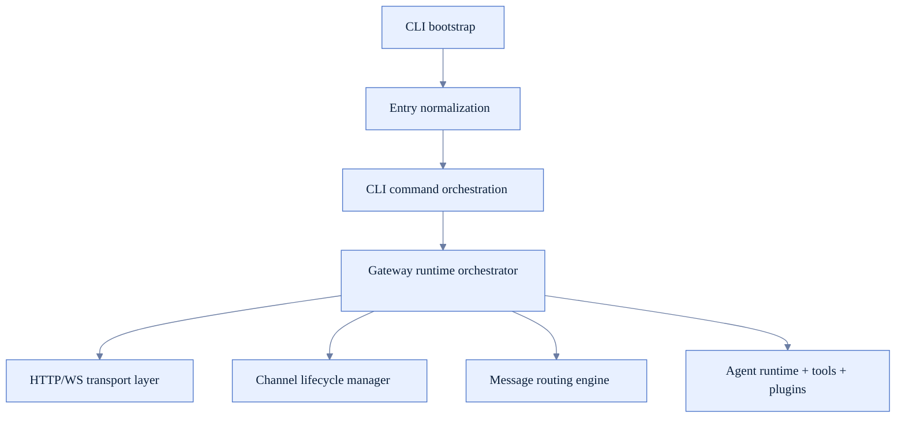

- **Gateway** vẫn là trung tâm điều phối.
- **Message routing** hoạt động qua binding/session key.
- **Channel lifecycle** quản lý theo account và có auto-restart policy.
- **Plugin-first** vẫn là kiến trúc nền.

### 1.2 Những năng lực nền đã có sẵn để tái dùng cho marketing

- Multi-channel + auto-reply binding.
- Agent runtime có tool calling, subagents, cron, memory search.
- Plugin SDK và extension ecosystem đủ rộng để thêm social integrations.
- UI/control plane đã có nền tảng để thêm dashboard chuyên biệt.

### 1.3 Thực tế cần lưu ý (để tránh hiểu nhầm)

- FoxFang hiện **chưa phải** một marketing system hoàn chỉnh; đang là AI assistant/gateway mạnh, có thể mở rộng theo hướng marketing.
- Một số mô tả marketing trong tài liệu cũ là định hướng, không phải behavior đã được wired end-to-end.

---

## 2) Định nghĩa sản phẩm đích (to-be)

FoxFang trở thành **Personal AI Marketing Agent** khi đáp ứng đủ 5 trụ:

1. **Brand brain**: hiểu rõ brand voice, audience, offers, positioning.
2. **Campaign OS**: lập kế hoạch, lịch nội dung, execution theo kênh.
3. **Content factory**: tạo/biên tập/biến thể nội dung có guardrails.
4. **Distribution + outreach**: publish/send/follow-up đa kênh.
5. **Feedback loop**: ingest metrics, đánh giá hiệu quả, tự tối ưu.

---

## 3) Kiến trúc đích cho marketing-native FoxFang

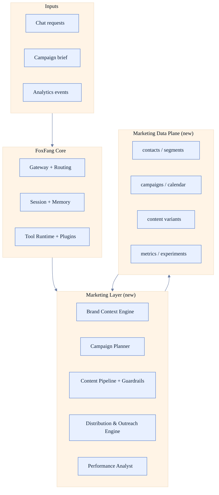

---

## 3.1) Flow chi tiết vận hành FoxFang (as-is)

### A. Gateway startup và runtime bootstrap

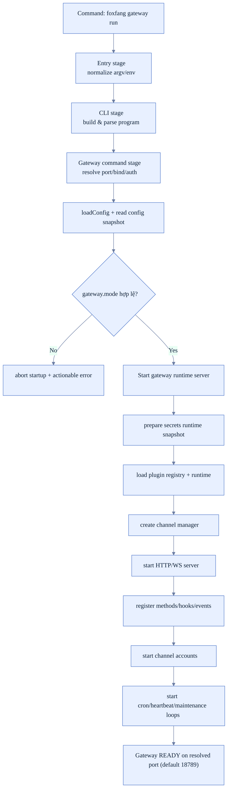

### B. Inbound message -> routing -> agent execution -> reply

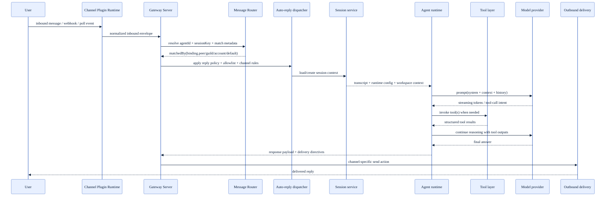

### C. Auto-reply binding resolution path (chi tiết match)

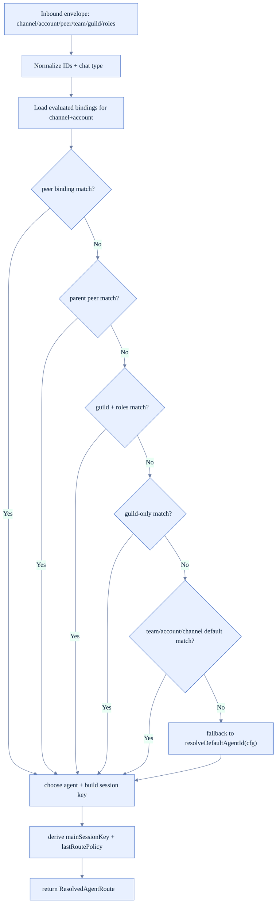

### D. Tool-call loop và safe execution lifecycle

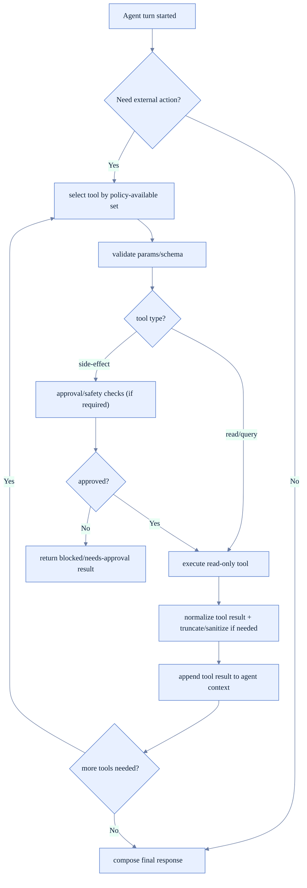

### E. Channel account lifecycle (start/stop/restart/backoff)

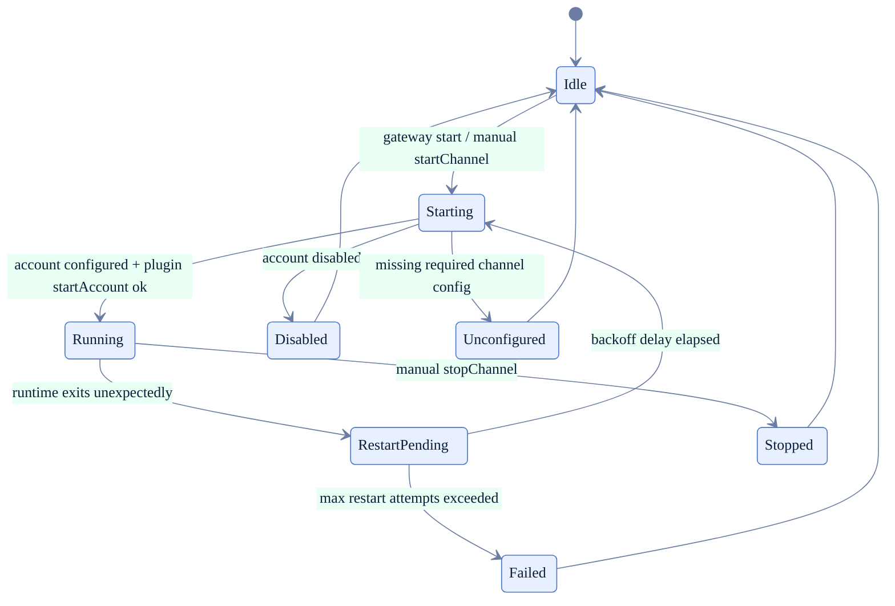

### F. Config load/reload và runtime apply path

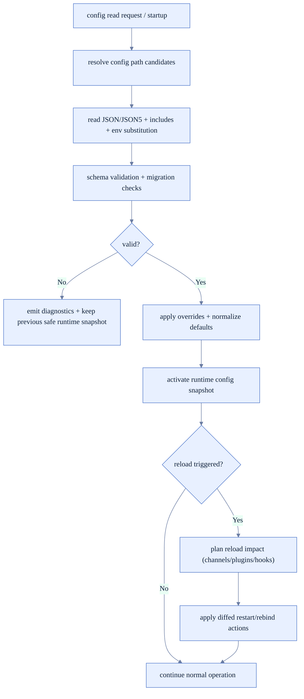

### G. Memory/context assembly cho mỗi agent turn

```mermaid
%%{init: {'theme':'base','themeVariables': {'primaryColor':'#E8F0FF','primaryTextColor':'#0B1F3A','primaryBorderColor':'#4B74C9','lineColor':'#6B7DA3','secondaryColor':'#E9FFF4','tertiaryColor':'#FFF4E6','fontFamily':'Inter, system-ui, sans-serif'}}}%%
flowchart LR
    M0["Inbound turn"] --> M1["Load session transcript slice"]
    M1 --> M2["Load workspace context files\nSOUL/BRAND/USER/BOOTSTRAP"]
    M2 --> M3["Resolve tool availability + runtime metadata"]
    M3 --> M4["Optional memory search/index retrieval"]
    M4 --> M5["Compose system prompt"]
    M5 --> M6["Assemble model request envelope"]
    M6 --> M7["Execute model turn"]
    M7 --> M8["Persist transcript + session metadata"]
```

### H. Cron/heartbeat execution loop

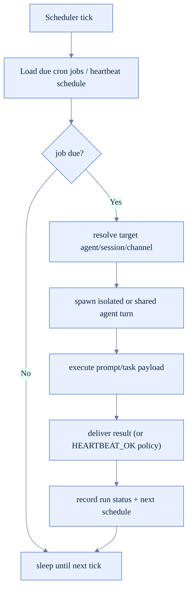

### I. Super-detailed unified flowchart (main + side branches)

```mermaid
%%{init: {'theme':'base','themeVariables': {'primaryColor':'#E8F0FF','primaryTextColor':'#0B1F3A','primaryBorderColor':'#4B74C9','lineColor':'#6B7DA3','secondaryColor':'#E9FFF4','tertiaryColor':'#FFF4E6','fontFamily':'Inter, system-ui, sans-serif'}}}%%
flowchart TD
    %% =========================
    %% 0) Entry and startup
    %% =========================
    U0["User/Operator runs foxfang command"] --> U1["CLI bootstrap"]
    U1 --> U2["Entry stage\nargv/env normalization"]
    U2 --> U3["CLI stage\nparse command + profile"]
    U3 --> U4{"Command type?"}

    U4 -- "gateway run" --> G0["Gateway command stage"]
    U4 -- "chat/run/direct command" --> D0["Direct agent/CLI execution path"]

    G0 --> G1["loadConfig + config snapshot + env substitution"]
    G1 --> G2{"Config valid + gateway mode allowed?"}
    G2 -- "No" --> GE0["Abort startup with diagnostics"]
    G2 -- "Yes" --> G3["Start gateway runtime server"]

    G3 --> G4["prepare secrets runtime snapshot"]
    G4 --> G5["initialize plugin registry + plugin runtime"]
    G5 --> G6["create channel manager"]
    G6 --> G7["start HTTP/WS server"]
    G7 --> G8["register RPC/method handlers + hooks"]
    G8 --> G9["start channel accounts"]
    G9 --> G10["start cron + heartbeat + maintenance loops"]
    G10 --> G11["Gateway READY"]

    %% =========================
    %% 1) Inbound and routing
    %% =========================
    G11 --> I0["Inbound event arrives\n(webhook/poll/socket/CLI)"]
    D0 --> I0
    I0 --> I1["Normalize inbound envelope\nchannel/account/peer/meta"]
    I1 --> I2["Resolve route"]
    I2 --> I3{"Binding match tier?"}
    I3 -- "peer / parent peer" --> I4["select agent + session key"]
    I3 -- "guild/team/account/channel" --> I4
    I3 -- "none" --> I5["fallback default agent"]
    I5 --> I4
    I4 --> I6["Apply auto-reply policy\nallowlist + channel rules"]
    I6 --> I7{"Allowed to continue?"}
    I7 -- "No" --> I8["Drop/ignore/log policy block"]
    I7 -- "Yes" --> S0["Session service load/create session"]

    %% =========================
    %% 2) Context and model loop
    %% =========================
    S0 --> S1["Load transcript slice + runtime metadata"]
    S1 --> S2["Load workspace files\nSOUL/BRAND/USER/BOOTSTRAP"]
    S2 --> S3["Resolve tool availability by policy"]
    S3 --> S4["Optional memory search/retrieval"]
    S4 --> S5["Compose system prompt"]
    S5 --> S6["Create model request envelope"]
    S6 --> M0["Call model provider"]
    M0 --> M1{"Model output type?"}
    M1 -- "final response" --> M2["Build final assistant payload"]
    M1 -- "tool call intent" --> T0["Tool-call pipeline"]
    M1 -- "error/timeout" --> ME0["Model retry/fallback policy"]
    ME0 --> ME1{"Recovered?"}
    ME1 -- "Yes" --> M0
    ME1 -- "No" --> M2a["Return graceful failure response"]

    %% =========================
    %% 3) Tool pipeline
    %% =========================
    T0 --> T1["Select tool (policy-available set)"]
    T1 --> T2["Validate tool params/schema"]
    T2 --> T3{"Tool has side effects?"}
    T3 -- "No" --> T4["Execute read/query tool"]
    T3 -- "Yes" --> T5["Approval + safety checks"]
    T5 --> T6{"Approved?"}
    T6 -- "No" --> T7["Return blocked/needs-approval result"]
    T6 -- "Yes" --> T4
    T4 --> T8["Normalize/sanitize/truncate result"]
    T7 --> T8
    T8 --> T9["Append tool result into context"]
    T9 --> T10{"Need more tools?"}
    T10 -- "Yes" --> T1
    T10 -- "No" --> M0

    %% =========================
    %% 4) Delivery and persistence
    %% =========================
    M2 --> O0["Gateway outbound dispatch"]
    M2a --> O0
    O0 --> O1["Channel-specific send adapter"]
    O1 --> O2{"Delivery success?"}
    O2 -- "No" --> O3["Retry/backoff or mark failed"]
    O2 -- "Yes" --> O4["Delivered to user/channel"]
    O3 --> O5["Emit delivery diagnostics"]
    O4 --> P0["Persist transcript + run metadata"]
    O5 --> P0
    P0 --> P1["Update session state + route hints"]
    P1 --> P2["Optional memory extraction/store"]
    P2 --> END0["Turn complete"]

    %% =========================
    %% 5) Channel runtime branch
    %% =========================
    G9 --> C0["Per-channel account startAccount()"]
    C0 --> C1{"Configured + enabled?"}
    C1 -- "No" --> C2["Mark disabled/unconfigured runtime state"]
    C1 -- "Yes" --> C3["Running"]
    C3 --> C4{"Runtime exits unexpectedly?"}
    C4 -- "No" --> C3
    C4 -- "Yes" --> C5["Set restartPending + attempt++"]
    C5 --> C6{"attempt <= max?"}
    C6 -- "Yes" --> C7["Backoff sleep then restart account"]
    C7 --> C0
    C6 -- "No" --> C8["Mark failed; stop auto-restart"]

    %% =========================
    %% 6) Config reload branch
    %% =========================
    G11 --> R0["Config change detected/manual reload"]
    R0 --> R1["Read + validate new config snapshot"]
    R1 --> R2{"Valid?"}
    R2 -- "No" --> R3["Keep previous runtime config + emit errors"]
    R2 -- "Yes" --> R4["Plan reload impact\n(channels/plugins/hooks/auth)"]
    R4 --> R5["Apply diffed restart/rebind actions"]
    R5 --> R6["Activate new runtime snapshot"]
    R6 --> G11

    %% =========================
    %% 7) Cron/heartbeat branch
    %% =========================
    G10 --> H0["Scheduler tick"]
    H0 --> H1["Load due cron/heartbeat jobs"]
    H1 --> H2{"Due jobs exist?"}
    H2 -- "No" --> H3["Sleep until next tick"]
    H2 -- "Yes" --> H4["Resolve target agent/session/channel"]
    H4 --> H5["Spawn isolated/shared run"]
    H5 --> H6["Execute job prompt/task"]
    H6 --> H7["Deliver result or HEARTBEAT_OK policy"]
    H7 --> H8["Persist run status + next schedule"]
    H8 --> H3
    H3 --> H0

    %% =========================
    %% 8) Marketing roadmap branch (to-be)
    %% =========================
    END0 --> MK0["Marketing layer loop (to-be)"]
    MK0 --> MK1["Campaign planner"]
    MK1 --> MK2["Content generation + variants"]
    MK2 --> MK3["Brand/compliance guardrails"]
    MK3 --> MK4{"Publish-ready?"}
    MK4 -- "No" --> MK2
    MK4 -- "Yes" --> MK5["Distribution + outreach execution"]
    MK5 --> MK6["Collect KPI/analytics events"]
    MK6 --> MK7["Performance analysis + optimization proposals"]
    MK7 --> MK1

    %% =========================
    %% 9) Benchmark proof branch
    %% =========================
    MK7 --> B0["Benchmark runbook"]
    B0 --> B1["Run same prompt suite on OpenClaw"]
    B0 --> B2["Run same prompt suite on FoxFang"]
    B1 --> B3["Rubric scoring + MSS compute"]
    B2 --> B3
    B3 --> B4{"Superiority criteria met?"}
    B4 -- "No" --> B5["Feed gaps into roadmap backlog"]
    B5 --> MK0
    B4 -- "Yes" --> B6["Publish evidence report"]

    %% Semantic classes
    classDef core fill:#E8F0FF,stroke:#4B74C9,color:#0B1F3A,stroke-width:1.5px;
    classDef runtime fill:#E9FFF4,stroke:#2E8B57,color:#0E3A24,stroke-width:1.5px;
    classDef model fill:#F3EEFF,stroke:#7A5DC7,color:#2E1F5C,stroke-width:1.5px;
    classDef tool fill:#FFF4E6,stroke:#C27B2F,color:#5A3513,stroke-width:1.5px;
    classDef marketing fill:#FFEFFC,stroke:#C05A9C,color:#5A163C,stroke-width:1.5px;
    classDef benchmark fill:#EEF6FF,stroke:#3E88C8,color:#103A5C,stroke-width:1.5px;
    classDef error fill:#FFECEC,stroke:#C0392B,color:#5A1914,stroke-width:1.7px;
    classDef done fill:#F3FFF2,stroke:#4A9B43,color:#1E4A1A,stroke-width:1.7px;

    class U0,U1,U2,U3,U4,G0,G1,G2,G3,G4,G5,G6,G7,G8,G9,G10,G11 core;
    class I0,I1,I2,I3,I4,I5,I6,I7,S0,S1,S2,S3,S4,S5,S6,O0,O1,P0,P1,P2 runtime;
    class M0,M1,M2,M2a,ME0,ME1 model;
    class T0,T1,T2,T3,T4,T5,T6,T7,T8,T9,T10 tool;
    class C0,C1,C2,C3,C4,C5,C6,C7,C8,R0,R1,R2,R3,R4,R5,R6,H0,H1,H2,H3,H4,H5,H6,H7,H8 runtime;
    class MK0,MK1,MK2,MK3,MK4,MK5,MK6,MK7 marketing;
    class B0,B1,B2,B3,B4,B5,B6 benchmark;
    class GE0,I8,O3,O5 error;
    class O2,R2,C1,C4,C6,H2,M1,T3,T6,T10,B4,MK4 done;
    class END0 done;
```

---

## 4) Gap analysis: từ nền hiện tại đến marketing agent

### 4.1 Gap bắt buộc (P0)

| Gap | Vấn đề | Kết quả cần đạt |
|---|---|---|
| **Brand context chưa đủ cấu trúc** | Prompt hiện có thể generic theo session | Mỗi phản hồi phải bám brand voice + audience + offer |
| **Campaign entity chưa first-class** | Không có model chuẩn cho campaign lifecycle | Có create/plan/execute/review campaign end-to-end |
| **Distribution toolchain thiếu social publishing** | Chưa có outbound tools cho X/LinkedIn/Meta | Có thể publish/schedule/post-status theo kênh |
| **Outreach workflow chưa hoàn chỉnh** | Chưa có loop contacts -> sequence -> follow-up -> outcome | Pipeline outreach có trạng thái và automation |
| **Analytics ingestion chưa chuẩn hóa** | Growth loop thiếu dữ liệu KPI thực | Có ingestion + attribution + recommendation |

### 4.2 Gap quan trọng (P1)

| Gap | Vấn đề | Kết quả cần đạt |
|---|---|---|
| **A/B variants chưa thành pipeline** | Khó thử nghiệm tiêu đề/hook/CTA | Sinh biến thể + auto compare theo metric |
| **Approval workflow cho nội dung chưa rõ** | Dễ publish sai tone/sai fact | Human-in-the-loop trước publish |
| **UI chưa marketing-centric** | Control UI thiên generic gateway | Có dashboard campaign, calendar, performance |

### 4.3 Gap nâng cao (P2)

| Gap | Kết quả |
|---|---|
| Multi-brand mode | Một user quản lý nhiều brand profile |
| Competitor watch | Theo dõi competitor theo lịch và summarize định kỳ |
| Playbook templates | Starter workflow cho launch, newsletter, promotion |

---

## 5) Lộ trình kỹ thuật đề xuất

### Phase 1 — Foundation (1-2 tuần)

**Mục tiêu:** có khung dữ liệu và prompt contract chuẩn cho marketing.

- Chuẩn hóa workspace contract:
  - `SOUL.md`: persona + tone.
  - `BRAND.md`: positioning, ICP, messaging pillars.
  - `USER.md`: decision preferences.
  - `BOOTSTRAP.md`: rules of engagement.
- Định nghĩa schema dữ liệu marketing (JSON + SQLite):
  - `campaigns`, `content_items`, `variants`, `contacts`, `segments`, `touchpoints`, `kpis`.
- Thiết kế rubric đánh giá nội dung (tone, clarity, CTA, channel fit, brand safety).

**Definition of done:**
- Có schema + docs + examples.
- Prompt builder luôn nhận đầy đủ brand context bắt buộc.

#### Flowchart triển khai Phase 1

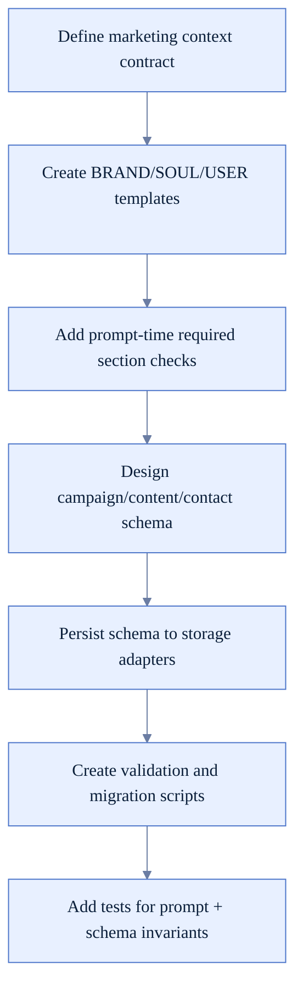

### Phase 2 — Content + campaign loop (2-4 tuần)

**Mục tiêu:** từ brief đến content plan + variants + review.

- Thêm tool domain:
  - `campaign.create`, `campaign.plan`, `campaign.status`.
  - `content.generate`, `content.variant`, `content.review`.
- Thêm guardrails:
  - Brand voice validator.
  - Compliance checklist (claims, sensitive wording).
- Hỗ trợ recurring workflows bằng cron cho content calendar.

**Definition of done:**
- Từ một brief có thể tạo campaign plan + content backlog + variants.
- Có điểm đánh giá tự động trước khi xuất bản.

#### Flowchart triển khai Phase 2

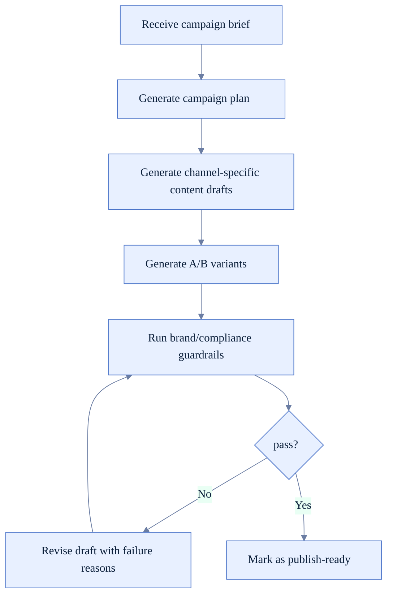

### Phase 3 — Distribution + outreach (3-6 tuần)

**Mục tiêu:** biến plan thành hành động outbound thật.

- Bổ sung social/channel publishing extensions.
- Hoàn thiện outreach pipeline:
  - contacts/segments
  - sequence steps
  - follow-up rules
  - outcome tracking
- Xây UI tối thiểu cho outreach + campaign board.

**Definition of done:**
- Có thể chạy một campaign nhỏ end-to-end từ FoxFang.

#### Flowchart triển khai Phase 3

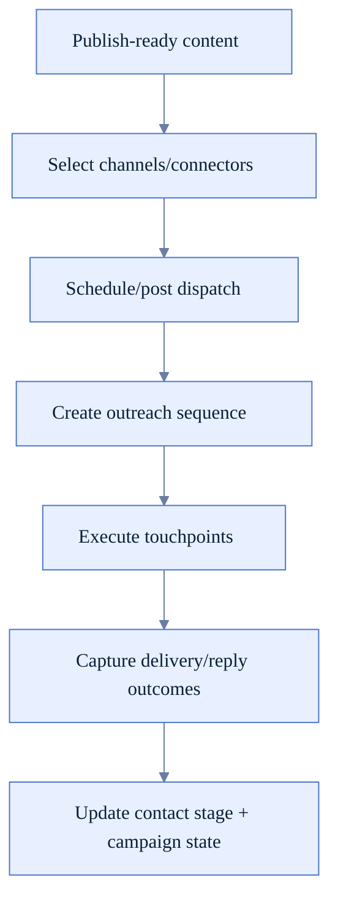

### Phase 4 — Feedback optimization (4-8 tuần)

**Mục tiêu:** closed loop bằng dữ liệu thật.

- Ingest analytics từ web/social/email tools.
- Chuẩn hóa KPI model:
  - reach, CTR, conversion, reply rate, meeting booked.
- Tạo recommendation engine:
  - đề xuất chỉnh hook/CTA/channel/time window dựa trên hiệu suất.

**Definition of done:**
- Hệ thống tự đề xuất cải thiện dựa trên dữ liệu campaign trước đó.

#### Flowchart triển khai Phase 4

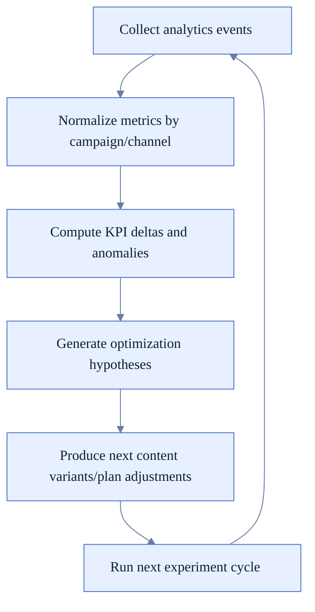

---

## 6) Thiết kế tác nhân (agent design) đề xuất

Thay vì hardcode “4 agent marketing” ngay từ đầu, nên đi theo hai bước:

1. **Step A:** chạy một orchestrator mạnh + role templates.
2. **Step B:** khi workflow ổn định thì cố định specialist agents.

Mẫu vai trò:

| Agent role | Trách nhiệm |
|---|---|
| **Orchestrator** | Phân rã task, gọi đúng tool, quản lý trạng thái campaign |
| **Content Specialist** | Viết copy + variants theo kênh |
| **Strategy Lead** | Positioning, campaign direction, audience segmentation |
| **Growth Analyst** | KPI review, experiment analysis, optimization proposals |

---

## 7) Data model tối thiểu cần có

```text
Campaign
- id, name, objective, audience, channels, budget, status, startAt, endAt

ContentItem
- id, campaignId, channel, format, objective, draft, approved, publishedAt

ContentVariant
- id, contentItemId, hypothesis, copy, score, status

Contact
- id, name, company, role, segment, stage, lastTouchpointAt

Touchpoint
- id, contactId, channel, templateId, sentAt, result

MetricEvent
- id, campaignId, source, metricName, metricValue, timestamp
```

---

## 8) KPI để đo “đã trở thành Personal AI Marketing Agent chưa”

### Product KPI

- Brief -> first campaign plan < 5 phút.
- 80% nội dung qua được brand guardrail ngay vòng 1.
- 1 campaign có thể chạy end-to-end không cần thao tác ngoài FoxFang.

### Marketing KPI

- Tăng conversion/reply rate theo từng vòng tối ưu.
- Giảm time-to-publish trung bình.
- Tăng số experiment chạy mỗi tuần.

---

## 9) Kết luận

FoxFang hiện đã có nền tảng rất mạnh: gateway, routing, sessions, tools, plugins, cron, memory.  
Để biến thành **Personal AI Marketing Agent** thực sự, trọng tâm không phải “viết lại core”, mà là:

1. dựng **marketing data model** chuẩn,
2. thêm **campaign/content/outreach/analytics workflows**,
3. đóng vòng **feedback optimization** bằng KPI thật.

Khi 3 lớp này hoàn tất, FoxFang sẽ chuyển từ “AI assistant đa dụng” sang “marketing operating system cá nhân”.

---

## 10) Chứng minh khác biệt OpenClaw vs FoxFang (marketing)

Để chứng minh rõ “FoxFang làm marketing tốt hơn OpenClaw”, không nên chỉ dựa vào mô tả tính năng.  
Cần bộ tiêu chí có thể đo, chạy cùng một bộ đề bài, và so sánh đầu ra theo rubric thống nhất.

### 10.1 Nguyên tắc so sánh công bằng

- So sánh trên cùng tập brief, cùng kênh, cùng giới hạn thời gian.
- Dùng cùng model tier hoặc chuẩn hóa theo chi phí/token tương đương.
- Chấm điểm bởi rubric cố định + đánh giá mù (blind review) nếu có reviewer người thật.
- Đo cả **quality** và **operational performance** (thời gian, số bước thủ công, tỷ lệ hoàn thành).

### 10.2 Benchmark suite đề xuất

| Nhóm bài test | Mô tả | Kết quả mong đợi của FoxFang |
|---|---|---|
| **Campaign planning** | Từ brief thành campaign plan đa kênh 2 tuần | Plan có mục tiêu, audience, messaging pillars, KPI rõ ràng |
| **Brand voice writing** | Viết 5 biến thể post theo tone brand | Độ bám tone cao, ít sai lệch voice |
| **Cross-channel adaptation** | Chuyển 1 thông điệp sang Telegram/Discord/Slack/email | Nội dung phù hợp từng kênh, không copy-paste máy móc |
| **Outreach sequence** | Tạo 3-step sequence cho lead outreach | Có logic follow-up và CTA theo stage |
| **Optimization loop** | Dựa trên metric giả lập để đề xuất cải thiện | Đề xuất đúng trọng tâm (hook/CTA/timing/channel) |

### 10.2.1 Benchmark execution flow

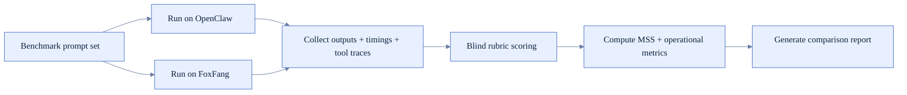

### 10.3 Rubric chấm điểm (0-5)

| Tiêu chí | Câu hỏi chấm |
|---|---|
| **Brand fit** | Có đúng tone, personality, value proposition của brand không? |
| **Marketing quality** | Có hook, thông điệp chính, CTA rõ và thuyết phục không? |
| **Channel fit** | Có phù hợp format/hành vi từng kênh không? |
| **Strategic coherence** | Output có bám objective và audience của campaign không? |
| **Actionability** | Có thể dùng ngay hay cần sửa nhiều thủ công? |

**Marketing Superiority Score (MSS)** đề xuất:
- `MSS = 0.30*BrandFit + 0.25*MarketingQuality + 0.15*ChannelFit + 0.20*StrategicCoherence + 0.10*Actionability`
- Mục tiêu: FoxFang cao hơn OpenClaw >= `+1.0` điểm MSS trung bình trên cùng bộ test.

### 10.4 Operational metrics cần đo song song

- Time-to-first-plan.
- Time-to-publish-ready-content.
- Số lần chỉnh sửa thủ công trước khi publish.
- % đầu ra đạt tiêu chuẩn “publish-ready”.
- Số bước thao tác ngoài hệ thống (external manual steps).

---

## 11) Feature roadmap để tạo lợi thế rõ ràng so với OpenClaw

Các hạng mục dưới đây được thiết kế để tạo lợi thế chuyên biệt marketing, thay vì mở rộng theo hướng trợ lý đa dụng.

### 11.1 Feature set bắt buộc để “win marketing”

| Feature | Mục tiêu khác biệt |
|---|---|
| **Brand Policy Engine** | Ép mọi output qua bộ quy tắc tone/claim/forbidden wording |
| **Campaign Object Model** | Biến campaign thành first-class entity có lifecycle |
| **Content Variant Lab** | Sinh + chấm + chọn biến thể theo mục tiêu |
| **Outreach Pipeline** | Quản lý contact -> sequence -> outcome có trạng thái |
| **Performance Feedback Loop** | Tự động chuyển dữ liệu KPI thành đề xuất tối ưu |

### 11.2 Mapping feature -> phase

| Phase | Feature chính |
|---|---|
| **Phase 1** | Brand Policy Engine + Campaign Object Model (schema + prompt contract) |
| **Phase 2** | Content Variant Lab + pre-publish guardrails |
| **Phase 3** | Outreach Pipeline + social publishing connectors |
| **Phase 4** | Performance Feedback Loop + recommendation engine |

---

## 12) Acceptance criteria: khi nào nói “FoxFang marketing tốt hơn OpenClaw”

Chỉ kết luận khi thỏa đồng thời các điều kiện:

1. **Quality superiority**
   - MSS của FoxFang cao hơn OpenClaw >= `+1.0` trên ít nhất 20 bài test.
2. **Operational superiority**
   - Time-to-publish-ready-content giảm >= `30%`.
   - Số chỉnh sửa thủ công giảm >= `40%`.
3. **Workflow completeness**
   - Chạy được 1 campaign mẫu end-to-end: plan -> content -> distribution -> performance review.
4. **Stability**
   - Tỷ lệ run thành công >= `95%` trong benchmark runbook.

Nếu chưa đạt các tiêu chí trên thì chỉ nên gọi là “FoxFang có định hướng marketing”, chưa đủ để claim superiority.

---

## 13) Runbook triển khai benchmark (đề xuất)

1. Chuẩn bị `benchmark/prompts/*.md` cho 5 nhóm bài test.
2. Chuẩn bị `benchmark/rubric.md` + mẫu chấm điểm.
3. Chạy cùng bộ đề cho OpenClaw và FoxFang.
4. Lưu kết quả vào `benchmark/results/<system>/<date>.json`.
5. Tính MSS và operational metrics.
6. Xuất báo cáo so sánh (table + trend chart) trong control UI hoặc docs.

### 13.1 Runbook flowchart

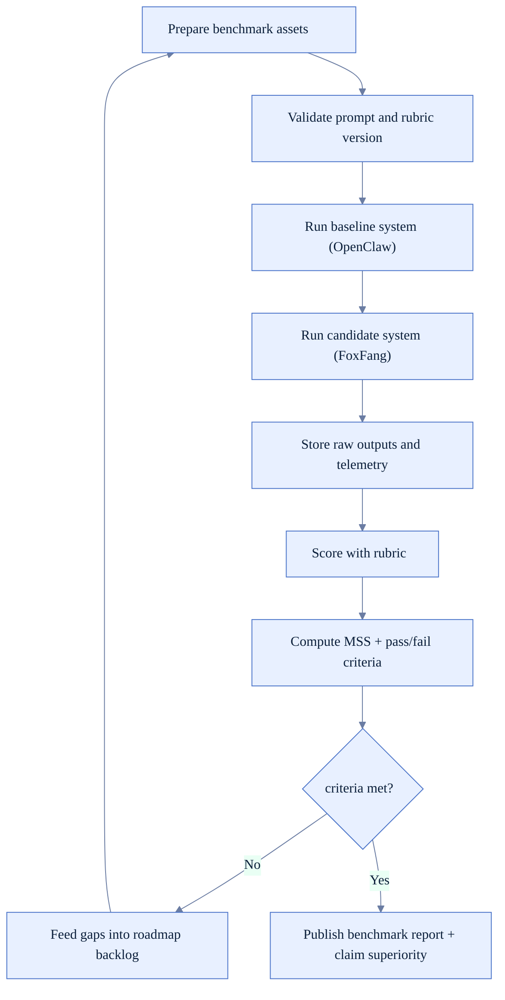

---

## 14) Kết luận thực dụng

- **OpenClaw** mạnh ở bề rộng use cases của trợ lý đa dụng.
- **FoxFang** chỉ vượt trội khi xây được lớp chuyên sâu marketing và chứng minh bằng benchmark định lượng.
- Vì vậy roadmap của FoxFang phải ưu tiên:
  - **chiều sâu marketing workflows**
  - **quality guardrails**
  - **measurement-first validation**
  thay vì mở rộng ngang sang quá nhiều capability không liên quan marketing.

---

## 15) Deep-dive runtime docs

- Session runtime: `/architecture/session-runtime`
- Memory runtime: `/architecture/memory-runtime`
- Agent loop runtime: `/architecture/agent-loop-runtime`
