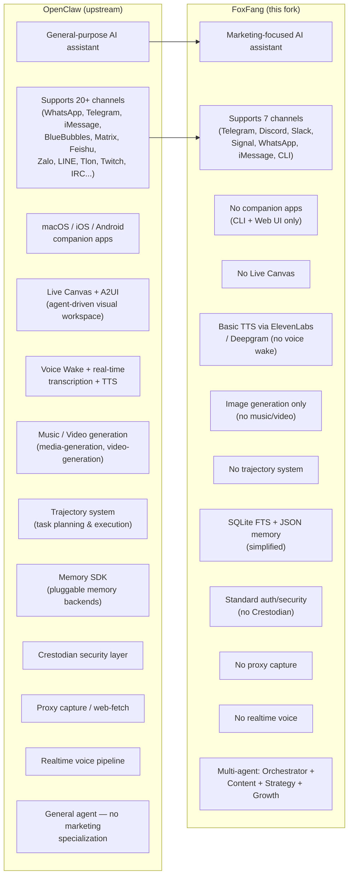
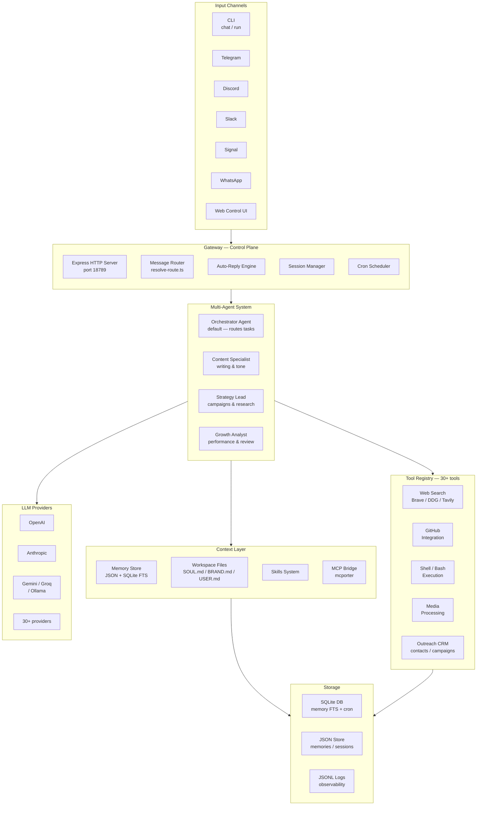
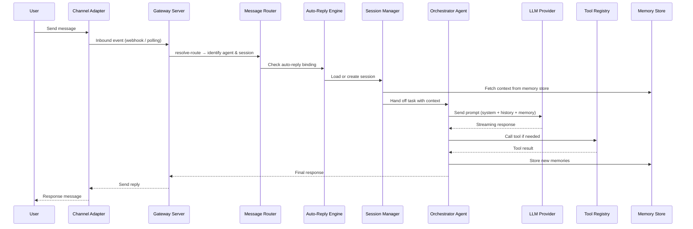
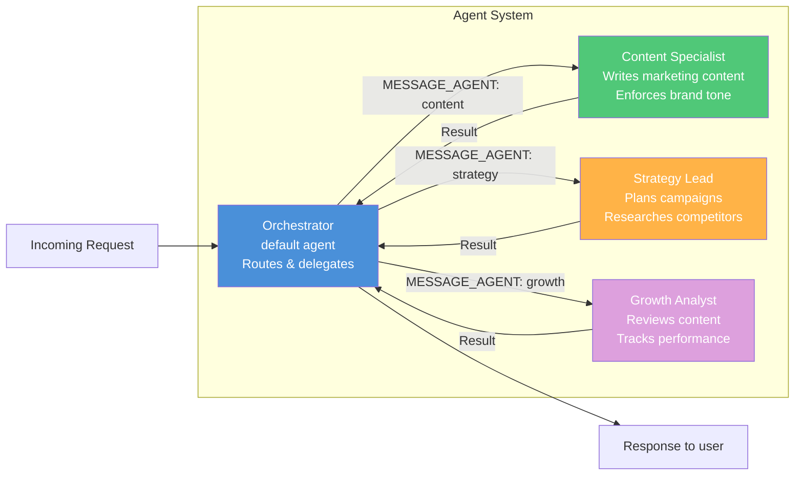
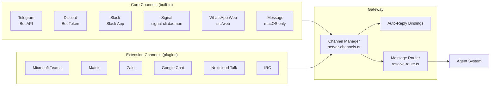
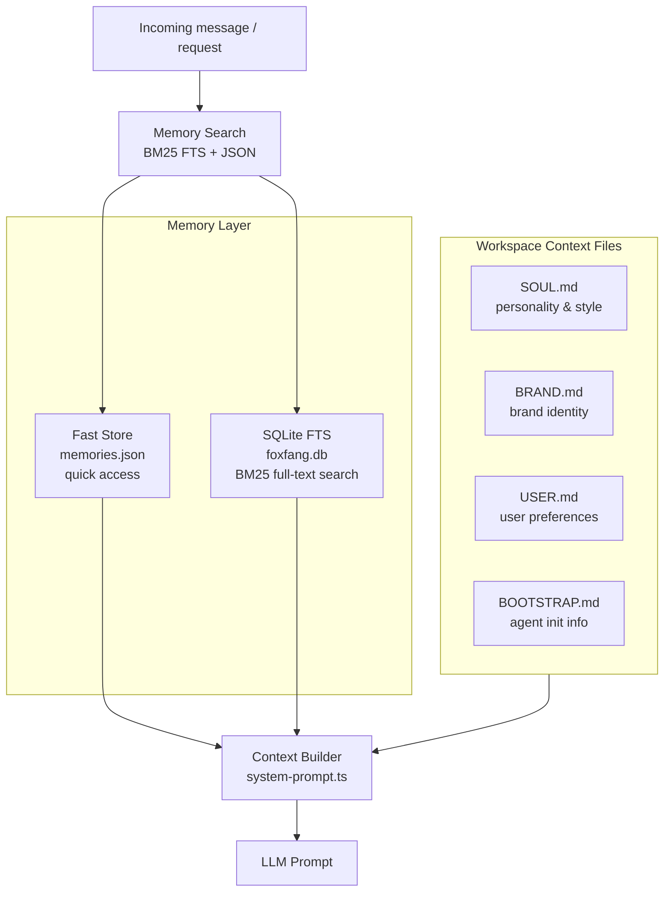
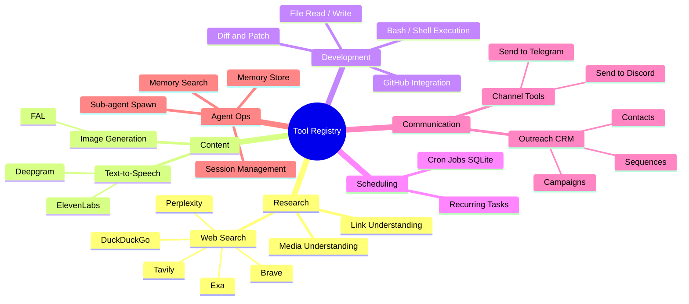
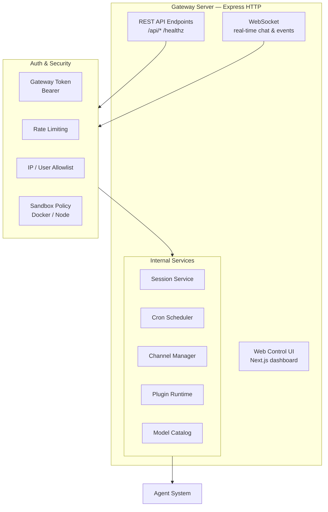
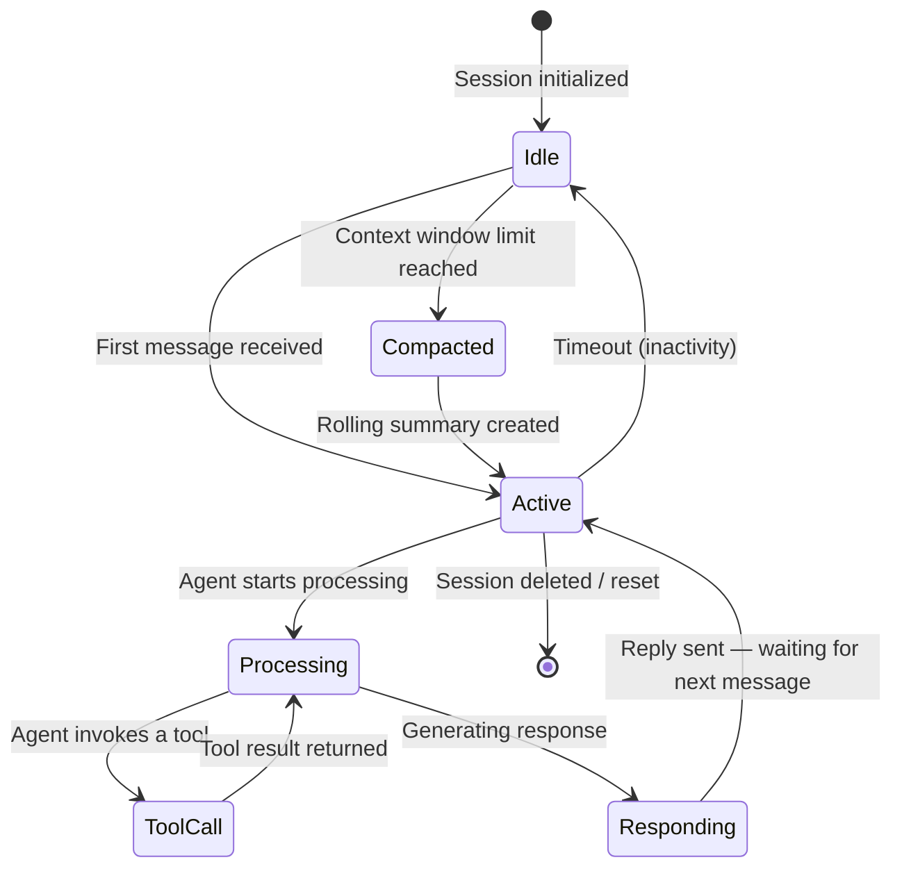
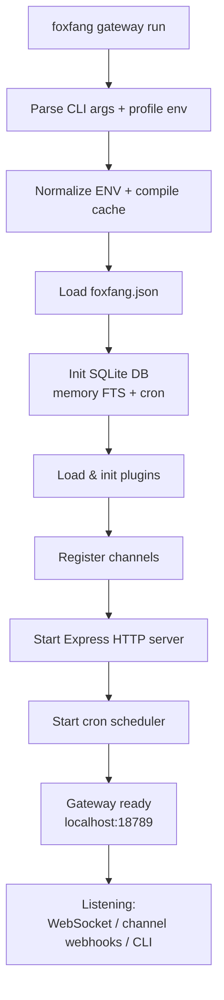

# Personal AI Marketing Agent — Architecture Overview

> This document describes the full architecture, flow logic, and key components of the **Personal AI Marketing Agent** — a locally-run, privacy-first AI assistant purpose-built for marketing workflows across multiple messaging channels.

---

## 1. Origin: Forked from OpenClaw

**FoxFang** is a fork of [OpenClaw](https://github.com/openclaw/openclaw) — an open-source, self-hosted personal AI assistant gateway. The fork was taken at an early version of OpenClaw and customized specifically toward **marketing use cases**.

Since forking, OpenClaw has evolved significantly (companion macOS/iOS/Android apps, Live Canvas, Voice Wake, real-time voice, music/video generation, trajectory system, memory SDK, etc.) while FoxFang has been redirected toward a narrower, more focused goal: **a personal AI marketing agent**.

### 1.1 OpenClaw vs FoxFang — Side-by-side Comparison



### 1.2 Key Differences Table

| Feature | OpenClaw (upstream) | FoxFang (this fork) |
|---|---|---|
| **Purpose** | General personal AI assistant | Marketing-focused AI assistant |
| **Channels** | 20+ (WhatsApp, iMessage, BlueBubbles, Matrix, Feishu, Zalo, LINE, IRC, Tlon, Twitch...) | 7 (Telegram, Discord, Slack, Signal, WhatsApp, iMessage, CLI) |
| **Companion Apps** | macOS app, iOS node, Android node | None (CLI-first) |
| **Live Canvas** | Yes (agent-driven visual workspace + A2UI) | No |
| **Voice** | Voice Wake, real-time transcription, push-to-talk | Basic TTS only (ElevenLabs/Deepgram) |
| **Media Generation** | Image + Music + Video generation | Image generation only |
| **Agent System** | Single general-purpose Pi agent | Multi-agent: Orchestrator + Content + Strategy + Growth |
| **Memory** | Pluggable memory SDK (LanceDB, etc.) | SQLite FTS + JSON (simplified) |
| **Trajectory** | Yes (task planning + execution tracking) | No |
| **Security Layer** | Crestodian (advanced) | Standard auth + allowlists |
| **Outreach CRM** | No | Yes (contacts, campaigns, sequences) |
| **Cron Scheduler** | Yes | Yes (kept) |
| **Web UI** | Yes (Control UI) | Yes (Next.js dashboard) |
| **Branding** | Space lobster 🦞 (Molty) | Fox 🦊 (marketing focus) |
| **Config dir** | `~/.openclaw/` | `~/.foxfang/` |
| **Binary name** | `openclaw` | `foxfang` |

---

## 2. System Architecture Overview



---

## 3. Message Processing Flow



---

## 4. Multi-Agent System



| Agent | Role | Strength |
|---|---|---|
| **Orchestrator** | Routes tasks, manages brands/projects | Coordination & delegation |
| **Content Specialist** | Writes content, enforces tone | Creative writing |
| **Strategy Lead** | Plans campaigns, researches market | Strategic thinking |
| **Growth Analyst** | Reviews content, analyzes performance | Analysis & optimization |

---

## 5. Channel Integration



---

## 6. Memory & Context System



---

## 7. Tool Registry



---

## 8. Gateway Server



---

## 9. Session Lifecycle



---

## 10. Boot Flow



---

## 11. Configuration & Data Layout

```
~/.foxfang/
├── foxfang.json          # Main config (providers, channels, agents, bindings)
├── credentials/          # API keys (keychain store)
├── memory/
│   └── memories.json     # JSON memory store (fast access)
├── sessions/             # Chat history per agent
│   └── <agentId>/sessions.json
├── workspace/            # Workspace files that shape agent behavior
│   ├── SOUL.md           # Personality & writing style
│   ├── BRAND.md          # Brand identity
│   └── USER.md           # User preferences
├── agents/<agentId>/agent/  # Per-agent workspace dir
├── logs/                 # JSONL request traces (observability)
└── foxfang.db            # SQLite: memory FTS + cron jobs
```

---

## 12. What Has Been Customized (FoxFang vs OpenClaw)

### ✅ Already Customized

| Area | Change |
|---|---|
| **Branding** | Renamed all `openclaw` → `foxfang`, changed binary/config/paths |
| **README** | Rewritten as marketing agent, added multi-agent table, updated commands |
| **Agent system** | Added 3 specialist agents: Content, Strategy, Growth |
| **Outreach CRM** | Added contacts/campaigns/sequences (not in OpenClaw) |
| **Workspace files** | SOUL.md/BRAND.md/USER.md oriented for marketing context |
| **Channels** | Reduced to 7 focused channels (removed obscure ones) |
| **LLM providers** | Kept broad provider support (OpenAI, Anthropic, Kimi, Groq, etc.) |
| **Tool registry** | Kept web search, GitHub, bash, cron, image gen |
| **Memory** | Simplified to SQLite FTS + JSON (removed LanceDB dependency) |
| **Observability** | JSONL request traces kept |
| **Deploy** | Railway + Docker templates updated |

---

## 13. What Still Needs to Be Built / Improved

### 🔴 Critical gaps (must-have for a true marketing agent)

| Gap | Why It Matters | Suggested Approach |
|---|---|---|
| **No marketing system prompt** | SOUL.md/BRAND.md are empty stubs — no actual marketing personality baked in | Fill SOUL.md with marketing copywriter persona, BRAND.md with your brand info |
| **Agent delegation is not wired** | `MESSAGE_AGENT:` directive exists but specialist agents (content/strategy/growth) are not set up in config | Add agent entries to `foxfang.json` with proper workspace dirs |
| **Outreach CRM has no UI** | Contacts/campaigns exist in code but no CLI or Web UI surface | Build `foxfang outreach` CLI commands + Web UI section |
| **No social media posting tools** | Cannot post to Twitter/X, LinkedIn, Instagram directly | Add tool extensions for social APIs |
| **No content calendar / scheduling** | Cron exists but no marketing-specific scheduling templates | Build campaign cron workflows |
| **No analytics ingestion** | Growth Analyst has no data to analyze without real metrics input | Integrate Google Analytics / Twitter analytics tool |

### 🟡 Important improvements (significantly better UX)

| Gap | Why It Matters | Suggested Approach |
|---|---|---|
| **Web UI has no marketing dashboard** | Control UI is generic (from OpenClaw) — shows sessions/config but not marketing KPIs | Add campaign view, content calendar, contact list to Web UI |
| **Memory is not marketing-aware** | Generic memory store — doesn't categorize by brand/project/campaign | Add structured memory schema for marketing context |
| **No brand voice guardrails** | Content Specialist can drift from brand tone | Add tone validation step in content pipeline |
| **Workspace SOUL.md not filled** | Agent has no personality — responds generically | Write a detailed marketing copywriter SOUL.md |
| **No A/B content variants** | Can't generate and compare multiple content versions | Build variant generation flow in Content Specialist |
| **No competitor tracking** | Strategy Lead has web search but no structured competitor monitoring | Add recurring cron job for competitor research |

### 🟢 Nice-to-have (advanced features)

| Feature | Description |
|---|---|
| **Campaign performance dashboard** | Real-time metrics pulled via tool calls + visualized in Web UI |
| **Multi-brand support** | Multiple BRAND.md files switchable per session |
| **Content approval flow** | Human-in-the-loop step before posting (approval via messaging channel) |
| **SEO keyword tracking** | Scheduled keyword research reports |
| **Influencer outreach tracking** | Extend Outreach CRM with influencer-specific fields |
| **AI image generation for posts** | FAL integration already exists — wire it to content workflow |
| **OpenClaw features to backport** | Trajectory system (task planning), Memory SDK, real-time voice (optional) |

---

## 14. Summary

| Component | Technology | Role |
|---|---|---|
| **Runtime** | Node 22+ / TypeScript ESM | Full core runtime |
| **Gateway** | Express HTTP + WebSocket | Control plane, API server |
| **Agent System** | Custom orchestrator + specialists | Task processing & delegation |
| **LLM Providers** | 30+ adapters (OpenAI, Anthropic...) | Model inference |
| **Channel Adapters** | Telegram, Discord, Slack, Signal... | Communication channels |
| **Memory** | SQLite BM25 FTS + JSON | Long-term context |
| **Tools** | 30+ built-in + extensible | Task execution |
| **Plugin System** | npm packages + ClawHub | Feature extensibility |
| **Storage** | SQLite + JSONL | Sessions, cron, logs |
| **Web UI** | Next.js dashboard | Visual management |
| **Build** | tsdown (ESM bundle) | Production build |
| **Tests** | Vitest + V8 coverage | Quality assurance |

> **Core design principles:**
> - **Local-first**: All data processed on your device
> - **Privacy by default**: No mandatory cloud dependency
> - **Plugin-first**: Lean core, optional features as plugins
> - **Multi-channel**: One Gateway serves all channels simultaneously
> - **Marketing-native**: Agents and tools shaped for marketing workflows
