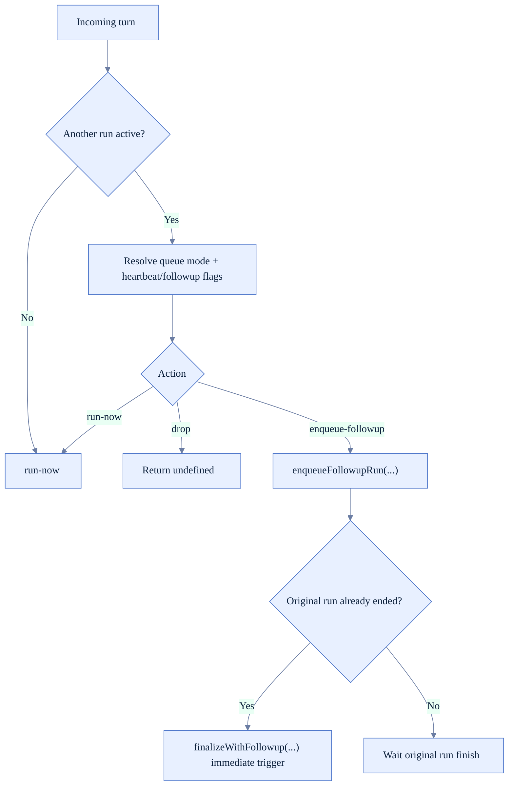
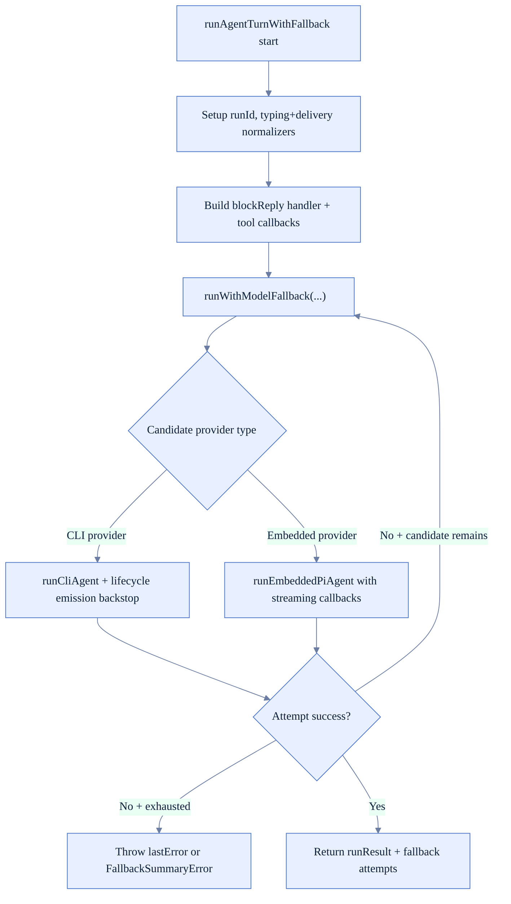
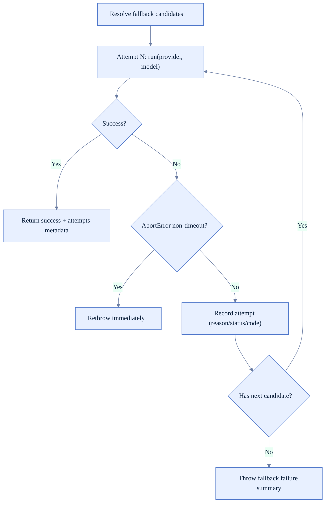
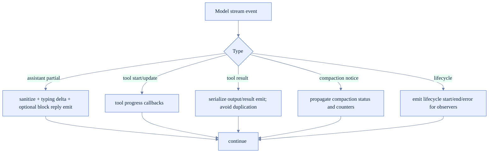
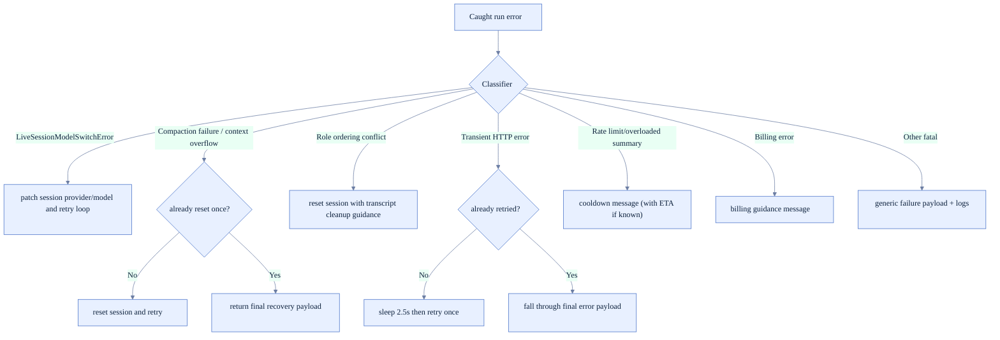

# Agent Loop Runtime Logic (FoxFang)

Tài liệu này là bản deep-dive của vòng lặp agent runtime theo code hiện tại, tập trung vào:
- active-run queue policy,
- preflight compaction + memory flush,
- fallback loop (CLI/embedded),
- tool/event streaming và delivery semantics,
- post-run accounting + recovery paths.

## 1) Thành phần chính (code-backed)

- Agent run orchestration: `src/auto-reply/reply/agent-runner.ts`
- Fallback + execution internals: `src/auto-reply/reply/agent-runner-execution.ts`
- Fallback engine: `src/agents/model-fallback.ts`
- Pre-run memory/compaction: `src/auto-reply/reply/agent-runner-memory.ts`
- Queue/followup policies: `src/auto-reply/reply/queue-policy.ts`, `src/auto-reply/reply/queue.ts`

## 2) Runtime phases (single turn)

```mermaid
%%{init: {'theme':'base','themeVariables': {'primaryColor':'#E8F0FF','primaryTextColor':'#0B1F3A','primaryBorderColor':'#4B74C9','lineColor':'#6B7DA3','secondaryColor':'#E9FFF4','tertiaryColor':'#FFF4E6','fontFamily':'Inter, system-ui, sans-serif'}}}%%
flowchart LR
    P0["Ingress"] --> P1["Queue decision"]
    P1 --> P2["Typing start"]
    P2 --> P3["Preflight compaction"]
    P3 --> P4["Memory flush gate"]
    P4 --> P5["runAgentTurnWithFallback"]
    P5 --> P6["Payload assembly + thread/reply mode"]
    P6 --> P7["Usage/session accounting"]
    P7 --> P8["Finalize + followup scheduling"]
```

## 3) Active-run queue policy (chi tiết)

`runReplyAgent()` không luôn chạy model ngay. Nó resolve action qua `resolveActiveRunQueueAction(...)`:
- `drop`: bỏ turn mới, cleanup typing.
- `enqueue-followup`: đưa vào queue và trả về sớm.
- `run-now`: tiếp tục chạy turn hiện tại.

## 4) Pre-run stage: compaction + memory flush

Trước khi vào model loop:
- `runPreflightCompactionIfNeeded(...)`
- `runMemoryFlushIfNeeded(...)`

Mục đích:
- giữ session không vượt context budget,
- flush memory đúng nhịp theo compaction counters,
- cập nhật session entry trước run chính.

## 5) Fallback execution (core loop)

`runAgentTurnWithFallback(...)` là phần nặng nhất của vòng lặp:
- tạo `runId`,
- đăng ký run context cho event stream,
- dựng callback pipeline cho partial/tool/lifecycle,
- gọi `runWithModelFallback(...)`,
- map lỗi sang recovery path phù hợp.

## 6) Model fallback engine semantics (`model-fallback.ts`)

- Dựng candidate list từ explicit model + allowlist + fallback candidates.
- De-dup theo `provider/model`.
- Với mỗi candidate:
  - chạy attempt,
  - normalize failover errors,
  - phân loại retryable vs terminal.
- Khi tất cả candidate fail:
  - 1 attempt duy nhất -> rethrow lỗi gốc,
  - nhiều attempts -> throw `FallbackSummaryError` với attempt history + cooldown hint.

## 7) Streaming and tool event path

Các điểm đặc biệt trong code:
- Lọc token điều khiển (`SILENT_REPLY_TOKEN`, `HEARTBEAT_TOKEN` artifacts).
- Cho phép payload media-only đi qua dù text rỗng.
- Giữ `directlySentBlockKeys` để tránh gửi trùng khi vừa pipeline vừa flush trực tiếp.
- CLI path có lifecycle-event backstop để tránh consumer treo.

## 8) Error and recovery matrix (chi tiết hơn)

## 9) Post-run accounting and persistence

- Persist usage tokens và metadata model/provider hiện dùng.
- Persist fallback transition (để UI/notice thể hiện model đã đổi).
- Cập nhật `compactionCount` + memory flush markers đồng bộ session entry.
- Refresh queued followup session mapping nếu sessionId/sessionFile đổi sau compaction/reset.
- Cleanup typing state luôn có backstop để tránh stuck typing indicator.

## 10) Observability points

- Agent event streams: `assistant`, `lifecycle`, tool-related streams.
- Fallback attempts metadata: provider/model/reason/status/code per attempt.
- Verbose diagnostics: token stripping, compaction notices, usage lines.
- Session-level updates: timestamps, usage counters, active model transitions.

## 11) Checklist khi sửa agent loop

- Queue policy vẫn giữ chuẩn `drop/enqueue-followup/run-now`.
- Pre-run compaction/memory flush không phá session consistency.
- Fallback loop không rethrow nhầm retryable failure, không nuốt terminal error.
- Tool/result streaming không duplicate hoặc out-of-order.
- Session reset paths có cleanup đúng phạm vi (không mất dữ liệu ngoài scope).
- Post-run accounting vẫn cập nhật đủ usage/fallback/compaction/followup mapping.
