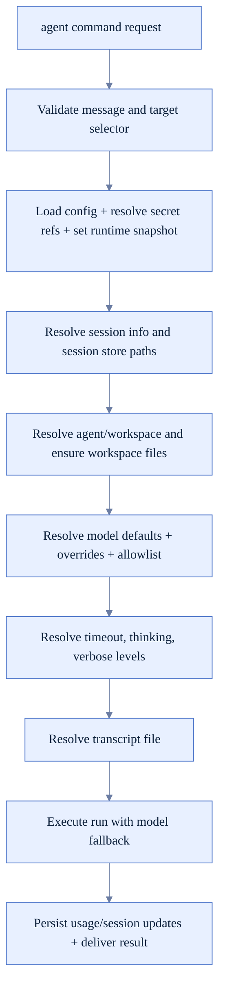
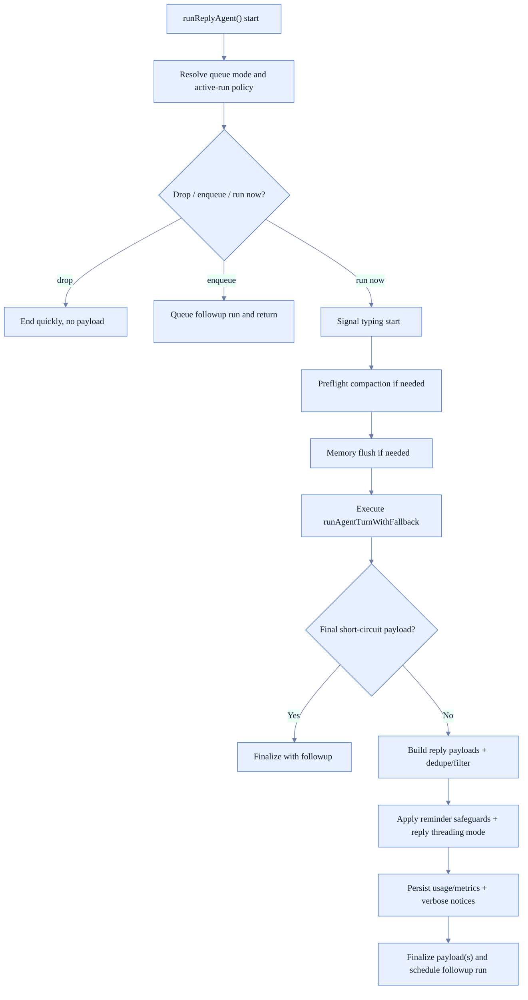
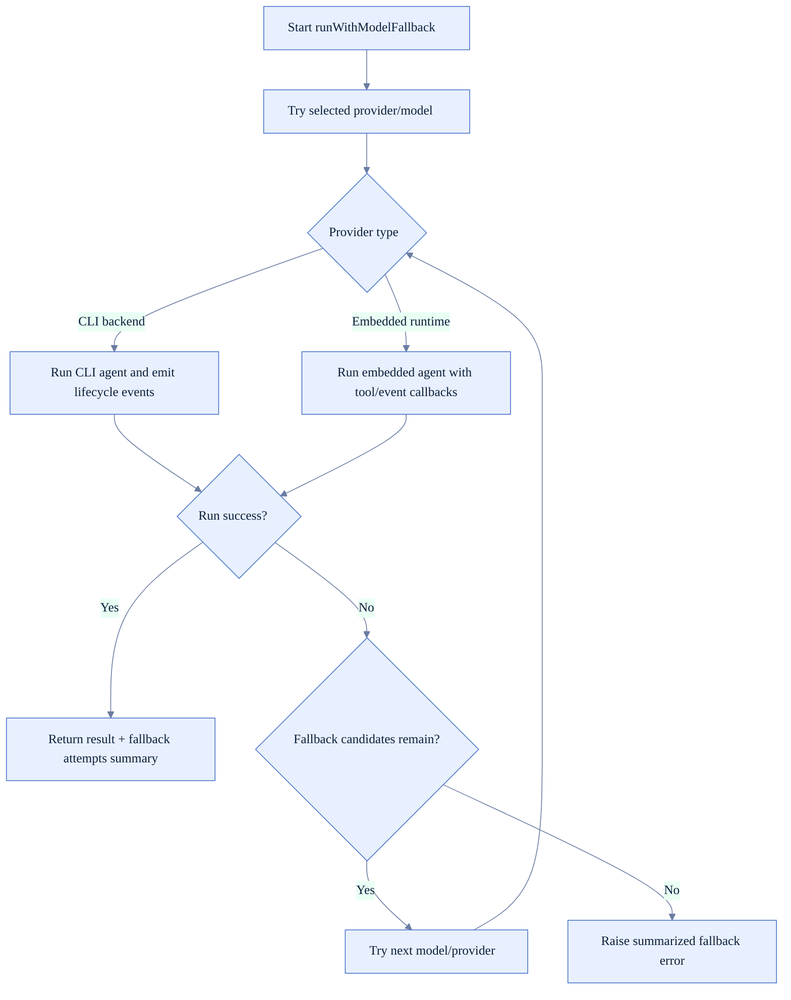
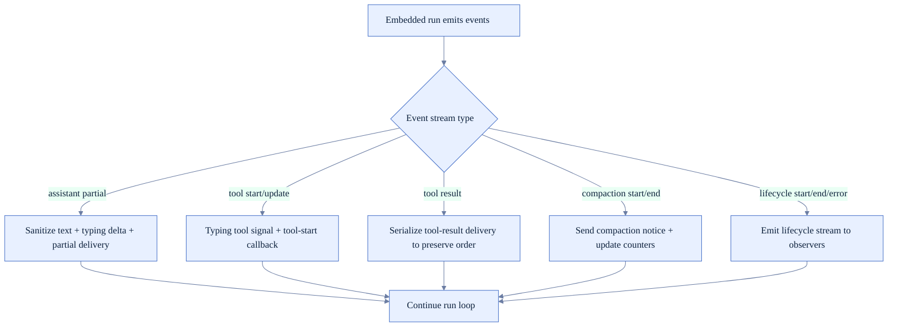
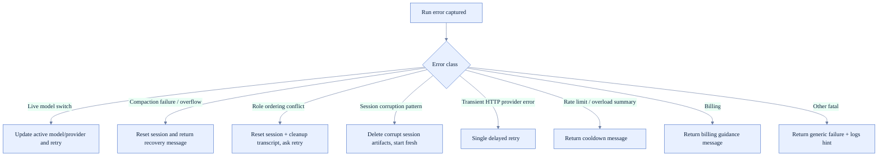

# Agent Loop Runtime Logic (FoxFang)

Tài liệu này mô tả chi tiết vòng lặp agent runtime:
- session/model preparation,
- fallback orchestration,
- tool streaming/events,
- delivery/persistence/update session usage.

## 1) Thành phần chính

- Agent command entrypoint và preparation: `src/agents/agent-command.ts`
- Reply agent main loop: `src/auto-reply/reply/agent-runner.ts`
- Model fallback + embedded/CLI run execution: `src/auto-reply/reply/agent-runner-execution.ts`
- Memory/compaction hooks trước run: `src/auto-reply/reply/agent-runner-memory.ts`

## 2) Agent command prepare -> execute flow

## 3) Main agent loop (reply path)

## 4) Model fallback execution (embedded + CLI)

## 5) Tool/event streaming path inside embedded run

## 6) Error recovery matrix trong agent loop

## 7) Post-run accounting và session update

- Session store được cập nhật usage/model sau mỗi run.
- Fallback transition được persist để hiển thị notice khi model active khác model selected.
- `compactionCount` và các trường memory-flush metadata được tăng đồng bộ với session.
- Queue followup session mapping được refresh nếu sessionId/sessionFile đổi sau compaction.
- Typing cleanup có backstop để tránh stuck indicator khi dispatcher không callback đủ.

## 8) Checklist khi sửa agent loop

- Có giữ đúng semantics của queue mode (`drop`, `enqueue`, `run now`) không.
- Fallback có giữ đúng order và không nuốt lỗi quan trọng không.
- Tool-result delivery có còn ordered khi concurrent tools chạy không.
- Recovery path có reset session/store/transcript nhất quán không.
- Accounting sau run có cập nhật đủ usage/model/fallback/compaction fields không.
