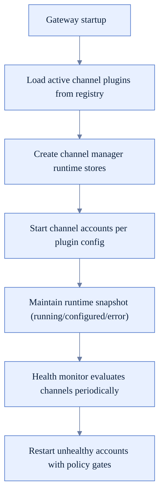
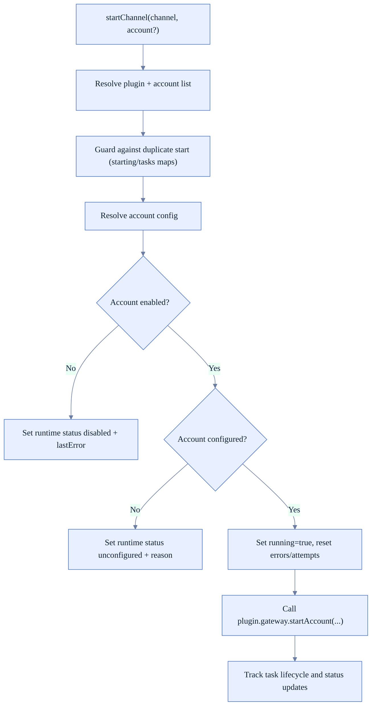
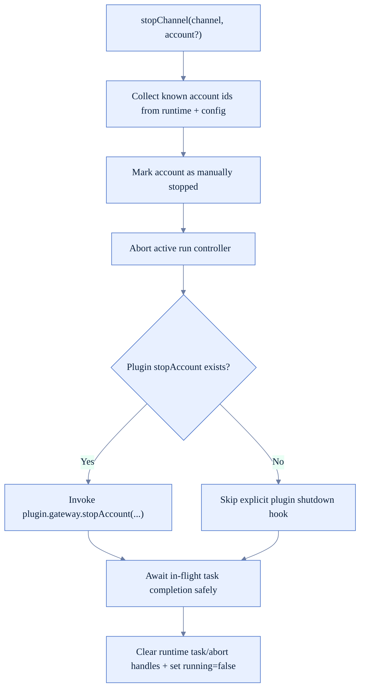
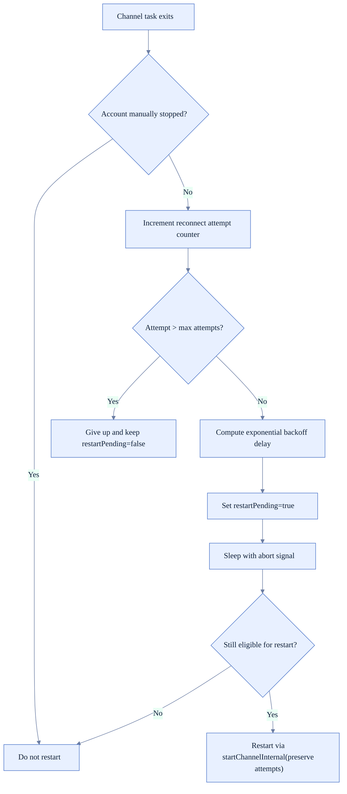
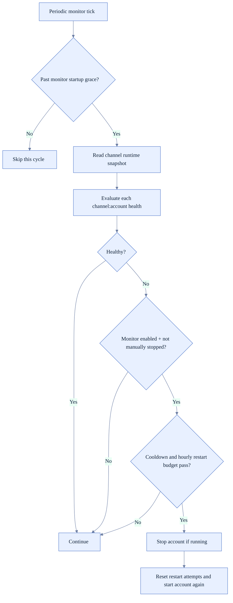
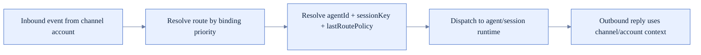

# Channel Runtime Logic (FoxFang)

Tài liệu này mô tả channel runtime theo code hiện tại: channel registry, account lifecycle, auto-restart, health monitoring, và routing liên quan session.

## 1) Thành phần chính

- Channel manager lifecycle: `src/gateway/server-channels.ts`
- Channel plugin index/registry: `src/channels/plugins/index.ts`, `src/channels/registry.ts`
- Health monitor loop: `src/gateway/channel-health-monitor.ts`
- Inbound route/session binding: `src/routing/resolve-route.ts`

## 2) Kiến trúc tổng thể

## 3) Channel account startup flow

## 4) Stop flow và manual-stop semantics

## 5) Auto-restart/backoff flow (after unexpected exit)

## 6) Health monitor loop

## 7) Runtime snapshot semantics

`getRuntimeSnapshot()` trả về:
- `channels`: trạng thái account mặc định cho mỗi channel (view tiện cho UI/status nhanh).
- `channelAccounts`: trạng thái đầy đủ theo từng account.

Các field quan trọng thường thấy:
- `running`, `restartPending`, `connected`
- `enabled`, `configured`
- `lastStartAt`, `lastStopAt`, `lastError`
- `reconnectAttempts`

## 8) Inbound routing liên quan channel runtime

## 9) Guardrails quan trọng

- Manual stop có ưu tiên cao: account đã manual-stop sẽ không auto-restart.
- Restart policy có cap attempts + exponential backoff + jitter.
- Health monitor có startup grace, cooldown, và max restarts/hour để tránh restart storm.
- Runtime snapshot luôn phản ánh disabled/unconfigured reason khi account không chạy.
- Channel registry lookup dựa active plugin registry, tránh eager-loading channel implementations nặng.

## 10) Checklist khi sửa channel runtime

- Có tạo race condition giữa `starting`, `tasks`, `aborts` maps không.
- Stop path có cleanup đầy đủ để không leak task/abort controller không.
- Backoff + max attempts có giữ behavior an toàn khi channel crash liên tục không.
- Health monitor có tôn trọng per-account/per-channel override không.
- Route/session key derivation có giữ đúng DM/group/thread semantics không.
