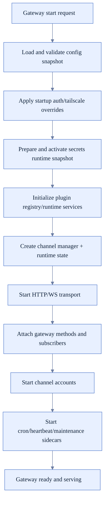
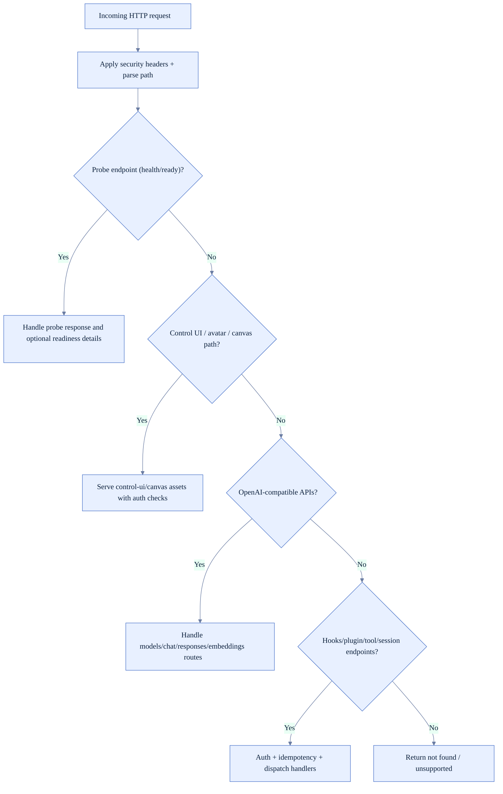
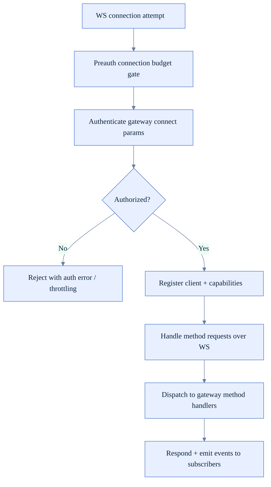
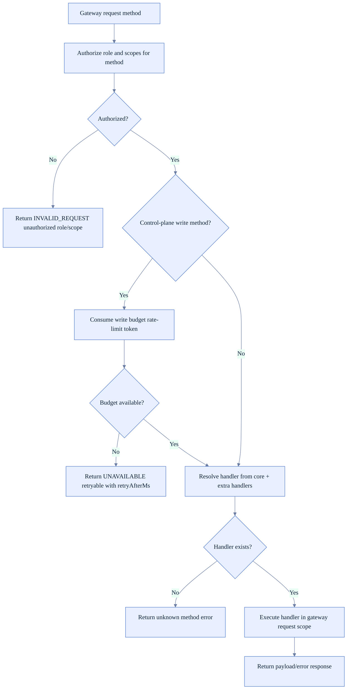
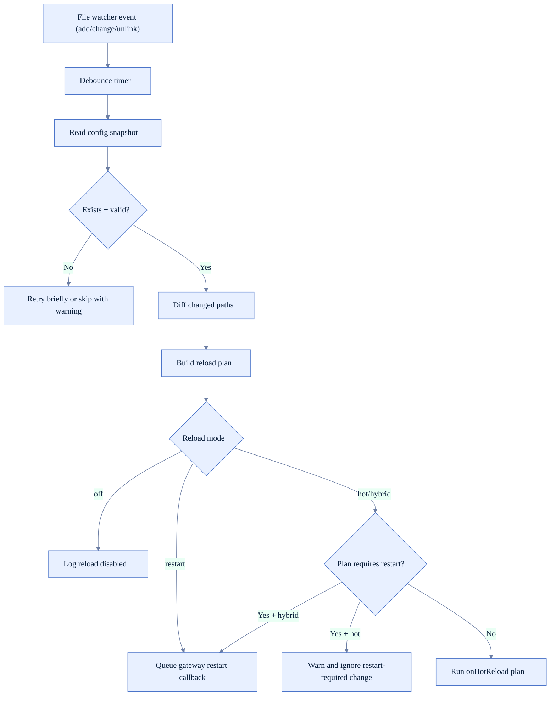
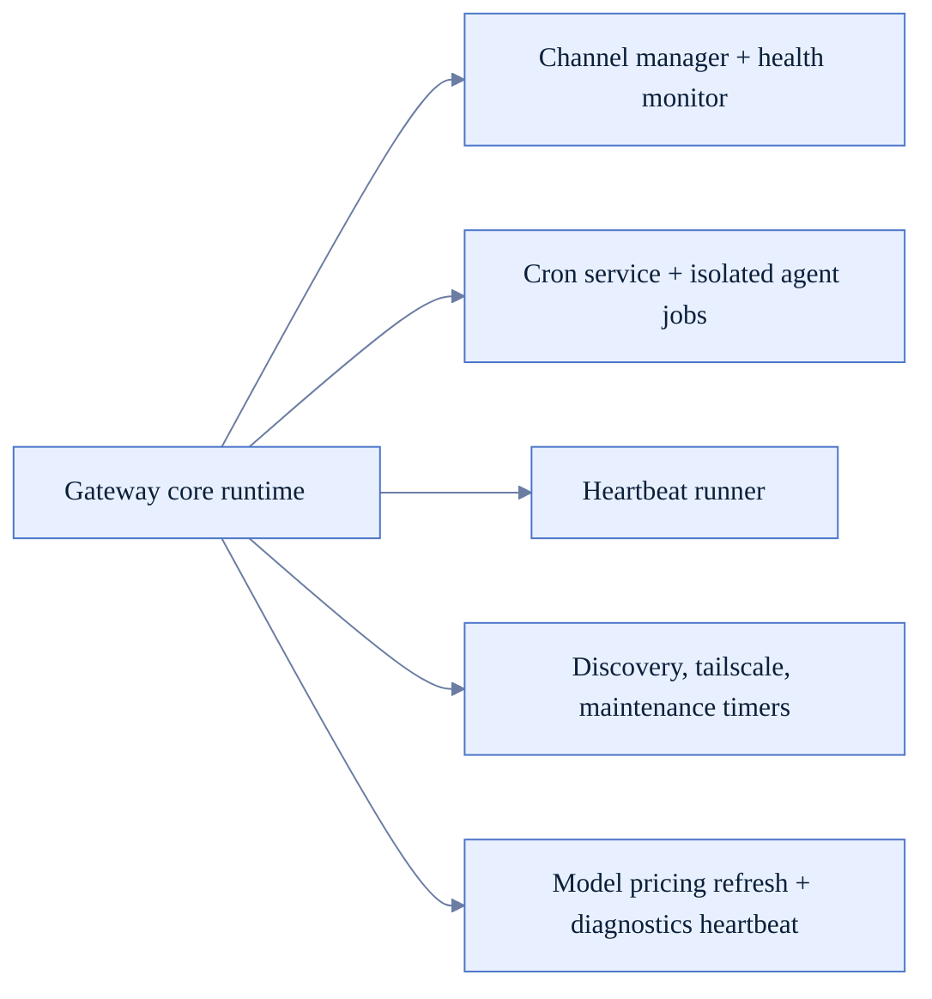

# Gateway Runtime Logic (FoxFang)

Tài liệu này mô tả control-plane runtime của Gateway theo code hiện tại:
- startup/bootstrap,
- HTTP + WebSocket request path,
- method dispatch/authz/rate-limit,
- config reload strategy,
- channel/runtime sidecars.

## 1) Thành phần chính

- Gateway orchestration: `src/gateway/server.impl.ts`
- HTTP transport + route handling: `src/gateway/server-http.ts`
- WS handler attachment: `src/gateway/server-ws-runtime.ts`
- Method dispatcher và authz: `src/gateway/server-methods.ts`
- Config watcher/reloader: `src/gateway/config-reload.ts`

## 2) Startup orchestration

## 3) HTTP request lifecycle

## 4) WebSocket lifecycle

## 5) Method dispatch: authz + scope + handler execution

## 6) Config reload (hot vs restart vs off)

## 7) Channel/runtime sidecars

## 8) Runtime safety behaviors đáng chú ý

- Auth mode và bind mode được kiểm tra trước startup để tránh exposed unauth gateway.
- Control-plane write methods có rate-limit riêng để giảm rủi ro burst writes.
- Request handler luôn chạy trong scoped runtime context để plugin/subagent calls có context đúng.
- Config watcher có debounce, retry khi file tạm mất, và queue restart an toàn (tránh loop restart).
- WS path có preauth budget + auth gate để giảm abuse trước khi fully authenticated.

## 9) Checklist khi sửa gateway runtime

- Có phá vỡ startup order (auth/secrets/plugins/transport/channels) không.
- HTTP probe/readiness behavior có giữ backward compatibility không.
- Method authz có giữ đúng role/scope matrix không.
- Config reload plan có làm restart quá nhiều khi chỉ cần hot reload không.
- Sidecars (cron/heartbeat/channel monitor) có lifecycle cleanup đầy đủ khi shutdown/restart không.
