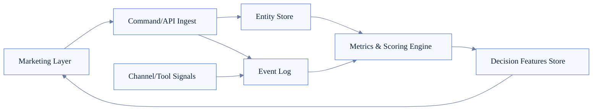
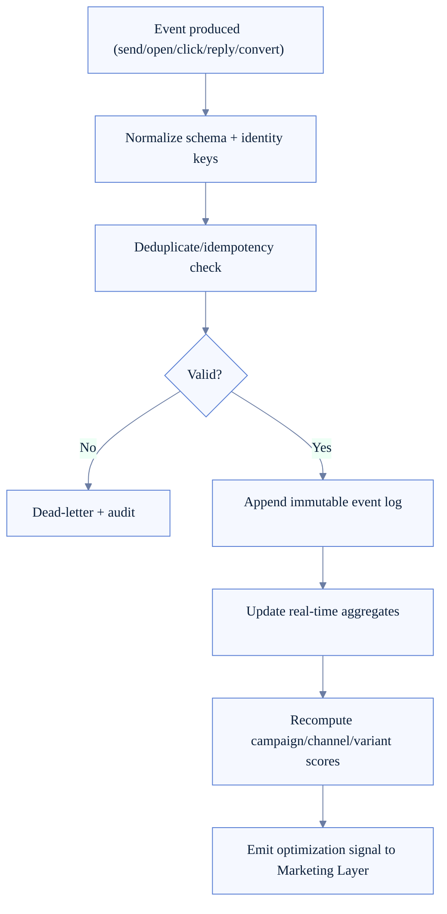
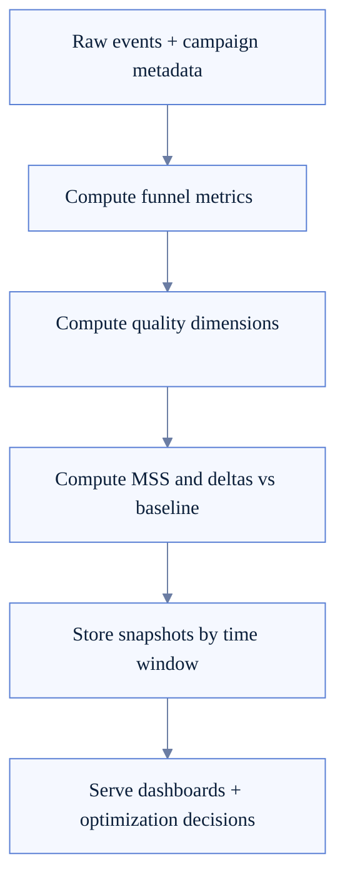

# Marketing Data Plane Architecture (FoxFang)

> Status: **to-be design**, chưa có implementation data plane marketing first-class trong `src/` ở thời điểm hiện tại.
>
> Verified from codebase hiện tại: chưa có entity/runtime modules tên `Campaign`, `BrandProfile`, `ContentAsset`, `DistributionRun`, `PerformanceSnapshot`, `MSS` trong `src/`.

Tài liệu này là thiết kế đích cho lớp dữ liệu marketing: entities, event streams, metrics computation, và vòng lặp học từ dữ liệu.

## 1) Code reality vs target

### As-is (đúng theo code hiện tại)

- Có data/state runtime cho session, transcript, config, plugin/channel status.
- Chưa có data plane chuyên biệt cho campaign marketing lifecycle.
- Chưa có scoring pipeline marketing first-class (MSS/KPI engine) trong runtime core.

### To-be (thiết kế đề xuất)

- Thêm Marketing Data Plane để lưu campaign entities, event log và scoring outputs.

## 2) Vai trò của Marketing Data Plane

Marketing Data Plane là nền dữ liệu vận hành cho Marketing Layer:
- lưu entities marketing chuẩn hóa,
- thu nhận events delivery/engagement/conversion,
- tính score và metrics phục vụ quyết định tự động.

## 3) Entity model (minimum viable)

- **BrandProfile**: voice, positioning, prohibited claims, style constraints.
- **Campaign**: objective, audience, channels, schedule, lifecycle status.
- **ContentAsset**: message variants, media references, CTA metadata.
- **DistributionRun**: publish attempts theo channel/account/time window.
- **AudienceSegment**: targeting rules + metadata.
- **PerformanceSnapshot**: KPI aggregates theo campaign/channel/variant.
- **Experiment**: A/B hoặc multivariate configs + hypothesis.

## 4) Data plane topology

## 5) Event lifecycle

## 6) KPI and scoring pipeline

## 7) Data contracts (recommended)

- Event envelope chuẩn: `eventId`, `occurredAt`, `source`, `campaignId`, `channelId`, `accountId`, `variantId`, `payload`.
- Idempotency key chuẩn cho delivery/conversion events.
- Snapshot windows: hourly, daily, campaign-lifecycle cumulative.
- Version hóa schema để tránh break historical analytics.

## 8) Integration with FoxFang runtime

- Gateway runtime: ingress APIs + control-plane operations.
- Channel runtime: nguồn delivery/health/retry events.
- Tool runtime: research/content generation/tool-result events.
- Session + agent loop: context logs và decision traces.
- Plugin runtime: nguồn events từ extension channels/providers.

## 9) Reliability guardrails

- Event log append-only để audit và replay.
- Dedupe/idempotency bắt buộc cho upstream retries.
- Backfill/recompute pipeline cho trường hợp schema update.
- Dead-letter queue cho events lỗi parse/validation.
- Data retention policy theo loại dữ liệu (raw, aggregate, debug).

## 10) Security and privacy

- Phân tách dữ liệu theo workspace/tenant/agent scope.
- Masking/redaction cho fields nhạy cảm trước analytics export.
- Access policy rõ cho read raw events vs read aggregates.
- Audit trail cho mọi write vào campaign và scoring tables.

## 11) Delivery roadmap (practical)

- **Step 1**: Ship entity schemas + event envelope spec.
- **Step 2**: Build ingest + append-only event log + snapshots MVP.
- **Step 3**: Add KPI/MSS compute service and dashboards.
- **Step 4**: Turn on optimization signals feeding Marketing Layer.

## 12) Done criteria

- Campaign lifecycle dữ liệu có thể query end-to-end.
- Metrics theo campaign/channel/variant cập nhật ổn định.
- Có thể replay events để recompute score khi đổi rubric.
- Optimization loop dùng data-plane outputs thay vì heuristic thuần prompt.
