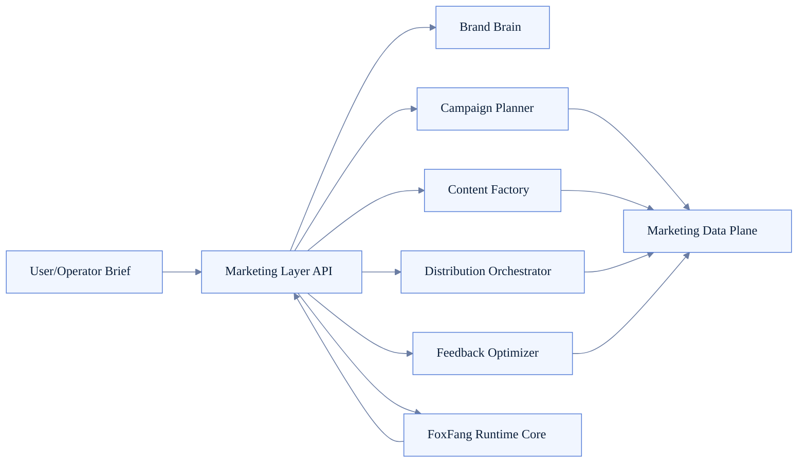
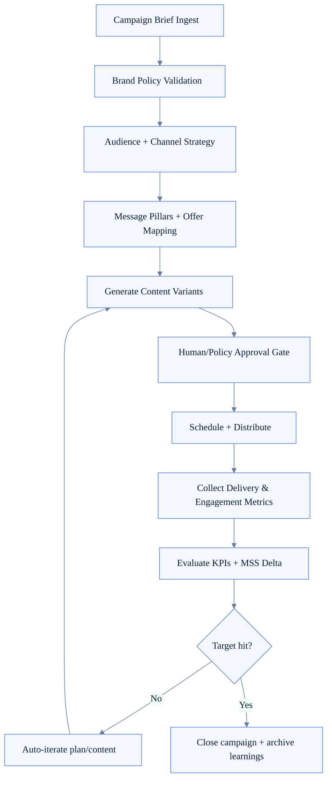
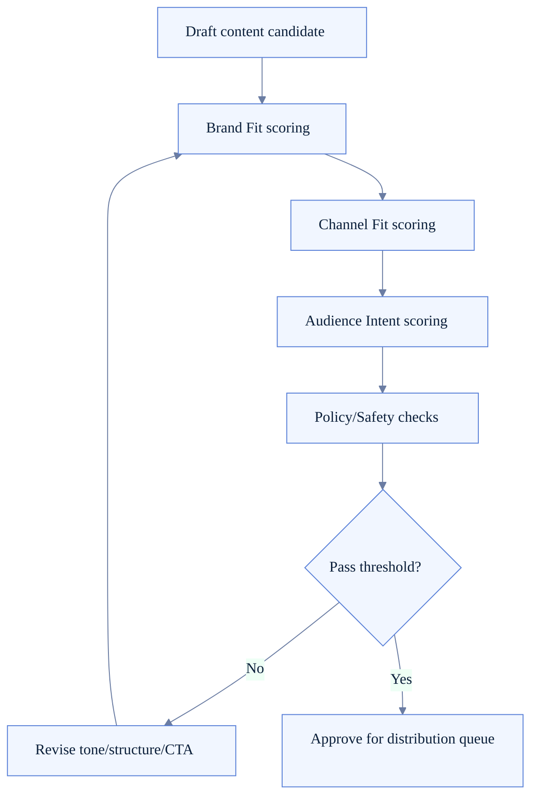

# Marketing Layer Architecture (FoxFang)

> Status: **to-be design**, chưa có implementation first-class trong `src/` ở thời điểm hiện tại.
>
> Verified from codebase hiện tại: chưa có module/runtime entities tên `Marketing Layer`, `Campaign Planner`, `Brand Brain`, `MSS` trong `src/`.

Tài liệu này là thiết kế đích cho lớp nghiệp vụ marketing được đặt trên runtime hiện tại của FoxFang để tiến tới Personal AI Marketing Agent.

## 1) Code reality vs target

### As-is (đúng theo code hiện tại)

- Runtime hiện có tập trung vào gateway/session/agent/tools/plugins/channels.
- Chưa có bounded-context marketing riêng trong `src/`.
- Chưa có campaign lifecycle first-class ở runtime core.

### To-be (thiết kế đề xuất)

- Thêm Marketing Layer để điều phối workflow marketing end-to-end.

## 2) Vai trò của Marketing Layer

Marketing Layer là lớp orchestration nghiệp vụ nằm giữa:
- Runtime core hiện có (gateway/session/agent/tools/plugins),
- Và Marketing Data Plane (entities, analytics, scoring, experiments).

Mục tiêu của lớp này:
- chuẩn hóa quy trình từ brief đến campaign execution,
- giữ tính nhất quán brand voice/policy,
- đóng vòng lặp đo lường và cải tiến.

## 3) Core capabilities

- **Brand Brain**: brand policy, voice guardrails, do/don't messaging.
- **Campaign Planner**: biến brief thành plan đa kênh theo mục tiêu/KPI.
- **Content Factory**: tạo content variants theo channel + audience segments.
- **Distribution Orchestrator**: scheduling, send rules, retry/governance.
- **Feedback Loop**: nhận metrics, tính quality signals, trigger optimize.

## 4) Layer topology

## 5) End-to-end campaign lifecycle

## 6) Decision engine for content-channel fit

## 7) Interfaces to existing runtime

- Session runtime cung cấp hội thoại state cho planning/approval loops.
- Agent loop runtime cung cấp tool-calling cho research/generation/review.
- Tool runtime cung cấp cả core tools và plugin tools cho marketing tasks.
- Plugin runtime mở rộng capability theo từng channel/provider.
- Channel runtime chịu trách nhiệm delivery/signal thu về từ các kênh.

## 8) Governance và guardrails

- Mọi campaign đều phải có objective, audience, KPI và owner rõ ràng.
- Brand policy là hard gate trước distribution.
- Có approval mode cho nội dung nhạy cảm hoặc high-impact channels.
- Có runbook rollback cho campaign khi quality/reputation signal xấu.
- Mọi optimization decision phải traceable qua metrics + reason.

## 9) Implementation phases (đề xuất)

- **Phase A**: Brand Brain + Campaign Planner MVP.
- **Phase B**: Content Factory + scoring gates.
- **Phase C**: Distribution Orchestrator + experiment loops.
- **Phase D**: Fully closed-loop optimizer with MSS tracking.

## 10) Acceptance criteria

- Có thể tạo campaign từ brief theo schema chuẩn, không cần prompt thủ công dài.
- Có thể generate và duyệt nhiều content variants theo từng channel.
- Có telemetry đầy đủ từ plan -> publish -> result -> optimization.
- MSS và marketing KPIs cải thiện ổn định qua nhiều campaign iterations.
