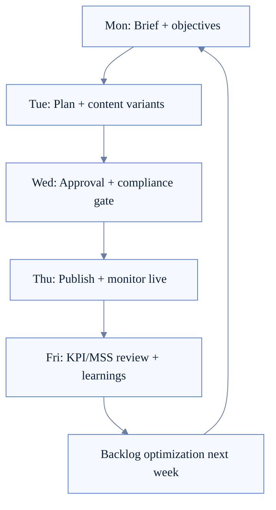
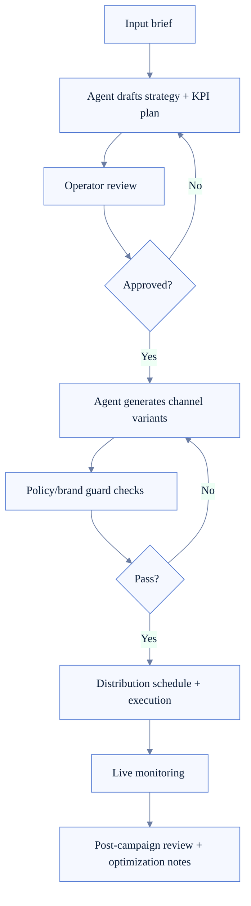
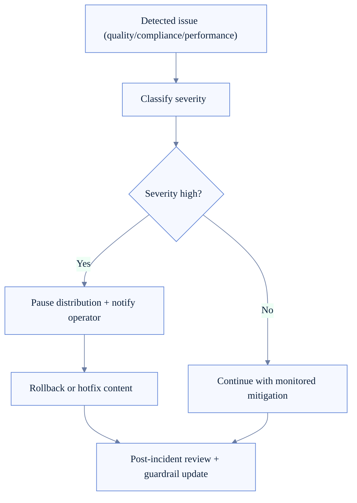

# Marketing Operating Model (FoxFang)

> Status: to-be operating model for a marketing-native FoxFang organization.

Tài liệu này mô tả cách vận hành thực tế để biến kiến trúc marketing thành quy trình làm việc có thể chạy hàng tuần.

## 1) Mục tiêu vận hành

- Chạy campaign liên tục theo cadence ổn định.
- Duy trì chất lượng brand/message khi scale đa kênh.
- Đo lường bằng KPI + MSS và cải tiến theo vòng lặp ngắn.

## 2) Team roles và trách nhiệm

- **Marketing Operator**: tạo brief, approve plan/content, go-live decision.
- **Strategy Lead Agent**: đề xuất campaign strategy, audience, KPI.
- **Content Specialist Agent**: tạo variants theo channel/persona.
- **Distribution Agent**: schedule/publish/retry theo channel policy.
- **Growth Analyst Agent**: tổng hợp metrics, đánh giá MSS, đề xuất optimization.

## 3) Weekly operating cadence

## 4) Campaign operating lifecycle (human + agent)

## 5) Approval gates and SLA

- **Plan approval SLA**: <= 24h từ lúc brief tạo.
- **Content approval SLA**: <= 12h trước scheduled publish.
- **Critical fix SLA** (brand/policy issue): <= 2h.
- **Rollback decision SLA**: <= 30m cho incident mức cao.

## 6) Incident and rollback model

## 7) KPI operating review template

- Campaign delivery: sent, delivered, failures, retry rate.
- Engagement: open/click/reply/conversion proxies per channel.
- Quality: brand-fit, clarity, CTA strength, channel-fit rubric.
- Strategy: coherence giữa objective, audience, message và output.
- MSS trend: current vs previous week vs baseline.

## 8) Decision policy for optimization

- Nếu KPI dưới threshold 2 kỳ liên tiếp -> bắt buộc đổi strategy hypothesis.
- Nếu channel-fit thấp -> giảm spend/volume channel đó và tăng test variants.
- Nếu brand-fit thấp -> chặn auto-publish, chuyển manual approval-only.
- Nếu MSS không tăng sau 3 vòng -> review lại rubric hoặc data quality.

## 9) Governance artifacts cần lưu

- Brief registry + version history.
- Approval logs (ai duyệt, lúc nào, lý do).
- Campaign/postmortem notes.
- Experiment registry (hypothesis, result, decision).
- Weekly operating report (KPI + MSS + next actions).

## 10) Rollout phases

- **Phase 1**: Manual-heavy, agent hỗ trợ plan/content, operator quyết định chính.
- **Phase 2**: Semi-auto distribution với guardrails và approval thresholds.
- **Phase 3**: Closed-loop optimization chủ động theo KPI/MSS signals.
