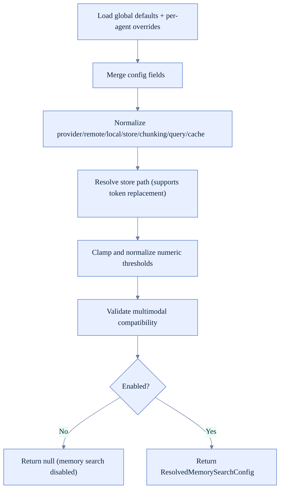
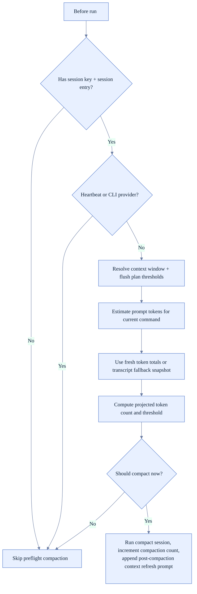
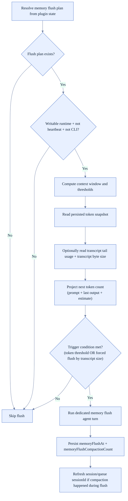
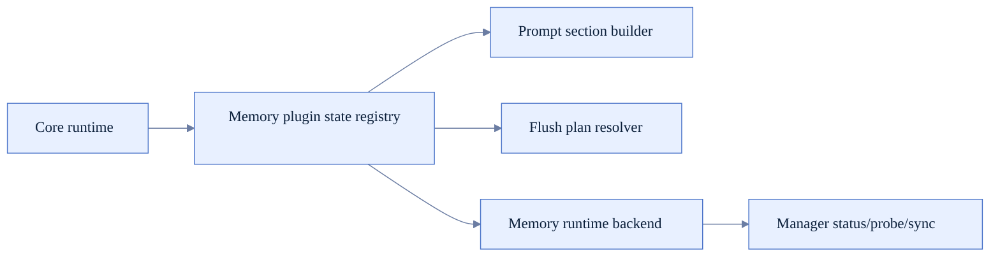

# Memory Runtime Logic (FoxFang)

Tài liệu này mô tả luồng memory theo runtime hiện tại:
- memory search config resolution,
- preflight compaction,
- memory flush gating,
- plugin memory integration.

## 1) Thành phần chính

- Memory search config merge/normalize: `src/agents/memory-search.ts`
- Flush/compaction gating + transcript usage extraction: `src/auto-reply/reply/agent-runner-memory.ts`
- Gating helpers và dedupe hash: `src/auto-reply/reply/memory-flush.ts`
- Memory plugin contract và flush plan resolver: `src/plugins/memory-state.ts`
- Memory config type surface: `src/config/types.memory.ts`

## 2) Luồng resolve cấu hình memory search

## 3) Preflight compaction trước agent turn

## 4) Memory flush gating và execution

## 5) Memory plugin runtime contract

## 6) Quy tắc chống flush lặp

Core rule đang được dùng trong `src/auto-reply/reply/memory-flush.ts`:
- Không flush lại nếu `memoryFlushCompactionCount` đã bằng `compactionCount` hiện tại.

Ghi chú:
- `computeContextHash()` hiện là helper sẵn có cho dedupe theo nội dung context, nhưng chưa được đưa vào nhánh gating runtime mặc định.

## 7) Error/safety behavior đáng chú ý

- Nếu flush run lỗi: không crash whole reply path, chỉ log verbose và tiếp tục.
- Nếu transcript usage không đọc được: fallback về snapshot hiện có.
- Multimodal memory bị chặn nếu provider/model không hỗ trợ embedding multimodal.
- Khi sandbox workspace không writable, memory flush bị tắt để tránh write failures.

## 8) Checklist khi chỉnh memory logic

- Thay đổi threshold có làm tăng compaction/flush quá mức không.
- Session token snapshot có được cập nhật `fresh` đúng điều kiện không.
- Forced flush theo transcript size có gây loop không.
- Sau flush/compaction, queue session mapping có được refresh đúng không.
- Plugin flush plan resolver có tồn tại trong runtime path cần dùng không.
