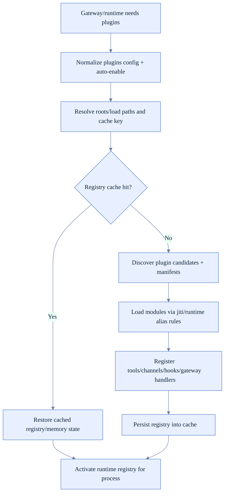
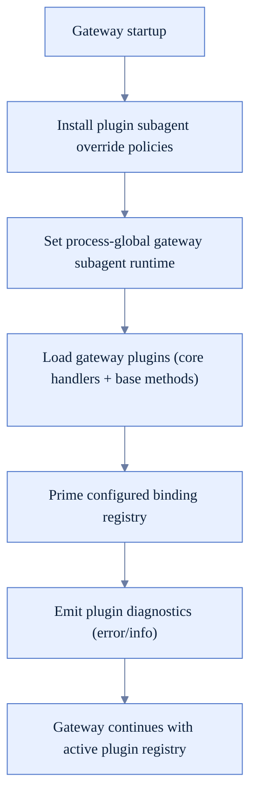
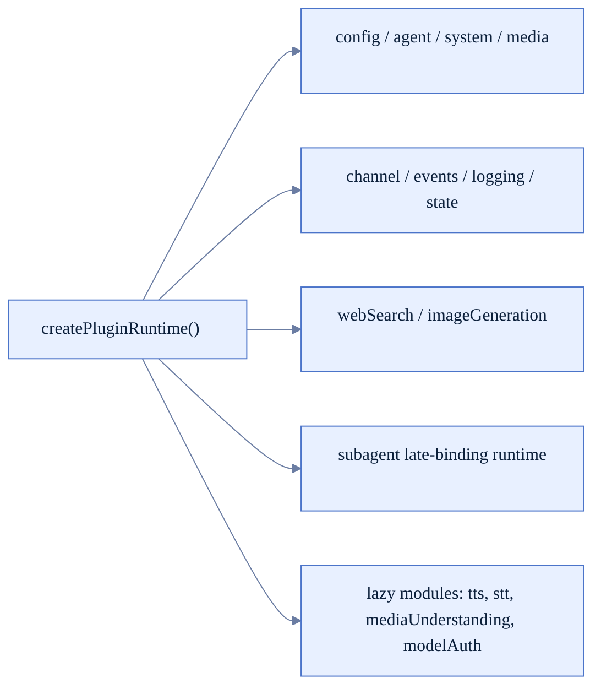
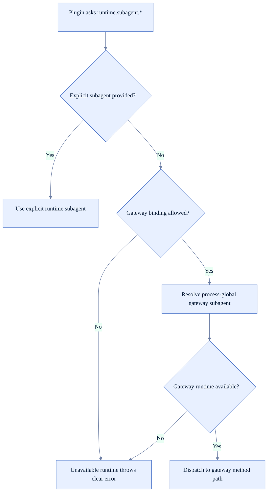
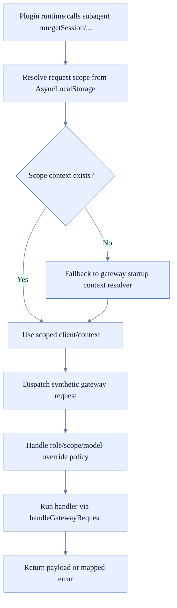

# Plugin Runtime Logic (FoxFang)

Tài liệu này mô tả plugin runtime theo code hiện tại: discovery/load/cache/runtime binding và gateway bootstrap integration.

## 1) Thành phần chính

- Plugin load orchestration: `src/plugins/loader.ts`
- Plugin runtime facade: `src/plugins/runtime/index.ts`
- Gateway plugin bootstrap: `src/gateway/server-plugin-bootstrap.ts`
- Gateway plugin integration + subagent runtime bridge: `src/gateway/server-plugins.ts`

## 2) End-to-end plugin lifecycle

## 3) Gateway bootstrap path

## 4) Runtime facade exposed to plugins

## 5) Subagent runtime binding model

## 6) Gateway dispatch bridge for plugin runtime

## 7) Runtime guardrails đáng chú ý

- Plugin registry có cache + eviction cap để tránh reload tốn chi phí.
- Gateway-bindable subagent runtime là opt-in, không phải default.
- Model override qua plugin subagent bị policy-gate theo plugin config.
- Plugin diagnostics giữ visibility cho load conflicts/failures thay vì fail silent.
- Runtime modules nặng (`tts`, `mediaUnderstanding`, `modelAuth`) load lazy để giảm startup cost.

## 8) Khi sửa plugin runtime, nên verify

- Cache key có phản ánh đủ các biến ảnh hưởng behavior không.
- Gateway startup có set đúng subagent runtime trước khi plugin dùng.
- Plugin tool/channel/gateway handlers có được đăng ký đúng trong registry mới.
- Fallback gateway context có còn hoạt động cho non-WS channel paths.
- Policy `subagent.allowModelOverride` + allowlist hoạt động đúng khi plugin yêu cầu model override.
