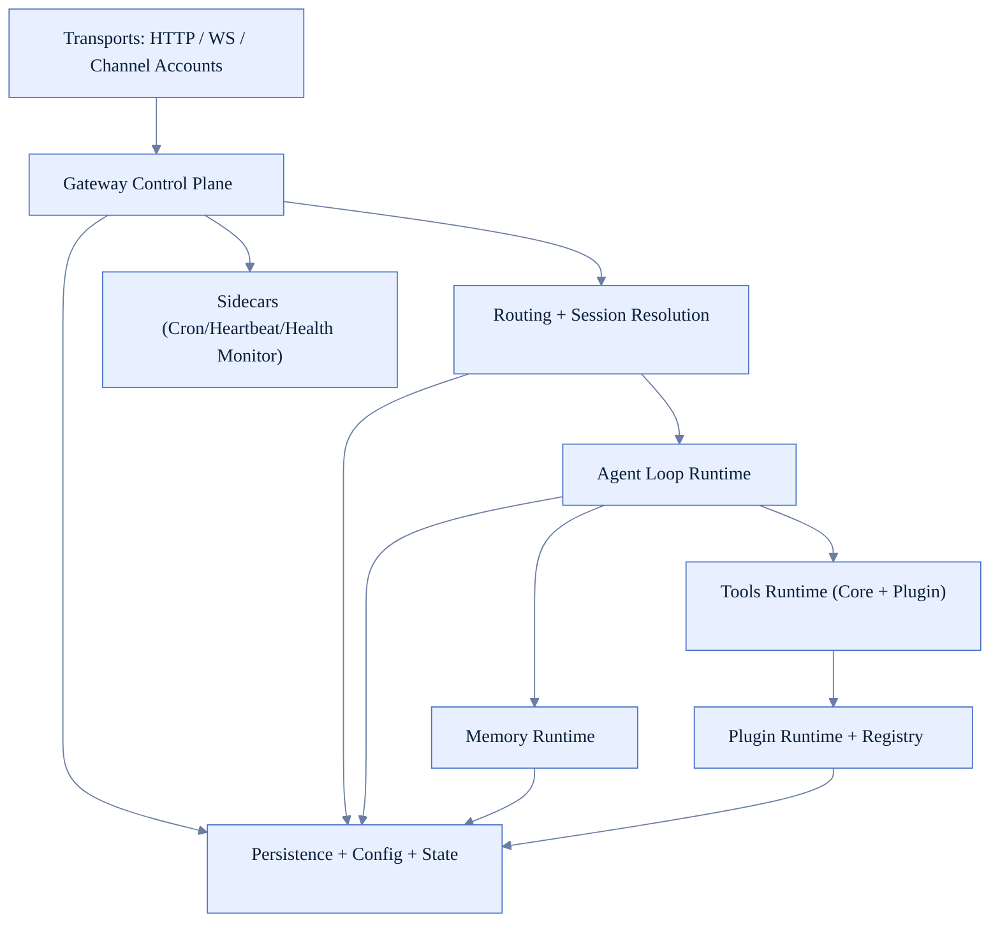
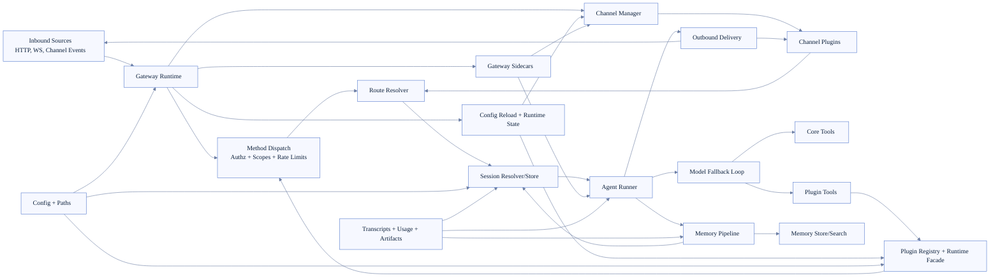

# Runtime Dependency Map (FoxFang)

Tài liệu này là bản đồ phụ thuộc runtime tổng hợp để onboarding nhanh: nhìn một chỗ là thấy luồng điều phối chính và ranh giới module.

## 1) Layer map (high-level)

## 2) Unified dependency graph (runtime-level)

## 3) Dependency rules of thumb

- Gateway là entrypoint điều phối; không nên embed business logic nặng của tools/channels trực tiếp vào transport layer.
- Routing/session là seam ổn định giữa ingress và agent loop; giữ key semantics nhất quán để tránh session drift.
- Agent loop phụ thuộc tools + memory theo runtime contracts, không phụ thuộc implementation chi tiết của từng plugin.
- Plugin runtime có thể gọi ngược gateway methods qua scoped bridge, nhưng phải qua auth/policy gates.
- Sidecars (cron/heartbeat/health monitor) là producer/observer runtime events, không phá lifecycle chính.

## 4) Critical coupling points cần cẩn thận khi refactor

- `Gateway ↔ Plugin runtime`: subagent binding, fallback context, policy model override.
- `Channel manager ↔ Route resolver`: account/channel identifiers phải normalize đồng nhất.
- `Agent runner ↔ Tool callbacks`: streaming/event hooks dễ gây duplicate hoặc out-of-order nếu thay đổi sai.
- `Session runtime ↔ Memory flush`: compaction/flush gating phải dùng cùng signal counters.
- `Config reload ↔ Channel/plugin runtime`: hot reload vs restart decision ảnh hưởng tính ổn định runtime.

## 5) Suggested reading order cho người mới

1. `/architecture/gateway-runtime`
2. `/architecture/channel-runtime`
3. `/architecture/session-runtime`
4. `/architecture/agent-loop-runtime`
5. `/architecture/tool-runtime`
6. `/architecture/plugin-runtime`
7. `/architecture/memory-runtime`
8. `/architecture/runtime-glossary`
