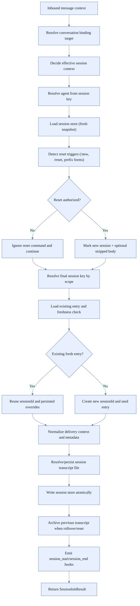
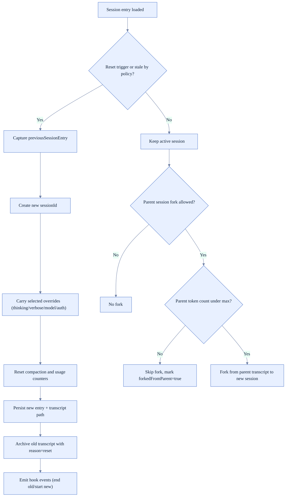
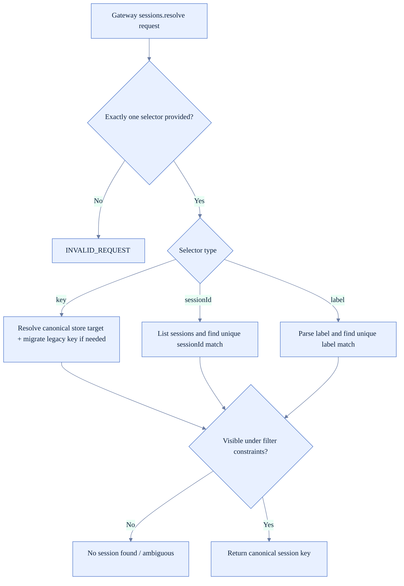

# Session Runtime Logic (FoxFang)

Tài liệu này mô tả logic session theo behavior runtime thực tế trong code, tập trung vào:
- cách chọn `sessionKey`/`sessionId`,
- reset/fork/archive,
- persistence và session resolution từ gateway.

## 1) Thành phần chính

- Session initialization và reset policy: `src/auto-reply/reply/session.ts`
- Session key/store/transcript helpers: `src/config/sessions/*`
- Gateway session resolve API: `src/gateway/sessions-resolve.ts`
- Session lifecycle hooks/archive: `src/auto-reply/reply/session.ts`, `src/gateway/session-archive.runtime.ts`

## 2) Luồng khởi tạo session (inbound message)

## 3) Session reset, rollover, fork, archive

## 4) Session resolution from gateway API (`key`/`sessionId`/`label`)

## 5) Dữ liệu session quan trọng cần theo dõi

- Session identity: `sessionId`, `sessionKey`, `sessionFile`
- Delivery routing: `lastChannel`, `lastTo`, `lastAccountId`, `lastThreadId`
- Runtime state: `updatedAt`, `abortedLastRun`, `systemSent`
- Agent behavior overrides: `thinkingLevel`, `verboseLevel`, `reasoningLevel`, `modelOverride`, `providerOverride`
- Maintenance state: `compactionCount`, `memoryFlushCompactionCount`, `totalTokens`, `totalTokensFresh`

## 6) Hành vi an toàn/chống lỗi đáng chú ý

- Bỏ qua reset trigger nếu sender không đủ quyền hoặc scope không phù hợp.
- Với session cũ không còn fresh, tạo session mới thay vì tái sử dụng transcript cũ.
- Transcript path được chuẩn hóa và persist trước khi run để tránh orphan state.
- Session resolve theo `label`/`sessionId` fail fast khi nhiều kết quả (tránh chọn nhầm).
- Legacy key migration được thực hiện tại gateway resolve để giữ tương thích cũ.

## 7) Checklist khi sửa logic session

- Session key có đổi theo scope mong muốn không.
- Reset trigger có làm mất override người dùng không.
- Rollover có archive transcript cũ không.
- Gateway resolve có trả nhầm session khi filter theo `spawnedBy`/`agentId` không.
- `sessionFile` có luôn được resolve/persist nhất quán sau reset/fork không.
