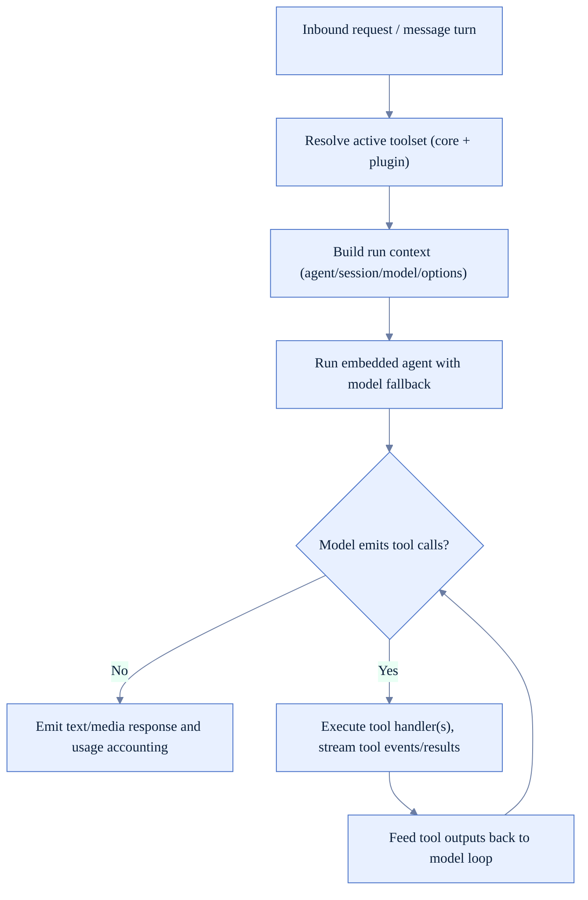
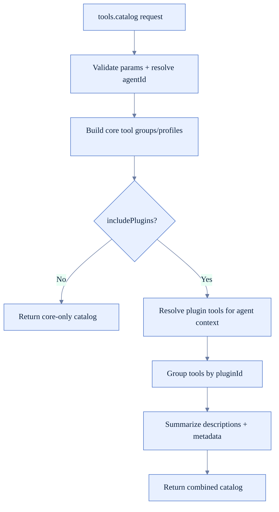
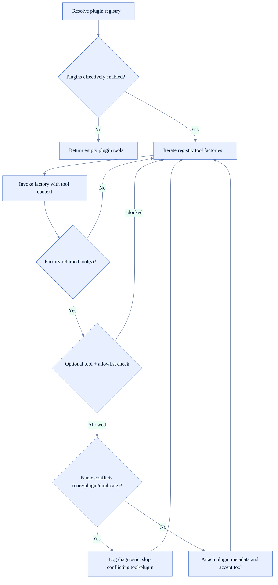
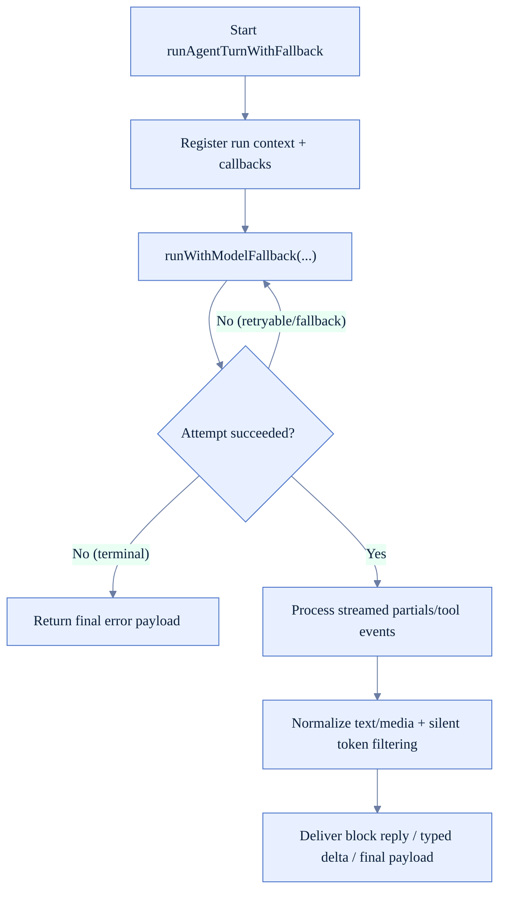

# Tool Runtime Logic (FoxFang)

Tài liệu này mô tả runtime của tools theo code hiện tại: từ catalog/resolve cho tới execution trong agent loop.

## 1) Thành phần chính

- Tool catalog API: `src/gateway/server-methods/tools-catalog.ts`
- Plugin tool resolve + conflict policy: `src/plugins/tools.ts`
- Agent turn execution + fallback loop: `src/auto-reply/reply/agent-runner-execution.ts`
- Embedded runtime entrypoint: `src/agents/pi-embedded.ts`

## 2) High-level flow

## 3) Tool catalog runtime (`tools.catalog`)

## 4) Plugin tool resolution policy

## 5) Execution loop with model fallback

## 6) Runtime guardrails đáng chú ý

- Optional plugin tools chỉ xuất hiện khi allowlist cho phép.
- Plugin tool name conflict không được override core tool name.
- Tool execution nằm trong cùng run lifecycle nên fallback/usage accounting vẫn nhất quán.
- Streaming path lọc token điều khiển (`SILENT_REPLY_TOKEN`, heartbeat artifacts) trước khi gửi user.
- Tool result callbacks có thể stream ra control-ui và channel delivery path tùy runtime mode.

## 7) Khi sửa tool runtime, nên verify

- `tools.catalog` có giữ đúng agent scope + profile metadata không.
- Plugin tool conflicts có còn bị chặn đúng.
- Tool streaming có gây duplicate block replies không.
- Fallback retry path có preserve tool callbacks và run context không.
- Error sanitization có giữ message user-safe trong các lỗi tool/provider.
